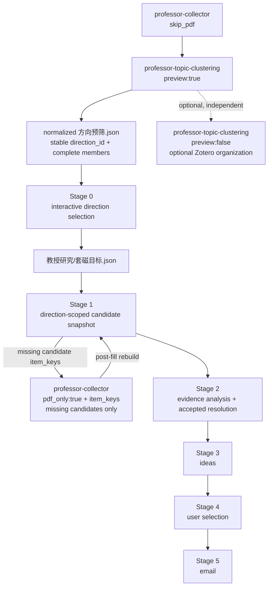
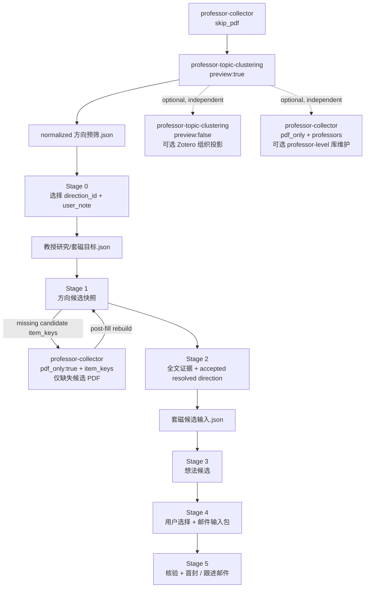

# professor-contact (skill — caller convention)

This skill is the **caller convention** for the 套磁 workflow (套磁 = contacting a Japanese professor before/around applying). The skill itself does NOT scan Zotero, download PDFs, or analyze papers — it tells you how to spawn the subagents that do.

> **skill = how to call (this file). subagent = the isolated execution unit (where it runs).**

## Runtime routing gate (read first)

- **当前 host 决定调用分支**：当前 host 是 Codex 就只走 Codex 原生 subagent workflow；当前 host 是 OpenCode 就只走 OpenCode 原生 Task。不得通过 CLI 是否安装、命令探测或模型自述改选另一分支。
- **Codex 的定位与调用是一个动作**：Stage 请求本身就是 routing gate。若当前 Codex 通过程序化工具调用器暴露原生多代理能力，定位该能力并发起 exact named agent 调用属于同一个**真实委派动作**，**不是能力探测前置条件**；不得停在列举/检索结果上，也不得把入口未显示、OpenCode 语法不存在或先前运行失败当成“无法委派”。
- **先真实调用，再判断失败**：立即按下表选定 installed exact named agent，发起当前运行的原生调用并等待结果。只有该 exact named agent 的本轮调用实际返回 `machine-level failure`，才允许记录 runtime/feature blocker；父线程不得 inline/simulate child。
- **禁止跨执行器 shell fallback**：不得用 shell、`opencode run`、`codex exec`、curl 或另发 eval 请求代替原生委派；不得把 OpenCode `task(...)` 语法写进 Codex 调用。

| 入口 | Codex 第一项路由动作 |
|---|---|
| Stage 1 | Stage 1 → `professor-contact-downloader` |
| Stage 2 | Stage 2 → `professor-contact-analyzer` |
| Stage 3 | Stage 3 → `professor-contact-idea-generator` |
| Stage 4 | Stage 4 → `professor-contact-selection` |
| Stage 5 | Stage 5 → `professor-contact-email-generator` |

上述 child 返回前，不执行属于该 child 的业务工作。详细 payload、等待、非递归与交互边界仍以下文对应 runtime 分支为准。

## What this is for

After `professor-collector(skip_pdf)` and `professor-topic-clustering(preview:true)` have produced a normalized `方向预筛.json`, the user may decide that **a specific direction of a specific professor** is worth contacting (套磁). **Stage 0 is the contact-workflow entry at that point.** Professor-level `pdf_only + professors=<keep-list>` and formal `professor-topic-clustering(preview:false)` remain valid independent library/organization operations, but neither is a prerequisite for Stage 0 or the canonical Stage 1 download scope. Stage 0 presents the normalized preview directions interactively, the user selects one or more directions (with optional per-direction user notes), and the selection is persisted to `教授研究/套磁目标.json`. The workflow no longer uses a fixed-title Zotero note as its selection UI. This skill's stages consume that machine state and turn it into 套磁 materials:



`套磁目标.json` is machine state. There is **no Stage 0 human-facing Markdown output**.

## Prerequisite

For every professor the user may contact, run `professor-topic-clustering(preview:true)` using the current normalized preview contract. Each `方向预筛.json` must contain:

- `preview_fingerprint` + `preview_fingerprint_version`;
- stable `direction_id` per direction;
- complete `members[]` with `item_key` and preview confidence;
- `representatives[]` as a human-facing subset;
- names/summary and evidence coverage metadata;
- `membership_mode: overlap_allowed`.

Stage 0 does not require Zotero to be open. Later stages may still use Zotero as a paper metadata/PDF store, but never as contact-target state.

## Stage 0 selection contract（替代旧「标记约定」）

- **选择入口**：不再在 Zotero GUI 里建任何 note。用户在 Stage 0 的交互提问里选定方向（可多选），并可对每个方向写一段可选 `user_note`——理由 + 你的想法草稿/方向说明（「我本来就想做 xxx」的 xxx，你自己先写，阶段 3 会读它做修正）。写的越多，阶段 3 的修正越贴合你的真实想法；不写则退回纯模型生成候选。
- **机器 ID**：交互界面里的 A/B/C 展示标签不是身份；机器身份是稳定 `direction_id`。
- **多方向独立**：两个被选方向即使共享论文也保持独立（各自 `direction_id`/`members[]`/`member_fingerprint`/names/summary/user_note）；Stage 2 会按教授、按 `item_key` 去重昂贵工作并复用结果，但**绝不因此合并方向**。
- **修订**：对同一教授重跑 Stage 0 = 修订该教授的选择，不影响其他教授；仍被选方向的 note 保留，除非该方向的 key 出现在 selection `notes` 里——省略 key = 保留旧 note，key 出现即替换（显式传空串 = 清空）；先前的选择快照存 `selection_history`。
- **preview 变更**：target 新鲜度按**被选方向逐个判定**，整体 `preview_fingerprint` 只作 provenance/audit 元数据，不作为唯一有效性闸门：未选方向的新增/删除/改名/重聚类不影响已选 target；被选方向成员集合（`item_key`，即上游 `direction_id` 的推导依据）变化或方向消失 → Stage 1/2 以 `needs_refresh`（reason_code `preview_changed`，stale 条目精确到 `direction_id`）停止，须回 Stage 0 修订选择；成员集合不变时，`member_fingerprint` 变化（如 `preview_confidence` 升降）与 display 元数据（name/summary/representatives 等）变化一样只触发投影刷新——`resolve` 就地刷新该方向投影元数据并返回 `ok`（`user_note`、`selection_history`、选择本身不动），payload 以 `projection_refreshed` 标注。

## 阶段总览（每阶段 = 一个 subagent，可独立调用）

| 阶段 | subagent | 做什么 | 产物 |
|---|---|---|---|
| 0 | `professor-contact` | 读 normalized `方向预筛.json` → 交互选定方向（可多选 + per-direction user note） | `教授研究/套磁目标.json`（机器状态；无 Stage 0 Markdown） |
| 1 | `professor-contact-downloader` | 先 `contact_targets.py resolve`，再 `contact_stage1.py build` 构建逐方向候选快照（保守扩召 + 就绪检查），仅对缺失候选跑 `professor-collector(pdf_only, item_keys=<缺失 keys>[, access_mode=<oa_only|allow_non_oa>])` 定向补下；全部就绪则 no-op | `教授研究/套磁阶段1候选.json`（机器状态）+ PDF 附件补下 |
| 2 | `professor-contact-analyzer` | 先 `contact_stage1.py verify` 校验 Stage 1 候选快照，再对每位教授跑 `contact_state.py stage2-preflight`：`reuse_all` 教授在 Zotero probe、PDF 读取、OCR、paper-analysis、handoff、模型 job 之前以 no-op 复用既有 `套磁候选输入.json` + `套磁候选分析.md` 结束（`chatgpt_result` 提供或 `kb_import=true` 时禁止 early exit）；仅对 process 教授以逐方向 `candidate_keys` 为读取/相关性/分析范围（可信度闸门只用 provisional members）；**full `paper-analysis` 覆盖候选集去重并集——每个 unique candidate 复用未变的有效 full analysis，否则跑一次 full pass（摘要级相关集与成本门只截断 gap/叙事，绝不截断 full analysis，issue #7 required flow #2）**→ 判定相关论文、署名、主线与 post-cost-gate 分析 scope 后，**总是先生成确定性的 ChatGPT handoff ZIP**。`chatgpt_handoff=continue` 时 ZIP 只是低成本 side effect，随后旧的本地 OCR/`paper-analysis` 路径语义不变；`wait` 时在任何新 OCR/`paper-analysis` 前软停止。提供匹配 result ZIP 后先严格本地导入成普通 analysis/sidecar，再继续既有 `stage2-resolve-plan → stage2-resolve-finalize → stage2-plan → stage2-finalize --preflight-file`（resolve 流水线对每个被选方向做权威性归属判定：移除误归类、新增他向支持、重命名、拆分/合并、写 `resolved_direction` 状态）。gap/runner/状态机仍完全本地 | `<教授名>/论文分析/_chatgpt_handoff/stage2-<id>.zip`（传输层）+ `<教授名>/论文分析/_resolved_directions.json`（方向权威归属）+ 原有 `<教授名>/套磁候选输入.json`（带 `resolved_directions` 字段与 `cache.preflight` 复用元数据，Stage 3 唯一事实源）/分析报告/_freshness_cache/index/sidecar |
| 3 | `professor-contact-idea-generator` | **只读输入包 + profile**（不读任何 Markdown/_index/sidecar；输入包为 v2：professor 级 `papers[item_key]` 单一规范论文记录 + 各方向 `supporting_item_keys` 引用）：`stage3-plan --direction-id`（canonical 机器身份；`--collection-key` 仅为 v1 兼容并经输入包精确映射解析）按 `refresh_scope` 生成逐 resolved 方向独立 job（结果文件由 runner 返回安全名 `candidates-<id>-<hash>.json`；模型输入只含本方向切片，绝不发全方向并集），每方向 3-5 条可选候选（除非 `--skip-direction-ids` 显式跳过→持久化 `stage3_status:"skipped"`；refined 模式同样 3-5 条且恰好 1 条 `origin:"user_refined"` 的校准后用户想法）；候选为 v2 精确溯源：`kind:"direction"` + `direction_ids:[本方向]` + `gap_refs` 精确 `(direction_id,item_key,gap_id)` 三元组（在另一方向合法的 gap 配错 direction_id 一律拒绝）；**跨方向为显式 opt-in**：只有调用方传 `--cross-direction-groups '[["DIR_A","DIR_B"]]'`（≥2 个既有 direction ID、排序去重）才生成独立 `kind:"cross_direction"` job（组身份 `cross:<hash>`，缓存=参与方向指纹+profile+契约版本），默认无任何 cross job/模型调用/Markdown 节 → `stage3-finalize` 校验后写 v2 状态并渲染候选文件（按方向分节 + 仅显式组才有的「跨方向想法（显式标注）」节；未再请求的组确定性删除并报告 `group_not_requested`）；复用逐 direction_id 判定（指纹不含 collection_key/显示名：纯投影改名只重渲染）；profile 改动只失效阶段 3/4；白话校验结果另由 `stage3-record-validation` 写入独立字段 | `<教授名>/套磁候选状态.json`（schema 2：逐方向 `direction_id` + `cross_direction_groups`） + `<教授名>/套磁想法候选.md` + `套磁想法候选总览.md`（后两者 runner 渲染） |
| 4 | `professor-contact-selection` | 用户从**候选状态**（非 Markdown）挑选：selection 条目以 `direction_ids`（canonical，排序规范化）圈定作用域——普通方向 `[DIR]`、跨方向想法 `[DIR_A,DIR_B]`（与组的排序 ID 完全一致）；`stage4-finalize` 按 direction_id + 精确三元组 join（候选 id 只在其 direction 作用域内解析，跨作用域引用整批 fail closed）并校验指纹（过期 `needs_refresh` 不落盘；组选取逐参与方向指纹校验，漂移 `cross_participant_changed`；v1 选择条目仅在有唯一 collection_key→direction_id 机器映射时可迁移，歧义 `legacy_direction_identity` 零写入；部分复选（只重选部分教授/方向）保留未涉及条目并整体重编译进两个正式文件——被保留条目的候选状态缺失/无法精确迁移/输入包不可读 → `candidate_state_missing`/`legacy_direction_identity`/`preserved_selection_uncompilable`，任何写盘前零写入，绝不静默挤出既有选择）→ 写 `套磁选择.json`（schema 2，保留候选的 `direction_ids`/精确溯源）并**编译程序级邮件输入包**（`邮件输入.json` schema 2：每条 email 携带 `direction_ids` + `directions[]` 显示名 provenance，`email_id = 教授::'+'.join(sorted(direction_ids))::想法ID`（A+B==B+A）；跨方向按参与方向切片并集编译——论文按 `item_key` 去重且各带 `direction_ids` 归属、gap 每行携带 `direction_id`；`cross_direction` 组信息与 `contact_evidence` 一起参与 `source_hash`；done_by_self 只作 extension_context_only；上游 `_联系方式证据.json` 记录连同 `record_fingerprint` 冻结进每条 email——阶段 5 的收件事实源） | `教授研究/套磁选择.json` + `教授研究/邮件输入.json`（阶段 5 唯一事实源，自包含短证据＋冻结联系方式快照） |
| 5 | `professor-contact-email-generator` | **只读邮件输入包**（+profile/模板/info/boshu/`_contact_verify.json`）：默认生成首封和无回复跟进两种输出；`stage5-plan --mode both`（模型 job + 核验缓存检查 + 联系方式证据优先判定）→ 送信前核验（5.9 不变；邮箱证据已确认时免网页查找）→ 模型只回首封的 4 句兴趣段+source_map+未来志向+学習中候选 →（可选）`humanizer-ja` 只润色模型动态字段（拼装前，5.6）→ 用户 choices（含初次发送日期；缺决定即停在既有 `needs_input` 边界，不代选、不编日期）→ `stage5_immutable.py stage5-finalize --mode both`（确定性模板拼装+保护串校验+渲染；仅在动态字段确被润色时传 `--polish-mode dynamic-fields-only`；整封成品与模板固定文字从不进入 humanizer）→ 首封和跟进各自过 validator 循环（validator 也只读 md+邮件包）并记录 `stage5-record-validation` | 每封选中邮件独立的 `套磁邮件.md`/`.txt` 与 `套磁跟进邮件.md`/`.txt`（单封用固定名，多封按方向与想法 ID 加后缀）+ `<教授名>/套磁邮件状态.json` + `套磁邮件总览.md` + `_contact_verify.json` |


## Stage 2 ChatGPT handoff（只替换逐论文高耗分析）

Stage 2 的 handoff 是**可选执行通道，不是第二套工作流**。`套磁候选输入.json` 仍是 Stage 3 唯一事实源，`contact_state.py stage2-plan/stage2-finalize`、gap/item/fingerprint 校验、Stage 3–5 全部保持本地权威。

### 启动时只问一次

- 完整 workflow **交互式**启动且调用方没有显式给 `chatgpt_handoff` 时，caller 必须在进入 Stage 2 前只问一次：
  1. `继续本地执行（仍生成 ChatGPT ZIP）` → `chatgpt_handoff=continue`
  2. `生成 ZIP 后暂停，等待 ChatGPT 结果` → `chatgpt_handoff=wait`
- 一旦选定，把该值原样传给 `professor-contact-analyzer`；**handoff 点不得再次提问**。
- 非交互/旧自动化没有该字段时固定按 `continue`，绝不因为升级后突然等待。
- 两种模式生成完全相同的逻辑 bundle；`continue` 不改变普通 Stage 2 结果语义，`wait` 不允许偷偷本地 OCR/`paper-analysis` 补齐。

### wait / resume

`wait` 在 analyzer 已完成方向可信度、署名、相关论文选择、成本门、幂等过滤与确定性 carrier/future-work prepare 后生成：

`<教授目录>/论文分析/_chatgpt_handoff/stage2-<handoff_id>.zip`

若确有待分析 jobs，analyzer 返回 `result=needs_external_result`、`reason_code=chatgpt_result_required`、`handoff_id`、`bundle_path`，这是软停止而非错误。零 jobs 时无需等待，继续普通 Stage 2。

用户把该 ZIP 交给 ChatGPT/外部处理并拿回 `stage2-<handoff_id>-result.zip` 后，重新调用同一教授的 Stage 2，并传 `chatgpt_handoff: wait` + `chatgpt_result: <result.zip绝对路径>`。analyzer **先按当前本地输入重新确定性构建 current bundle，再用 current bundle 校验 result**：因此 PDF/abstract/note/scope/local baseline 任一变化都会改变 handoff/source fingerprint，使旧 result 自动拒绝。匹配结果只会被安装到普通 `论文分析/...md`、本地 finalize 的 `.future_work.json`、经本地 `facts.py finalize` 验证落盘的 `.facts.json`（PDF fulltext job 必须带 facts 草稿；OCR-only/abstract-only job 显式无 facts 契约，不伪造、不本地补跑）与 `_index.json`；随后继续 sidecar/facts/`stage2-plan`/`stage2-finalize`，下游不因执行者来自 handoff 而分叉——本地与 handoff 两条路径产出同一规范化 paper-facts 形状。

外部 ZIP 永远不能直接提供权威 `_index.json`、`.future_work.json`、`.facts.json`、`套磁候选输入.json`、gap_id 或其它 Stage 3 状态；facts 草稿只有经本地确定性 `facts.py` 校验 finalize 后才成为 sidecar。多教授等待时每教授各有 bundle；恢复时用 `professors=<单个教授>` 逐个提交对应 result，避免错配。

## 目标状态语义（替代旧「标记语义」）

- **套磁处理教授名单来自 `套磁目标.json`**：Stage 1/2 先用 `contact_targets.py resolve` 解析当前被选目标，再把名单显式传给下游；这只是 contact workflow 的 target scope。Professor-level collector keep-list（`pdf_only + professors=<keep-list>`、`screened:"out"`/`include_deferred`）可以作为独立的库维护状态存在，但**不是 Stage 0/1 的前置事实源，也不由 Stage 1 重跑或改写**；Stage 1 的 PDF 补下只走 item-scoped fast path。
- **阶段 1 下载范围 = 方向候选集**：不再是「被选教授的全部可下论文」。Stage 1 先为每个被选方向构建保守高召回的候选集，再只对缺 PDF 的候选 item key 定向补下。

### Stage 1 方向候选集与定向补 PDF

对每个被选方向（候选集按方向独立，绝不因共享论文合并方向）：

1. **起点** = 该方向在 target state 中的完整 provisional members。
2. **廉价证据保守扩召**（只可用本地廉价证据，绝不当最终归属判定）至少覆盖：
   - 该方向的 low-confidence preview members（照常入选，额外记 `low_confidence_preview` 理由）；
   - 其他 preview 方向的成员与被选方向语义强重叠者（`cross_direction_overlap`，本地词面重叠证据 + `expansion_evidence` 记录）；
   - preview 未安置的论文（未分类/preview 后新增）中与被选方向有词面重叠者（`unclassified_or_new_since_preview`）；
   - 用户显式点名的论文（`user_named`，经 `--named-file` 传入，item key 或精确标题）。
3. **工作队列**：仅对「物理下载 + paper-analysis 补齐」把各方向候选 keys 并集去重；方向候选集本身保持分离。
4. **就绪检查**：按 `papers.json` 的 `pdf_status` 判定（`downloaded` = usable），已下载候选绝不重下。
5. **定向补下**：只把缺失的候选 item key 传给 item-scoped fast path：`professor-collector(pdf_only:true, item_keys=<缺失 keys>[, access_mode=<oa_only|allow_non_oa>])`——不解析教授列表、不改 keep-list、不触发程序根级 collection 准备/打标。**绝不与 `professors` 同时传**。全部候选已就绪 → Stage 1 为 no-op，不 spawn collector。
   - `access_mode` 是 caller 从真实用户取得的本轮网络访问决定；显式值严格只能是 `oa_only` 或 `allow_non_oa`，并以同名同值原样加入 collector payload。
   - 未提供时完全省略 `access_mode`，不生成默认值、不变成 downloader 的 `needs_input`、不发明 child continuation/resume；有交互能力的下游仍可按既有 `question` 规则询问，Codex non-interactive 成功路径必须由 caller 显式提供合法值。
   - 非法值只在 `action=pdf_fill_needed` 时校验，并在 collector spawn 前返回结构化 `error`；不自动映射、不 spawn、不新增 `needs_input` continuation。`noop` / `needs_resolution` 不消费也不校验本轮无用的 `access_mode`。
6. **重跑幂等**：换网络后重跑同一流程，`papers.json` 状态未变的缺失候选自然重新入选重试。
7. **补下后刷新快照（强制）**：collector 会改 `papers.json`，downloader 在 collector 返回后必须重跑 `contact_stage1.py build`，以 post-fill 就绪状态作为最终快照与返回值——绝不留下描述补下前状态的 `套磁阶段1候选.json`（Stage 2 要 verify 消费它）。
8. **action 语义**：`noop` = 每个候选都已有 usable full text（missing 与 unresolved 皆空）；`pdf_fill_needed` = 有缺失可补候选；`needs_resolution` = 候选存在于 target/preview 但 `papers.json` 无条目（fast path 无法补）——返回 `partial` 并附诊断，绝不判成 `noop`。
9. **Stage 2 消费**：Stage 2 先 `contact_stage1.py verify` 校验快照对当前输入新鲜，再以逐方向 `candidate_keys` 作为读取/相关性/分析范围（`gap_scope=selected_direction` 的 gap 池同样来自候选集 sidecar）；**full `paper-analysis` 覆盖候选集去重并集，摘要级相关集与成本门只截断 gap/叙事，绝不截断 full analysis**；方向可信度闸门只用 provisional members，`relevance_reason` 附扩召理由，扩召候选绝不写成最终成员。

快照 `教授研究/套磁阶段1候选.json`（schema 1 / kind `professor-contact-stage1`）按教授持久化：逐方向 `direction_id`/provisional member keys/expanded candidate keys/逐篇 expansion reasons（+overlap evidence）/`input_fingerprint`/PDF readiness 汇总。`input_fingerprint` 是**精确依赖指纹**（v2），仅覆盖能改变候选成员/就绪状态的字段——被选方向身份与 provisional member item keys；被选方向词面画像输入（`name_ja`/`name_zh`/`summary_zh` + representative `title`/`title_zh`，供 `direction_profile_tokens()` 消费）；**全部** preview 方向的 membership placement 与 `preview_confidence`（cross-direction 门槛/low-confidence 理由/未安置判定由此派生）；Stage 1 实际读取的论文字段——`title`/`title_zh` 覆盖全部论文（扩召输入），`pdf_status` **仅对候选集**做指纹化（非候选论文的 pdf_status 变化不改变任何 Stage-2 input，绝不触发重建）。`preview_fingerprint` 仅作 provenance/audit 元数据保留，**不再是** Stage 1 有效性闸门——上游 `resolve` 会因 display-only 投影变化（如 `coverage_share`）合法改写 target 中的旧指纹，整 preview 指纹变化但精确依赖不变时 `verify` 仍 `ok`。`membership_claim` 恒为 `non_final_candidates_only`——**Stage 1 从不宣称最终方向归属**，候选集只是 Stage 2 的输入。无 Stage 1 人读 Markdown。

### Canonical target state

`<program_root>/教授研究/套磁目标.json` 为 schema 1 / kind `professor-contact-targets`，每个被选教授一个 target 对象，至少携带：

- professor identity 与教授目录；
- preview 路径、指纹与指纹版本；
- direction-ID 版本 / membership mode；
- 被选 `direction_id` 列表；
- 逐方向 provisional members 与 member fingerprint；
- 逐方向 representatives 与展示摘要；
- 逐方向 user note；
- 选择时间戳/历史（`selection_history`）。

**禁止手改此状态**，一律经 helper。`<professor-contact-skill-dir>` 指本 skill 在当前 workspace 中的安装目录（即本 `SKILL.md` 与其 `scripts/` 所在目录；consumer 安装投影为 `.agents/skills/professor-contact/`），调用一律解析到该目录，**绝不**经 user-global registry wrapper（`skillrepo exec`）、开发 checkout 或 workspace 外路径执行：

```bash
python3 <professor-contact-skill-dir>/scripts/contact_targets.py preview ...
python3 <professor-contact-skill-dir>/scripts/contact_targets.py select ...
python3 <professor-contact-skill-dir>/scripts/contact_targets.py resolve ...
```

## 确定性 runner 与状态文件

阶段 2–5 的可确定性工作由 `scripts/contact_state.py` 承担（纯本地：校验/指纹/缓存/排序/原子写/渲染；绝不启动模型、浏览器、Zotero、网络）。各阶段 agent 的循环统一为 **plan → 模型 job（只喂最小 `model_input`，模型落 result JSON）→ finalize（校验 + 原子写状态 + 确定性渲染）**；模型最终只回 `job_id/result_path/status/计数`。

### 单一机器事实源（Markdown 全是投影，禁止反向解析）

| 阶段 | 状态文件 | 位置 |
|---|---|---|
| 2 | `套磁候选输入.json`（schema 2 / `identity_version: direction-id-v1`：professor 级规范 `papers[item_key]`（共享论文只存一份权威记录）+ 各方向 `direction_id`（canonical 机器身份；`collection_key` 仅投影元数据）+ `supporting_item_keys` 引用 + gap shortlist 全证据/黑名单/版本关系/红线/user_note/narrative/输入指纹；含 `resolved_directions` 字段与每个 direction 的 `resolved_direction` 子字段；可含独立 `validator` 结果与 `cache.preflight` 复用元数据——仅 cache，Stage 3 不读取） | `<教授名>/` |
| 1 | `套磁阶段1候选.json`（逐方向候选集：provisional members/expanded candidates/逐篇 expansion reasons/preview+input 指纹/PDF readiness；`membership_claim: non_final_candidates_only`） | `教授研究/` |
| 2 | `_freshness_cache.json`（逐 gap：status + gap_fingerprint + candidate_fingerprint，无 TTL） | `<教授名>/论文分析/` |
| 2 | `_resolved_directions.json`（方向权威归属：resolved_direction_id/provisional_direction_id/name_ja/name_zh/resolution_type/papers_to_add/papers_to_remove/paper_justifications；`membership_claim: authoritative_fulltext_verified`） | `<教授名>/论文分析/` |
| 3 | `套磁候选状态.json`（schema 2：逐方向候选（每条 `kind` + `direction_ids` + `gap_refs` 精确三元组 + `stage3_status` ready/skipped）+ 权威 `direction_id` 键控 + `cross_direction_groups`（显式 opt-in 组：排序 `direction_ids` + `direction_fingerprints` + `profile_fingerprint`）+ profile 指纹 + 输入指纹 + 生成器契约版本；可含独立 `validator` 结果） | `<教授名>/` |
| 4 | `套磁选择.json`（schema 2，selection 按 `direction_ids` 作用域并保留候选精确溯源）+ `邮件输入.json`（schema 2：`direction_ids`/`directions[]` provenance + 自包含短证据，阶段 5 唯一事实源） | `教授研究/` |
| 5 | `套磁邮件状态.json`（逐 email：model_result/choices/render sha/validation；`issues` 必须为列表） | `<教授名>/` |

受管 Markdown（`套磁候选分析.md`/`套磁想法候选.md`/`套磁邮件.md`/`.txt`/两个总览）frontmatter 带 `managed_by: contact_state` + `state_fingerprint` + `render_sha256`。下次渲染发现人手修改 → `needs_decision / manual_markdown_changed`，不静默覆盖、不反向解析。可选决策：overwrite（覆盖为状态版本）/ keep_manual（保留手改但不作流程输入）/ promote（把要保留的内容经 `selection.note` 或 profile 正式写入状态后再渲染）。

### 范围参数

| 参数 | 阶段 | 取值 | 缺省 | 语义 |
|---|---|---|---|---|
| `gap_scope` | 2 | `relevant` / `selected_direction` / `all` | `selected_direction` | 只决定从哪些**已有有效 sidecar** 的论文选 gap；绝不触发额外 gap 提取 |
| `freshness_scope` | 2 | `shortlist` / `full` | `shortlist` | `shortlist` 只判断稳定排序的 5–10 条 gap；`full` 判断候选池全部。独立于 gap_scope 可单独扩大 |
| `refresh_scope` | 3 | `flagged` / `selected` / `all` | `flagged` | 只决定哪些方向（重新）生成候选；`flagged` 在 preview 工作流中=当前 Stage 2 输入包内的被选方向（旧参数名保留为兼容）；不调用阶段 2，不读 Zotero/sidecar/`_index.json`/Markdown |

### 缓存失效（稳定 reason_code）

所有 `needs_refresh` / `needs_scope_choice` / `degraded` / `needs_decision` 返回稳定 `reason_code`：`profile_changed`、`source_fingerprint_changed`、`missing_input_pack`、`missing_email_pack`、`missing_valid_sidecar`、`gap_status_unknown`、`manual_markdown_changed`、`shortlist_over_limit`、`result_missing`、`invalid_result_json`、`unknown_reference_id`、`blacklisted_gap_anchor`、`invalid_papers_override`、`duplicate_selection`、`duplicate_idea_id`、`duplicate_email_id`、`humanized_map_required`、`invalid_humanized_map`、`missing_user_choice`、`humanizer_violation`、`verify_stale`、`contact_evidence_snapshot_stale`、`contact_evidence_snapshot_missing` 等。给人读的 Markdown 只显示日常中文解释，不显示内部 hash。

阶段 2、3 白话校验结果分别用 `stage2-record-validation`、`stage3-record-validation` 写回各自状态文件的独立 `validator` 字段；不能覆盖阶段数据状态。阶段 5 使用 `stage5-record-validation`，其每条 `issues` 必须是列表，并保留原邮件的模型结果、用户选择、文件路径和 render SHA。

阶段 2 输入包失效条件（仅这些）：Stage 0 选择修订（方向被取消选择/换方向）、user_note 正文变化、方向成员集合变化、被选方向成员身份变化（成员 `item_key` 集合变化或方向消失，`needs_refresh` 阻断；未选方向变化、置信度/display 元数据漂移、整体指纹变化均不阻断，后者由 resolve 就地刷新投影元数据）、Stage 1 候选集（`candidate_keys` 参与 direction 指纹）变化、相关论文元数据/sidecar/freshness/版本关系/署名线变化、`force=true`。未变化直接复用包（不读论文全文、不重判 gap、不重写叙事）。freshness 缓存逐 gap 失效：任一相关后续论文的元数据/摘要/PDF/分析变化只影响受影响 gap。profile 改动只失效阶段 3 候选与阶段 4 选择/邮件包。阶段 3 复用逐 direction_id 判定（canonical 机器身份 + 该方向输入指纹；指纹只含模型相关证据，不含 `collection_key` 与显示名——纯投影改名/显示名改名只触发确定性重渲染，绝不重跑想法模型）；显式跨方向组缓存 = 排序参与方向 ID + 各参与方向当前输入指纹 + profile 指纹 + cross 契约版本，任一参与方向变化只让该组重生成，不影响无关方向与无关组（plan/finalize 同一判定）。上一轮未被请求的组由 finalize 确定性删除并报告 `dropped_cross_direction`（稳定 reason `group_not_requested`）。`--skip-direction-ids` 显式跳过的方向持久化 `stage3_status:"skipped"`（与"从未处理"可区分），取消跳过后正常处理。

**阶段 2 early preflight gate（`contact_state.py stage2-preflight`）**：analyzer 在 `contact_targets.py resolve` → `contact_stage1.py verify` 之后、任何昂贵准备（Zotero probe、论文读取、OCR、paper-analysis、handoff build、模型 job）之前，对每位教授运行只读 preflight。它只消费本地 persisted state：逐方向 `target_fingerprint`（仅 hash Stage 2 实际消费的 target 字段——direction_id/name_ja/name_zh/summary_zh/members/user_note；整体 preview 指纹、选择历史、display 投影不进缓存键）、`candidate_fingerprint`（已 verify 的 Stage 1 快照逐方向候选视图，不重跑扩召）、教授级 Stage 1 input 指纹与 candidate 视图指纹（`papers.json` 只投影当前教授所有 selected directions 的 Stage 1 `candidate_keys` 并集的目录记录视图、`_署名对照.json` 只取当前教授的署名簿+overrides 切片——非 candidate 论文、其他教授的记录和 tagger 重建时间戳不进缓存键，不得触发慢路径；catalog/ledger 缺失、不可解析或关键容器 malformed 时用稳定 sentinel 使指纹必然失配，fail-closed 回慢路径）、逐 provisional 方向的 **authoritative resolved 输出集**（issue #7×#11：`resolved_direction_ids`/`merged_into` 与逐 resolved 条目的 accepted+freshness 指纹——split child 以自己的 stable resolved ID 保留 early reuse，merged 源方向凭 `merged_into` provenance 继续可证明；recorded 映射与 pack 实际 `resolved_direction` 分组不符 → `resolved_set_changed`）、candidate-union **resolution evidence guards**（覆盖教授级 candidate union 内全部可能进入归属/rename/split/merge 判断的候选论文 artifact，任何一篇 facts/sidecar/pdf 变化 → 早期 miss，不受 relevant/gap scope 限制）、accepted artifact 的 stat guards（path/size/mtime_ns/ctime_ns；**绝不为 cache 检查重读 PDF bytes**）、`_freshness_cache.json` 中该方向已浮现 gap 的视图指纹、pack integrity sha（`cache.preflight.accepted_directions_sha256`）以及 Stage 2 参数/语义版本（`paper_analysis`/`gap_scope`/`freshness_scope`/`max_relevant_papers`/`current_year`；`chatgpt_handoff` 不属于输出语义身份）。全部命中且 validator 结果为 pass/skipped → 教授 `reuse_all`：直接复用既有 `套磁候选输入.json` + `套磁候选分析.md`，不更新时间戳、不 rewrite pack，本轮无需 Zotero 在线；`chatgpt_result` 显式提供或 `kb_import=true` 时禁止 early hard exit。任一条件无法证明安全（legacy pack 无 `cache.preflight`、`cache.preflight` 或其 `program_inputs`/`directions`/artifact guards/freshness `entries` 容器为 truthy 非 dict 的 malformed 形状（稳定 reason `preflight_cache_malformed`/`preflight_record_missing`）、preflight/semantics 版本变化、参数变化、指纹/artifact guard 不一致、validator 未验收或失败）→ 整位教授回原 Stage 2 慢路径：preflight 是 correctness-preserving 优化而非弱化缓存，绝不生成新的科学事实；部分失效时由既有 `stage2-plan` 逐方向 reuse，只对受影响方向生成 job，未受影响论文不重跑 OCR/paper-analysis。慢路径结束的 `stage2-finalize` 必须传回 `--preflight-file`（Step 保存的 preflight stdout，payload 含稳定证明 `preflight_id`；analyzer 写 facts JSON 时把该 id 原样抄入 facts 的 `stage2_preflight.preflight_id`）：finalize 在任何写盘前重算 cheap inputs，不一致 → `needs_refresh/preflight_inputs_changed`（TOCTOU 防护，pack/freshness/Markdown 一律不动）；并核对 payload 的 `preflight_id` 与 facts 记录的绑定——payload 被同一教授并发/重入的另一次调用覆盖、facts 缺失绑定或 id 不一致时同样 `needs_refresh`，绝不允许用晚到的 proof 给早先准备的 facts 盖章；`--resolved-directions` 的 `_resolved_directions.json` 也绑定同一 proof（resolve 流水线写入时盖章 `stage2_preflight.preflight_id`，accept 同样校验）：sidecar 来自另一代 facts/preflight → `needs_refresh/resolved_directions_proof_mismatch`（写盘前拒绝，零写入）；全部一致则把 preflight metadata 种进 `cache.preflight`——首次 Stage 2 后自动 seed，下一次 Stage 2 才可 early reuse。

阶段 2 白话校验失败时，不能直接改受管 Markdown，也不能把普通 `stage2-finalize` 当作修订入口，因为相同输入指纹会命中旧叙事。原 facts 文件存在时，调用 `stage2-refine-plan --facts <facts.json> --validation-file <validation.json>`；原 facts 已过期或不存在时，调用 `stage2-refine-plan --professor-dir <教授目录> --validation-file <validation.json>`，runner 从已接受输入包做 pack-only 修订。两种路径都生成每个失败方向的短修订 job；模型只改 `narrative.positioning/gap_notes`，然后用对应的 `stage2-refine-finalize` 校验并重渲染。runner 只替换结构化叙事，freshness、gap、用户笔记和论文事实不变；成功后清除旧 validator 状态，需重新校验并最终调用 `stage2-record-validation`。全局红线中的 item key 由 runner 渲染为论文标题或“相关论文”，不进入人读正文。`stage2-refine-finalize` 同时清除 `cache.preflight`（保守失效：修订后的 pack 下次 Stage 2 必须重新走慢路径证明，通过后再次 seed）。

### 版本关系（阶段 2 输入包内临时计算）

runner 在输入包内计算临时 `version_family/version_role/supersedes`：会议版/期刊扩展版仅在作者核心集合、题名/摘要主题、时间顺序、明确扩展证据（后续摘要正则命中 extend/journal version 等）都成立时合并（期刊扩展版为主证据，重复 gap 标 `suppressed_by`）；证据不足只写 `possible_family` 人工提示，不合并不压制不影响 freshness。

### Resolved directions（权威性方向归属，阶段 2 → 阶段 3–5 唯一方向身份）

preview 聚类以**摘要**为证据，可能把论文误放进 / 漏出某个方向；阶段 2 拿到全文级 paper-analysis facts 后，必须对每个被选方向做一次权威性归属判定，把结果写进 `<教授名>/论文分析/_resolved_directions.json` 与 `套磁候选输入.json` 的 `resolved_directions` 字段，阶段 3–5 只读这个状态，不再回读 provisional 身份或 Zotero 分类作方向归属。

**证据范围拆分（issue #7 required flow #2）**：full `paper-analysis` 的范围 = 全教授被选方向 `candidate_keys` 的去重并集——每个 unique candidate paper 复用未变的有效 full analysis，否则跑一次 full pass；摘要级 relevance 判定与成本门**只**决定相关集（gap/叙事/future-work 补齐范围），绝不截断 full analysis 或归属 resolution 的证据来源。resolved_direction 的逐方向指纹、resolve-plan 的 paper_evidence、split/merge/addition 检测全部以 candidate union 为准——被摘要判为不相关、但全文真正属于该方向的候选，必须能凭 full facts 被新增回来。

流水线（在 `stage2-plan/finalize` 之前必须完成）：

1. `contact_state.py stage2-resolve-plan --facts <facts>` —— 纯确定性零模型，读取现有 `_resolved_directions.json`：逐方向 `input_fingerprint` 仍匹配**且条目已 accepted** → `action=reuse` 不发 job；其余方向（含仍 pending 的提案）给出 `candidates.{additions,removals,splits,merges}` 列表与一个 `resolve:<教授>:<方向>` job。归属证据范围 = 全教授被选方向 candidate_keys 的去重并集（各方向 Stage 1 candidate 集可能不相交，跨 preview 误聚类的论文仍可被全文证据新增回来）；addition 候选按**全文证据分量**排序，provisional 成员/gap/authorship 先验不参与比较。
2. 模型按 job 写 `results/resolve-<方向>.json`：每方向 `resolved.{resolved_direction_id,provisional_direction_id,name_ja,name_zh,resolution_type,papers_to_add,papers_to_remove,paper_justifications,split_target,merge_target,user_note}`，resolution_type ∈ {`unchanged`/`renamed`/`split_from`/`merged_into`/`refined`}。result 与方向身份强绑定：`direction_id`（v2；兼容旧 `collection_key` 回显）/`provisional_direction_id` 必须等于 job 方向，非 split 的 `resolved_direction_id` 也必须相等（runner 拒绝任何漂移）。**split_from**：`split_target` = 全新子方向 ID（不得与现有方向冲突），`papers_to_add` = 移入新子方向的论文（源方向至少留 1 篇）；**merged_into**：`merge_target` = 本教授现有目标方向 ID，add/remove 必须为空。
3. `contact_state.py stage2-resolve-finalize --facts <facts> --results <results>` —— 校验 schema/合法性（identity 绑定、`papers_to_remove` ⊆ provisional member、`papers_to_add` ⊆ 教授级 candidate union、split/merge 结构约束、禁止 merge 链），并对任何 membership 变更（add/remove 及 split 移动的论文）逐篇校验当前 `facts_state=valid` —— abstract-only/legacy/证据链断裂的论文无法成为归属变更依据，违者 `invalid_result_json` fail closed；**结构性 material change 另有全文证据 gate**：`merged_into` 需通过 `_authoritative_merge_basis`（双方都有 facts-valid 论文且 topic terms 收敛；共享论文+画像重叠只是 detector hint，单独不构成权威 merge 依据），`renamed` 与无 membership 变更的 `refined` 要求方向内至少一篇当前 `facts_state=valid` 的论文——零全文证据时的 authoritative 身份/结构重构一律 fail closed（unchanged/provisional 不需要证据）；逐方向写 `input_fingerprint` 落 `_resolved_directions.json`。**acceptance 生命周期**：条目带 `acceptance` 字段，`unchanged` 直接 `accepted`；material change 写为 `proposed`——在用户选择之前只是提案：proposed 方向下一轮 plan 总是重新 process，resolve-finalize 无新 result 时原样保留提案并继续报 `needs_user_choice`，绝不把未接受的提案当已接受缓存。把条目变为 accepted 只能走步骤 4 的两条 deterministic 路径（`stage2-resolve-accept` / `--keep-provisional`）；`stage2-finalize` 只应用全部条目已 accepted 的 sidecar且自己不翻转 acceptance。`needs_user_choice=true` 当且仅当存在未接受的 material change（已 accepted 的 resolution 重跑不重复提示）。全部方向 reuse 时可跳过 2–3 直接进 5。
4. **有 material change 时**问用户采纳 refined / 回 Stage 0 重选 / **沿用 provisional**。**acceptance 是 runner 强制的机器边界**：material 提案保持 `proposed`，把条目变为 accepted 只有两条 deterministic 路径——用户采纳的方向跑 `stage2-resolve-accept --facts <facts> --ckeys <dir,...>`（零模型；逐方向 `proposed → accepted`，逐方向校验 `input_fingerprint` 仍匹配当前 facts，提案过期 fail closed 要求重跑 resolve），或对沿用 provisional 的方向重跑 `stage2-resolve-finalize --keep-provisional <ckey1,ckey2>`（零模型；条目改写为 `acceptance=accepted`、`decision=user_kept_provisional`、resolution_type=unchanged、名字/成员 = provisional，取代该方向旧提案；只作用于点名的方向，其余仍 proposed 的方向会继续挡住 finalize）。两条路径之后都照常带 `--resolved-directions` 跑 stage2-finalize——每个方向仍都有显式 `resolved_direction`（下游无需 provisional fallback），且决定被复用：facts/profile/candidate union 不变时不再重发 resolve job、不再重复提问，只有 v4 fingerprint 变化才重新提示。不选 → 保留旧产物 + `needs_input`（绝不能靠直接传 sidecar 绕过提问）。**稳定 resolved ID 策略**：resolved ID 是用户确认过的稳定标识；fingerprint 变化后 re-resolve 若为同一概念 split 提出不同 `split_target`，新 ID 只是新的 material proposal 走用户确认（validator 只要求不冲突，绝不静默替换已物化 child），未采纳前输入包保留旧 child——不要把 prior accepted 身份塞进 resolve model_input 换取「ID 延续」，那会让 fingerprint 依赖自己盖章的输出导致 reuse 无法收敛。
5. `stage2-finalize --resolved-directions <path>` —— 对 sidecar **fail closed**（schema/kind/professor 不符 → `resolved_directions_stale` / `resolved_directions_professor_mismatch`；任一方向 fingerprint 过期 → `resolved_directions_stale`；**任一条目仍 `proposed` → `resolved_directions_not_accepted`**——绝不静默应用，也**绝不自己翻转 acceptance**，翻转只发生在步骤 4 的两条路径）。校验通过后应用 resolved 状态：移除/新增论文、刷新 `name_ja/name_zh`；**split_from 在输入包创建真正的第二个权威方向条目**（split 论文与 gap 引用迁移；全文救回但不在 `relevant_keys` 的 candidate 由 runner 直接从库+facts 物化进子方向，Stage 3 对两个方向分别生成 job）；**merged_into 把源方向条目从输入包移除**（论文/gap 引用完整移植到目标并记 `merged_from`，根部索引永久保留 源→目标 映射）；**每个方向（含 unchanged）都写入 `resolved_direction` 子字段**（权威 resolved ID）。已物化的 split 子方向在后续无变化 reuse finalize 时原样保留（不被已裁剪的源方向重建为空）；源方向因 facts 变化重新构建时子方向随新 resolve 结果重建。

复用与失效：

- resolved 状态不是 paper-analysis 的二级缓存，而是独立的方向归属机器事实。复用条件 = 逐方向 `input_fingerprint` 与本轮仍匹配**且 `acceptance=accepted`**。fingerprint（version 4）= 该方向 resolve job **规范化 model_input 的 SHA**（`_build_resolve_model_input` 同时用于发 job 与算指纹，二者按构造一致）：教授级 selected candidate union 每篇论文的 metadata + **有效** `facts_state`/`facts_error`/topic terms（future-work sidecar 精确 join 是证据链一部分，join 断裂会改变所有看到该论文的方向）+ 对**全部**方向的 affinity 分数；跨方向 removal/split/merge/addition 候选证据（依赖他方向画像/membership/gap）；本方向画像（credibility/user_note/provisional 成员）与 gap evidence；resolve 规则文本。因此其他方向的 profile 或 facts 有效性变化同样失效本方向缓存（跨 preview 误聚类修正不被缓存挡住）；而 analysis Markdown 正文、abstract/month 等不进入 job 输入的内容**不**失效缓存（编辑性改动不烧 resolve job）。
- 一篇论文可支撑多个 resolved 方向（共享 membership 仍然合法）；同一论文 analysis 仍按 `item_key` 去重执行一次。
- keyword/grep 单独命中不构成 resolved membership 证据——必须全文 facts 支撑。
- 下游（阶段 3 / 4 / 5）不再回读 Stage 1 候选快照 / target state `members[]` / Zotero 分类作方向归属；如需重置，必须清掉 `_resolved_directions.json` 并重跑 resolve 流水线。

### 迁移（migrate-v3）

```bash
python3 scripts/contact_state.py migrate-v3 --plan --program-root <程序根> [--out plan.json]
python3 scripts/contact_state.py migrate-v3 --apply <plan.json> --program-root <程序根>
```

`--plan` 只读旧产物、输出迁移计划（不调模型）：方向分为 `ready`（schema 2 index + 有效 sidecar + 精确 gap ID + 足够元数据）/ `needs_stage2`（缺 sidecar/时效/精确 ID/相关论文事实）/ `needs_stage3`（输入包可迁移但候选无可恢复机器元数据）/ `blocked`（损坏/来源矛盾）。`--apply` 仅对 `ready` 做无模型、无网络、无 token 的确定性迁移（写输入包 + freshness 缓存，标 `migrated: true`，不渲染 Markdown、不隐式启动阶段 2/3）；其余输出最小补跑清单。

## 阶段 5 — 套磁邮件（核心设计约定）

阶段 5 把阶段 4 选定的想法变成一封首封日语套磁邮件，并可同时生成一封数日后无回复时使用的跟进邮件。以下约定是 caller 与 `professor-contact-email-generator` 共同遵守的设计共识。

### 5.0 Stage 5 caller choices contract

Stage 5 的 `choices` 是 ScholarWorkflow 的业务级 caller contract，不是
Codex 自带的 typed spawn 参数。它是可选的 canonical JSON 输入，且不是
新的长期状态文件：

- 单封邮件传 object，多封邮件传 list；每条都必须用当前
  `邮件输入.json` 中真实、非空的 `email_id` 显式映射。
- 每条必须包含 `first_choice`（显式 boolean）、非空
  `signature_name`、非空 `learning`。
- `mode: both|followup` 另需非空且非 `{{...}}` 占位的
  `initial_sent_date`；`mode: first` 不要求该字段。
- 只保留既有可选字段 `followup_subject` 与 `email_address`；不把
  runner 内部 key 顺手公开为 caller API。

Caller 必须把 canonical JSON 原样写入一次性的临时 choices 文件并传给
既有 runner 的 `--choices`。runner 继续负责类型、缺失、重复/未知/id 集合、
contact-evidence 和最终写盘校验；caller 不补默认值、不按数组位置或教授名
重映射。缺少 choices 时，OpenCode 继续走 `question`；Codex 的
non-interactive 调用返回既有 `needs_input` 边界，不代选、不最终写盘。

### 5.1 只产兴趣段 + 未来志向句 + 学習中候选

整封邮件里**由模型创作的内容 = 核心兴趣段（4 句强制四动作） + 未来志向句（1 句） + 学習中候选（2-3 个供挑）**。其余全部是模板固定文本 + 占位符填充。模型不得改写模板固定段落（寒暄/自我介绍/资历框架/请求/收尾）。

兴趣段四句结构（**全部必有**，按下列结构生成）：
- **①自定位句**：句式「**〈用户角色〉として、私はこれまで、〈领域信念〉と考えてきました**」。用户角色 = 用户与该领域的真实使用关系（软件工具用户 / 音乐・视频 App 用户），**非职业背景**；领域信念 = 领域内"希望这门技术更好"的日常愿望，**必须通过防假检验**；用户技术背景挪去资历段。
- **②点名+桥接句**（1-3 篇）：从选中想法 `papers[]` 挑（锚定词/年份新/被红线点名不作主点名，规则不变）；桥接 = 跨论文共同主题的应用级表述（「…を拝読し、<共同主题>に気づかされました」），**共同主题须对每篇被点名论文成立（自检），不成立的剔除、宁少勿混**；疑似幻觉/勉强方向只信被点名论文的共同主题，不借用方向定位。
- **③宽泛例子句**：一句 if-then 应用场景；**锚点优先教授自己写过的假设/future work**（从分析.md 的「可延伸方向」节/方向定位叙事找软层表述，措辞贴近教授原话），无可锚软层退回 idea_zh 投射。**锚点时效限定**：只锚 `gap_status ∈ {open, partial, unknown}` 的条目——`done_by_self`（教授后续论文已做掉，分析.md「已被本人实现」小节）禁锚；`partial` 锚落剩余缺口。
- **④软收束句**：模板固定「このような<领域名词>は、まだ数多く存在すると感じております。」，领域名词参数化，不展开。

**分层原则**：兴趣段只写软层（是什么 / 教授自己写的话 / 用户意图）；「怎么做」层（方法/贡献/指标/数据集/年份叙事）一律不进邮件，留在 套磁候选分析.md / 论文分析 / 套磁想法候选.md 作面试预答。**排除清单**：禁方法名/模型名/算法名（标题内除外）、指标数字、数据集名、组件名、公式、限定语链、年份叙事；允许标题原文、应用场景词、自定位。**整段软上限 ≤180 字**。

**夸+启发、不找碴（邮件基调）**：对教授研究的表述只有两种合法形态——**夸**（②中具体到论文+共同主题的"读到什么/看到什么可能"，禁「久仰大名」「贵方向优秀」式空洞夸；①自定位禁恭维语）与**启发**（③中引用教授原话的假设/future work + "我愿在此方向探索"，措辞简单、短、不堆修饰）。**找碴判定（双过才合法）**：措辞主体是"我"（"我想/我受启发/我愿探索"，不是"教授/您的 X 不足/没考虑/应改进"）AND 延伸点属作者明说的 future work（教授 future work 原话，非读者推断）——缺一即找碴，blocking。validator 规则 9 兜底。**内部材料（阶段 2/3 分析、候选）不套此禁令**——它们可尖锐（方向可信度、future work 判断是决策材料），找碴禁令只管对外邮件文本。

**未来志向句**（兴趣段下一段「将来的には……に携わる研究や開発を行いたい」的指定语）：模板骨架固定为 `先生のご指導のもとで関連分野を深く学び、将来的には{{未来志向}}に携わる研究や開発を行いたいと考えております。`，其中 `{{未来志向}}` 由模型按该方向写——把 idea_zh 的增量落点 + 用户背景技能（profile）映射成该方向下的未来工作表述，**宽泛方向表述 + 背景技能（设计/实现/评估/实数据适用），禁具体技术栈**（模型名/算法名/框架名/组件名）。**绝不能用成功模板里属于另一个方向的那句套话**；同样遵守红线（可行可追溯）。

**学習中句**（資历段「現在は……にも積極的に取り組んでおります」的指定语，如「機械学习的基础知识」）：模板骨架固定，指定语由模型按该方向给出 **2-3 个候选**（名词短语，措辞必须贴近用户 profile 中明确的知识储备），**交用户对照自己的知识储备挑选**。候选不是"我已在学"的断言，而是"为该方向想补的知识"；用户不挑不能擅自写入。真实性锚 = 套磁信息.md「当前在学的知识」字段（空则由用户挑选后回填）。

### 5.2 模板：内嵌黄金骨架 + 可覆盖

- **黄金骨架**：抬头（大学/研究科/先生名）→ 寒暄 → 自我介绍 → 入学目的 → `{{兴趣段}}` → 愿望 → 资历 → 志望 → 附件 → 收尾。默认内嵌在 subagent 中。
- **可覆盖**：首封使用 `套磁邮件/套磁模板.md`；跟进使用 `套磁邮件/套磁跟进模板.md`。两个文件都可用 `{{}}` 占位符覆盖；缺文件时分别使用内嵌骨架。
- **首封占位符**：`{{subject}}` `{{大学}}` `{{研究科}}` `{{専攻}}` `{{先生名}}` `{{出身校}}` `{{氏名}}` `{{入学年度}}` `{{入学月}}` `{{学位}}` `{{入試批次}}` `{{兴趣段}}` `{{未来志向}}` `{{学習中}}` `{{志望}}`。
- **跟进占位符**：`{{先生名}}` `{{大学}}` `{{研究科}}` `{{学位}}` `{{入学年度}}` `{{入学月}}` `{{出身校}}` `{{氏名}}` `{{初回送信日}}` `{{研究主题}}` `{{メールアドレス}}`。跟进 Subject 默认是首封 Subject 前加 `Re:`。
- **填充来源**：大学/研究科/入学年度/入学月 ← info.json；専攻/学位/入試批次 ← boshu_analysis.json exam_type；先生名 ← selection.json professor；出身校 ← 套磁信息.md（缺省「総合大学出身」）；氏名 ← 交互补齐；兴趣段/未来志向 ← 模型按方向生成；学習中 ← 候选交用户挑（真实锚 = 套磁信息.md「当前在学的知识」）。

### 5.3 Subject 构造

- 默认 `【入学希望】{{入学年度}}年{{入学月}}期 {{学位}}{{入試批次}}入学に関するご相談`
- **`{{学位}}` 优先从要项读**：`boshu_analysis.json` `exam_type.degree`（如「博士前期課程」）；读不到退回「大学院修士課程」（用户旧格式）。
- **`{{入試批次}}`**：从 `exam_type.selection_name`/source 提取批次词（冬季/夏季/2次募集/3次募集/海外特別入試）；提取不到为空。
- 模板 `{{subject}}` 若已被用户写死 → 用用户的。

### 5.4 红线硬约束

红线 = talking_points[] + selection note + 套磁候选分析.md 校准点 + mismatches。生成时作为**硬约束**消费：被红线限制的表述按红线改写（如「预测+缓解闭环」只能作衔接句不能当新点子；「不说教授已证明 X」；「不要引用未提供来源的实验数字」）。**宁短勿错**；压缩结果必须可回溯到来源。

### 5.5 身份表述与志望

- **身份表述以黄金邮件为基准**（具体经历以用户 profile 为准），profile 额外信息按需提，不加不必要细节（避免臃肿）。
- **志望默认非第一**：`{{志望}}` 默认「先生の研究室を志望として出願させていただきたく存じます」；只有确认该教授是唯一第一志愿（`first_choice` 或交互确认）才改「第一志望として」。

### 5.6 humanizer-ja 动态字段润色（可选，模板拼装前）

`professor-contact-email-generator` 在模型 result JSON 写完之后、模板拼装之前，可对**模型创作的动态字段**（`interest_sentences_ja` 四句、`future_aspiration_ja`、`learning_candidates`）做一次可选的 `humanizer-ja` 润色（模式固定 **business**）。这是 Stage 5 唯一允许的 humanizer 触点：

- **只润色动态字段**：Subject、固定寒暄、固定请求、签名等模板固定文字，以及拼装后的首封/跟进整封成品，一律不进入 `humanizer-ja`（跟进邮件正文不做 humanize）。润色后的字符串回写 result JSON，`schema`/`kind`/`email_id`/`source_map`、事实和四句结构不变，然后才进入 `stage5_immutable.py stage5-finalize`（确有润色时传 `--polish-mode dynamic-fields-only`，否则缺省 `none`；旧 `--humanized`/`--humanized-map` 整封输入会被 wrapper 忽略并按旧路径退役）。
- **显式给定上下文**：调用前显式给定 `business` 目标和完整动态字段上下文，不让 `humanizer-ja` 自己的澄清问题充当 Stage 5 的用户输入协议；润色所需事实或选择缺失时，先按 Stage 5 用户输入规则阻塞（`needs_input`），不让 humanizer 猜。
- **硬边界**：不改事实/红线——论文标题、年份、TOEIC/N1、工作经历、初次发送日期、学校、研究科、入学信息、署名一律原样；不补 profile 之外的新信息。
- **用户选定项不动**：choices 回填的学習中、志望表述、署名等用户选择短语不是模型动态字段，本就不参与润色。
- **次序**：模型 result →（可选）动态字段润色 → 用户 choices → `stage5-finalize` 确定性拼装+渲染 → validator 校验最终文本（validator 是最终关卡）。
- **跨 harness 调用**：OpenCode 用原生 `skill` 能力加载 `humanizer-ja`；Codex 使用安装后可发现的 `humanizer-ja` Skill（不写 OpenCode 函数签名）。详见 generator agent 的双目标调用说明；缺失决定时两端都停在既有 `needs_input` 边界，不代选。

### 5.7 校验循环

`professor-contact-email-validator` 只报告不重写，generator 循环最多 2 轮，仍 fail 保留第 2 轮产物记 problems。**输入契约：validator 只读 最终 `套磁邮件.md` + `邮件输入.json`（+md 内嵌核对表），不读候选/分析 Markdown、`_index.json`、sidecar、Zotero、网络**。校验项：
- blocking：首封兴趣段/未来志向句每句可回溯（**六类来源**：user_note / idea_zh / fit_note / 方向定位与研究脉络 / future work 与教授假设 / 论文标题原文；④软收束句为模板固定句免回溯）、无六类之外的新断言、论文标题与 selection papers[].title 一致、敬语/称呼正确（です/ます/先生）、学習中句来自候选集/用户自填（不擅自发明新领域）、无残留 `{{}}`、无未经标记的「第一志望」、**③锚定的 future work 非 done_by_self**（validator 规则 10）。跟进邮件另查首封关联、初次发送日期、主题一致、无新研究断言；跟进不要求重复四句兴趣段。
- **humanizer 例外**：动态字段润色（5.6）造成的措辞变化（run-on 拆句、文末重复收束等）不视为「模板被擅自改写」；validator 只盯事实是否被改（论文标题/年份/TOEIC/N1/工作经历等），纯润色不作 minor。
- 红线本身不自动校验（人话难形式化），生成时已消费。

### 5.8 产物

- `<教授名>/套磁邮件.md` / `.txt` — 阶段 5首封邮件；无回复版本为同目录的 `套磁跟进邮件.md` / `.txt`。两类文件都包含独立的送信前核对表、humanizer 保护校验和 validator 记录；跟进文件额外记录首封 email_id 与初次发送日期。
- `教授研究/套磁邮件总览.md` — 程序级聚合。
- 幂等：同方向重跑覆盖对应文件（受管 md 人手改动 → `needs_decision`）；`套磁邮件状态.json` 记录 render sha 与 validation 状态。
- **阶段 5 不需要 Zotero**（纯本地文件；论文标题已在阶段 2 从 Zotero 取过）。

### 5.9 送信前核验

阶段 5 在拼装邮件之前，对每位教授做一次「送信前核验」，结果以固定表格写进每封 套磁邮件.md（头部引言之后、正文之前），作为发信前最后人工过目的 checklist。设计约定如下：

- **核验范围（8 个固定项目）**：①收件邮箱＋来源阶梯级 ②教授在要项教员一览在册（学域/分野/职衔＋页码或 extraction 行）③目标批次存在性与名额（如「冬季 一般選抜 若干名」）④抬头逐字比对（{{大学}}/{{研究科}} vs 要项原文标题）⑤件名批次词 vs exam_type.selection_name ⑥日程快照（出願/試験/合格発表 ← boshu_analysis.json schedule[]）⑦内诺制度要点（受験承諾書/签名 ← inner_consent）⑧特记 ⚠（info.json notes 中记录的目标批次未实施等矛盾）。
- **三级结论**：`confirmed` / `not_found(⚠)` / `unverified`。not_found 不阻断生成，但 md 顶部打醒目警告横幅交用户决定；unverified 如实标注。
- **邮箱证据优先（Issue #10，上游 `_联系方式证据.json`）**：阶段 4 编译邮件包时把 `教授研究/_联系方式证据.json`（professor-research 调和产物）中该教授的记录快照进每条 email 记录的 `contact_evidence`（含 `record_fingerprint`；工件缺失为 null）；**`邮件输入.json` 是阶段 5 唯一事实源：收件邮箱一律读自该冻结快照，live 工件（含阶段 5 内 rebuild 产物）只作 freshness/指纹验证**——live record 指纹必须与快照 `record_fingerprint` 逐字节一致，不一致（含 rebuild 改变了 record）→ `needs_refresh`/`contact_evidence_snapshot_stale`，pack 无快照 → `needs_refresh`/`contact_evidence_snapshot_missing`，都要求重跑阶段 4 刷新邮件包，**绝不直接采用从未进入邮件包的 live/rebuild 新地址**；`contact_evidence` 参与 email entry 的 `source_hash`（重冻结必得新 hash，杜绝静默替换）。阶段 5 判定前先通过 installed-skill locator 定位并运行上游本地确定性 freshness 接口 `contact_evidence.py <程序根> --check`（locator 顺序：`PROFESSOR_CONTACT_EVIDENCE_SCRIPT` 显式注入 → 本 runner 安装位置旁的共享 skills 根下的 `professor-collector/scripts/` → 兄弟 registered checkout `<…>/professor-research/.apm/skills/professor-collector/scripts/`；**绝不从 program_root 推导 skill 路径**——程序根只有用户数据；注入指向缺失文件时按缺失处理），**只消费目标教授自己的 `professors[]` freshness 结果**（顶层 `result`/`artifact_degraded` 不作为 gate）：
  - **`fresh`** → live record 指纹与冻结快照一致后，消费**快照内冻结记录**：仍要求该记录 `evidence_status.current_email_blocked_by == []`（该教授的邮箱判定被上游阻断 → `contact_evidence_artifact_degraded`；仅某家族不可读但判定未被阻断的记录照常采用，如对应缓存损坏时保留的单官方邮箱、签名簿损坏但已验证联系人全部直接匹配的记录）；工件级 `degraded`/`global_degraded` 本身不触发 web，其他教授的源失败不牵连本人。随后走既有 verdict 阶梯：官方邮箱与近期高置信论文通讯一致（`confirmed_cross_source` 单一确认邮箱）→ 直接采用，**免教员/研究室网页查找**；仅唯一官方结构化来源（`official_only` 单邮箱）→ 可作单源邮箱采用并保留 provenance/status；仅论文侧证据 → 论文邮箱一律不作当前邮箱（`paper_only`/陈旧署名邮箱不默认采信）。
  - **`stale`** → **不直接 web、不把 pack 快照当 confirmed**：先运行同一个确定性本地重建 `contact_evidence.py <程序根>`（幂等、纯本地），然后再次 `--check`。重建后 record 与冻结快照逐字节一致（收敛重建，判定未变）→ 按 fresh 继续走 verdict 阶梯（含 `_corresp_cache.json`/`_署名对照.json` 新近不可读但单官方判定未变的场景）；record 改变 → `needs_refresh`/`contact_evidence_snapshot_stale`（先重跑阶段 4 重冻结，再回来判定——conflict 等结论由刷新后的 pack 走正常阶梯得出）；重建+复查后仍无法确认 fresh（如重建命令失败）→ `contact_evidence_rebuild_failed`。
  - **`unavailable`**（universal blocker，典型为 `_professor_candidates.json` 或该教授自己的 `papers.json` 不可用，或工件结构不可消费）→ `contact_evidence_source_unavailable`，按既有 repair/escalation 路径处理；旧 pack 快照与旧证据 seed 的 `_contact_verify.json` 不得替代 live freshness，未重新建立可验证证据前绝不 seed 成 accepted。checker 缺失/失败时 fail-closed：schema-2 → `contact_evidence_check_unavailable`（live 新鲜度无法确认）；过渡期 schema-1 工件在无 checker 安装下仅保留 age-policy 判定，checker 就位时经同一 rebuild 迁移到 schema-2。
  - **两层时效语义分离**：source-state freshness（上游 `--check` 逐教授三态 + 本地确定性 rebuild/复查）是主 gate；`generated_at`/30 天 TTL 只作送信时 age policy（超窗 → `contact_evidence_stale`，时间戳缺失/不可解析 → `contact_evidence_timestamp_invalid`），绝不替代 source-state freshness。
  - **升级联动失效**：此前由证据 seed 进 `_contact_verify.json` 的邮箱条目（sources 全为 `level: "contact_evidence"`）随任何 escalate 或 `needs_refresh` 决策（含 source-state stale/unavailable/checker 不可用、冻结快照指纹失配）一起失效——plan 返回 `needs_recheck:contact_evidence_escalated` 强制重核该邮箱项，finalize 在条目仍是证据来源时以 `verify_contact_evidence_escalated` 阻断；本地重建+复查恢复 fresh 后可重新 seed。阶梯/用户核验的条目不受无关证据 churn 牵连，仍按自身 30 天 TTL。**needs_refresh 确定性联动**：快照指纹失配/缺失时 plan 把该教授计入 `needs_recheck_professors`（`needs_recheck:contact_evidence_snapshot_stale|missing`），finalize 在任何写盘前以 `needs_refresh`（同 reason_code）硬阻断——修复动作是重跑阶段 4 刷新邮件包，不是 web 升级。**地址冲突前置暴露**：工件 scope 是 `workflow_evidence_not_send_time_authority`，`_contact_verify.json` 才是送信核验权威——接受决策成立时若仍在有效期内的 cache（无论何种 provenance）持有**不同地址**，plan 即返回 `needs_recheck:contact_evidence_verify_conflict`、finalize 以 `verify_contact_evidence_verify_conflict` 阻断落盘，绝不静默 reseed 覆盖独立 web/用户核验，也绝不拖到 finalize 才发现；同地址则直接复用 cache 不重查。解决路径：用户显式裁决——证据工件错则修上游源并重建，cache 错则重走阶梯/用户核验。工件有效时阶段 5 不再重复解析募集/通讯 PDF 重构邮箱证据；已确认证据被换成其他地址时 finalize 返回 `contact_evidence_mismatch`。选定邮箱与 provenance（含升级原因）由 runner 记入 `套磁邮件状态.json`。
- **邮箱五级查找阶梯**（零成本→高成本；仅在证据优先判定未接受时执行）：①程序根缓存 ②论文分析记录 ③用户提供的官方教员主页 ④用户提供的研究室网站 ⑤全空 → unverified 并交互问用户。能凑齐两个独立来源就交叉验证。邮箱一律原样照抄来源，禁止按学校域名规律推构。
- **在册判定三规则**：姓名 NFKC 规范化＋去全部空白后全名精确匹配；不做姓氏-only 匹配；按邮件所在分类核对要项分野。
- **快照边界**：日程/内诺只读 boshu_analysis.json 已结构化字段（schedule[]/inner_consent，自带页码摘录），缺则标 unverified——**不为快照新增爬取**；要项没分析过的学校先补跑 boshu-analyzer。
- **缓存**：`<教授名>/_contact_verify.json`（各项目 verdict＋来源 URL＋时间戳＋info.json/boshu_analysis.json 指纹）。指纹变化、>30 天、或 force 才重核；命中即复用。核验是教授级的：同一教授多封邮件共享一份核验，但每封 md 各自内嵌完整核对表。
- **validator 联动**：校验规则新增两条（规则 11 抬头与核对表一致＋核对节存在；规则 12 核对表完备且 ⚠ 必须带横幅）——防止未来某次生成悄悄跳过核验。
- **范例**：公开文档只使用 `Professor Example`、`Fixture University A`、`faculty@example.edu` 和 `https://example.test/` 等合成值。

操作细节（阶梯步骤/缓存 schema/核对表模板）内嵌在 `professor-contact-email-generator` agent 定义中，本节为设计共识记录。

## 输入前提：profile 与 套磁邮件/ 配置目录

阶段 3/5 依赖你的研究兴趣/背景/想做的课题。写一个本地文件：

- **配置目录**：`<调用方工作目录>/套磁邮件/`（与程序目录同级）。里面放：
  - `套磁信息.md` — profile（研究兴趣、背景[出身校/专业/工作经历]、想做/正在想的课题方向、语言偏好）。
  - `套磁模板.md` — 可覆盖首封邮件模板（含 `{{}}` 占位符；不建则阶段 5 用内嵌黄金骨架）。
  - `套磁跟进模板.md` — 可覆盖无回复跟进模板（可选；不建则使用内嵌模板）。可用占位符：`{{先生名}}` `{{大学}}` `{{研究科}}` `{{学位}}` `{{入学年度}}` `{{入学月}}` `{{出身校}}` `{{氏名}}` `{{初回送信日}}` `{{研究主题}}` `{{メールアドレス}}`。
- **查找链**：`<调用方工作目录>/套磁邮件/套磁信息.md`（或 套磁模板.md）首选；subagent 找不到时向上搜 `<program_root>` 的 `../套磁邮件/`、`../../套磁邮件/`（最多 2 级）。

没写 profile → 阶段 3 只按论文内容生成想法、不做与用户真实兴趣的契合评估（并在报告注明）；阶段 5 缺字段（如姓名）交互补齐。

## How to call（target-aware caller convention）

8 个 subagent 的公共调用约定按安装目标（harness）分开。APM 安装时把 `.apm/agents/*.agent.md` 投影为：OpenCode 的 `.opencode/agents/<name>.md`（保留 `mode: subagent`/`hidden`/`permission` 等原生 frontmatter），Codex 的 `.codex/agents/<name>.toml`（`name`/`description`/`developer_instructions`）。两个 harness 之间不存在统一的跨目标调用 API——先确认当前运行环境，再按对应分支调用。

### 共享调用表（Stage → exact agent name）

无论哪个 harness，都按 **exact agent name** 调用对应代理，并把 Input contract 原样传给它：

| Stage | exact agent name | 输入契约 |
|---|---|---|
| 0 | `professor-contact` | `folder_path`、可选 `professors`、可选 `selection`（显式结构化选择；见 Input contract 与 Stage 0 说明） |
| 1 | `professor-contact-downloader` | 见 Input contract |
| 2 | `professor-contact-analyzer` | 见 Input contract |
| 3 | `professor-contact-idea-generator` | 见 Input contract |
| 4 | `professor-contact-selection` | 见 Input contract |
| 5 | `professor-contact-email-generator` | 见 Input contract |

`professor-contact-email-validator` / `professor-contact-style-validator` 不由 caller 直接驱动：它们由对应 Stage 的 agent 按既有 validator loop 调用（本约定不改变该归属）。

### OpenCode 分支

`mode: subagent` 与 `hidden: true` 是 **OpenCode 原生语义**：hidden 只表示该代理不出现在 OpenCode 的可见 agent 列表，须经 Task 委派触达；`permission`（含 `permission.task`）是 OpenCode 对工具/Task 委派的权限控制。这些字段与 Codex 无关。

**安装前提（depth 预算）**：三层 Task 委派（主代理 → `professor-contact-analyzer` → `paper-analysis` → 叶子）要求项目 `subagent_depth >= 3`（OpenCode 官方缺省 1，agent frontmatter 不支持该键）。正式安装 = `apm install` 之后在项目根运行 skill 自带的 `scripts/configure_opencode_depth.py`（确定性、幂等，把 `subagent_depth >= 3` 合入项目 `opencode.json`，`--check` 可机器验证）；未配置时按各代理文档的深度受限降级路径运行。

在 OpenCode 中用 Task 工具按 exact name 调用：

```
# 阶段 0：交互选定套磁方向（读 方向预筛.json，写 套磁目标.json）
# 缺省用 OpenCode 原生 question 交互；显式给 selection（结构化 direction_ids + notes）时跳过提问直接保存，用于自动化/smoke
task(subagent_type: "professor-contact", prompt: "folder_path: <program-root or per-専攻 subfolder>\nprofessors: <可选，逗号分隔精确教授名>\nselection: <可选，显式结构化选择，形状见 Input contract>")

# 阶段 1：方向候选集 + 定向补 PDF（全部候选已有 PDF 时自动 no-op；默认只使用合法来源）
# 有本轮显式网络访问决定时，追加同值的 access_mode 行；缺省时不要写该行
task(subagent_type: "professor-contact-downloader", prompt: "folder_path: <...>\nprofessors: <可选，逗号分隔精确教授名>\nnamed_papers_file: <可选，用户点名论文 JSON 绝对路径>")
# 仅当 caller 显式提供合法值时，向该 prompt 追加这一行；缺省时不要追加：
# access_mode: <oa_only|allow_non_oa>

# 阶段 2：分析（交互式 caller 已在此之前把 handoff 模式问好；非交互缺省 continue）
task(subagent_type: "professor-contact-analyzer", prompt: "folder_path: <...>\nprofessors: <可选，逗号分隔精确教授名>\nchatgpt_handoff: continue|wait（非交互缺省 continue）\nchatgpt_result: <匹配 result ZIP 绝对路径，可选，仅 resume>\npaper_analysis: relevant|all（可选，缺省 relevant）\ngap_scope: relevant|selected_direction|all（可选，缺省 selected_direction）\nfreshness_scope: shortlist|full（可选，缺省 shortlist）\nkb_import: true|false（可选，缺省 false）")

# 阶段 3：生成想法候选（refresh_scope 缺省 flagged=当前 Stage 2 输入包内被选方向）
task(subagent_type: "professor-contact-idea-generator", prompt: "folder_path: <...>\nprofile_path: <绝对路径，可选>\nrefresh_scope: flagged|selected|all（可选，缺省 flagged）\ndirection_id: <只处理一个方向时的 canonical 方向 ID，可选>\nskip_direction_ids: <逗号分隔的显式跳过方向 ID，可选>\ncross_direction_groups: <JSON 方向 ID 组列表，如 [["DIR_A","DIR_B"]]；显式 opt-in，缺省无任何跨方向工作>")

# 阶段 4：记录选择
task(subagent_type: "professor-contact-selection", prompt: "folder_path: <...>\nselection: <可选，直接给选择，跳过交互>")

# 阶段 5：默认同时生成首封邮件和无回复跟进邮件
task(subagent_type: "professor-contact-email-generator", prompt: "folder_path: <...>\nmode: both\nchoices: <可选 canonical JSON；缺省由 question 取得>")

# 只生成首封或单独补生成跟进
task(subagent_type: "professor-contact-email-generator", prompt: "folder_path: <...>\nmode: first|followup\nchoices: <可选 canonical JSON>")
```

### Codex 分支

Codex 侧这些代理以 named custom agent 形式安装（`.codex/agents/<name>.toml`，Codex 按 `name` 识别）。调用语义只使用 Codex 官方文档支持的委派方式：

- **运行分支只由当前执行器/host 决定**：当前 host 是 Codex 时始终执行本 Codex 分支；不得用 `command -v`、机器上是否装有 `opencode` / `codex` CLI，或任何 CLI 探测结果改选 OpenCode 分支。不得用 shell 调用 `opencode run` 或 `codex exec` 来代替当前 root 的原生委派，也不得另发 eval 请求来绕过本轮编排；
- **需要 child 时直接委派**：当本 contract 要求 child 时，直接要求 Codex 使用已安装的 exact named custom agent，并等待它返回结果；不要求额外的能力探测作为 delegation 前置条件，也不得把 `exec_command` shell、`curl`、另起 Codex/OpenCode/eval 会话当作委派的替代路径。只有真实的 machine-level delegation failure 才记录 Codex runtime/feature blocker，不得由 parent inline 模拟或代替 child 完成业务。任何未公开或未确认的运行时特性、固定工具目录/namespace、私有 spawn schema 或内部事件/工具名，都不是普通 Codex 委派的前提；
- **委派 payload 只带本阶段业务输入**：委派 payload 只携带该 Stage 的 Input contract 业务输入字段，不把调用者自己收到的路由指令原文转发给 child；任何 coordinator 不得把任务委派给与自身机器名相同的 named custom agent，同一委派链里同一个机器名只允许出现一层。runtime 里观察到过的失效形态：child 收到写给调用者的「交给已安装的 `professor-contact-analyzer`」这类路由指令后照做，又委派了一个同名 agent，于是每跳多出一层包装，嵌套叶子被推到 runtime 已无法 settlement 的深度；
- **delegation target 与 child message 分开**：caller 选择/使用已安装的 exact named custom agent 作为 delegation target；发送给 child 的 `child message` 只能包含该 Stage 的 Input contract 字段和任务约束。不得在 child payload 中写「Delegate this task to ...」或「交给已安装的 ...」这类路由元指令，也不得把 caller 自己收到的路由指令转发给 child；
- **Stage 请求就是 root 的委派触发条件**：用户要求执行某个 Stage 本身已经触发该 Stage 的 routing gate；不要求用户在外层请求中补写 agent 名或 delegate to / use 句式。当前 Codex root 必须在本轮使用 Codex 原生 subagent workflow，按 routing matrix 选择已安装的 exact named custom agent 作为 delegation target，并等待结果；不得用 shell 调用 `opencode run` 或其它 CLI 冒充 Codex 委派；child 返回后，caller 才把结果用于后续 Stage；
- 等待该子代理完成并返回结果后，才把结果用于后续 Stage；
- **不**把子代理的 instructions 复制进父对话里自己执行，也**不**让父代理自称目标角色来冒充“已调用指定代理”；
- **不**假设任何 Codex 官方文档未公开的 spawn API、调用参数或事件字段；runtime 无法用机器字段证明 child/agent 身份时，在证据里如实记录 observability gap，不发明字段补洞。

#### Codex 下 Stage 1–5 顶层 routing matrix

用户要求执行某个 Stage 本身就是 routing gate。顶层 caller 必须先把该 Stage 委派给下表中的 exact installed named custom agent，并等待结果后再继续；caller 不得因为能够运行 `contact_state.py` 就越过 Stage agent，也不得把 child instructions 复制到 root 自己执行。

| Stage | 顶层 caller 必须先委派 | caller 必须等待 | caller 禁止 inline 的 owner 工作 |
|---|---|---|---|
| 1 | `professor-contact-downloader` | 是 | Stage-1 downloader business / collector fill routing |
| 2 | `professor-contact-analyzer` | 是 | Stage-2 evidence/analyzer business |
| 3 | `professor-contact-idea-generator` | 是 | `stage3-plan`、candidate model generation、candidate result file、`stage3-finalize` |
| 4 | `professor-contact-selection` | 是 | pending selection 模拟、默认选择、`stage4-finalize` |
| 5 | `professor-contact-email-generator` | 是 | `stage5-plan`、4句模型 payload、humanizer business、`stage5-finalize`、`email-validator` |

**Stage 4 请求没有例外顺序（入口即生效的固定顺序）**：

```text
Stage 4 request
  -> FIRST routing action: delegate professor-contact-selection
  -> wait
  -> only then consume child result
```

一旦 root 被要求执行 Stage 4，无论 `selection` 提供还是省略，第一个路由动作就是委派已安装的 `professor-contact-selection` 并等待；child 结果返回之后才允许被消费。`selection omitted` 是该 child 的正式输入分支（child 读取当前 canonical `套磁候选状态.json` 并返回 Path C），不是 root 的提前返回条件；root 只转发/消费真实 child 结果，绝不代读候选状态、绝不自行合成 `needs_input`/`pending_selection`。

Stage 4 缺少 selection 仍由 child 返回 `needs_input` + `pending_selection`；下一用户回合带真实 selection 做 fresh delegation。Stage 5 的 email-validator loop 仍归 email-generator 所有，不由顶层 caller 直接启动。

#### Stage 2 在 Codex 下的委派链与用户选择

- Stage 2 按安装后的机器名逐级真实委派：caller → `professor-contact-analyzer` → analyzer 再委派已安装的 `paper-analysis`（每篇论文一个）与 `professor-contact-style-validator`；每一级显式等待结果后再继续。不复制 `paper-analysis` 的内部论文分析 prompt 由 analyzer 自己模拟，不新增包装代理层，`paper-analysis` 的叶子仍是叶子。若当前 Codex runtime 无法完成这条嵌套链，保存完整证据并记为 Codex runtime/feature blocker，不降级伪装成功。
- “同批最多 3 个 `paper-analysis`” 是本项目业务上限，在 Codex 下照常适用；Codex 配置的 `agents.max_concurrent_threads_per_session` 只是全局并发线程上限，与该业务上限不等价，不能互相替代。
- 需要用户确认 material resolution（resolved-direction proposal）时按两轮 fresh root 运行执行：第一轮停在 `needs_input` / `needs_user_choice`——不自动采纳提案、不自动 keep provisional、不写任何未接受的新 Stage 2 事实——第一轮产生/使用的 facts、提案、preflight proof / 逐方向指纹等磁盘状态原样保留在 program root；第二轮是一次全新的 fresh root 运行（不恢复第一轮的会话/线程），prompt 中显式提供用户选择，从同一 program root 重新读取磁盘状态，runner 重新校验 fingerprint / preflight proof 通过后才 accept / finalize。跨轮连续性 = 已持久化的确定性 Stage 2 状态（facts / `_resolved_directions.json` / 指纹 / proof）+ 显式用户选择，不依赖恢复旧 root session，不要求恢复 analyzer 子代理线程，也不新建复述旧 prompt 的“假 analyzer”。

#### Codex 下的 Stage 0：业务级两步输入

Codex 的 non-interactive 执行（`codex exec`）没有「暂停一个嵌套子代理 → 用户回答 → 恢复同一个 child」的交互，因此 Stage 0 方向选择用业务级两步输入完成，不发明 runtime 续传协议：

1. 调用方**没有**显式给 `selection` 时，委派 `professor-contact` 会返回 `needs_input` + `selection_request`（逐教授列出每个方向的 `direction_id`/日中名/`summary_zh`/representatives/论文数/evidence warnings），**不写、不改 `套磁目标.json`**，绝不自动替用户选（不选第一项、不按方向名或 A/B/C 标签猜）；
2. 顶层调用者把 `selection_request` 展示给真实用户；
3. 用户回答后，顶层调用者在后续顶层 turn **重新委派** installed named custom agent `professor-contact`，把用户答案作为显式结构化 `selection` 传入——professor key 精确匹配；`direction_id` 必须来自该教授当前 `contact_targets.py preview`（机器身份，方向名/A-B-C 标签无效）；多方向逐 `direction_id` 独立保存；`notes` 省略 key=保留旧备注、非空=替换、`""`=显式清空；invalid/stale `direction_id` 一律 fail closed、零写入并要求重新取得用户选择；
4. 新 invocation 延续的是同一 Stage 0 **业务语义**——它是一次新的委派，不是对原 nested child/thread 的 resume；也不把 App Server 实验性 user-input 接口混进 eval 调用链。

`selection` 只是调用输入，不是第二份长期状态；长期机器状态仍然只有 `教授研究/套磁目标.json`。

#### Codex 下的 Stage 1：委派 exact named custom agent `professor-collector`

缺 PDF 补齐时，Codex 侧直接委派 installed named custom agent `professor-collector` 并**等待其结果**再继续；若原生委派在机器/运行时层面失败，记为 Codex runtime/feature blocker，绝不由本父代理自行补下 PDF。输入保持收窄为 `folder_path` + `pdf_only:true` + `item_keys=<缺失 item keys>`，以及仅在 caller 显式提供合法值时追加同值 `access_mode=<oa_only|allow_non_oa>`。缺省时完全省略该字段；Codex non-interactive 成功路径必须显式接收真实用户决定。非法值只在 `pdf_fill_needed` 时于 collector spawn 前返回结构化 `error`；`noop`/`needs_resolution` 不消费或校验它。绝不同时传 `professors`，也绝不扩大下载范围。OpenCode 的 Task 委派写法只属于 OpenCode 分支；Codex 分支不复制 collector 的 agent body、不由父代理 inline 模拟 collector，也不直接调 `pdf_fill.py`/worker 绕过 collector。collector 返回后无条件重跑 `contact_stage1.py build`，empty runtime result 仍只允许一次相同输入重试，且 retry 保持 `access_mode` 同值或同样省略。

#### Codex 下的 Stage 5：caller choices 作为业务输入

调用方可以把完整的 canonical JSON `choices` 作为 Stage 5 业务输入交给 `professor-contact-email-generator`。它不是 Codex runtime 的委派参数，也不是新的长期状态文件：调用方只在本轮把 JSON 原样写入临时文件，随后通过现有 runner 的 `--choices <临时文件>` 传入；不得默认、翻译、按位置重排或重新映射字段。每行必须带真实的非空 `email_id`、布尔 `first_choice`、非空 `signature_name` 与 `learning`；`both`/`followup` 还必须带真实的 `initial_sent_date`，`first` 不要求该日期。缺少完整 `choices` 时返回 `needs_input` 且不写最终邮件；有 choices 时仍由 runner 负责 contact-evidence、冲突与验证门禁。


### Stage 3/4 编排边界（业务规则一份，runtime 调用方式分开）

Stage 3/4 的业务语义在两个 runtime 完全一致，只有「谁负责委派 validator / 怎样跨用户回合拿到真实选择」按 runtime 分开。以下说明是 caller contract 的一部分。

**Stage 3 validator 校验循环**（两 runtime 共同遵守：validator 只报告不改写；fail 后只修正被指出的候选并重新 finalize；**最多 2 轮**；顺序依赖——validator 必须在 finalize 完成后运行，修正 finalize 完成后才能跑下一轮 validator；最终真实 result/rounds/issues 都经 `stage3-record-validation` 写入状态；绝不允许任何人自称「validator 已通过」代替真实委派与真实记录）：

- **OpenCode（OpenCode-only 嵌套路径）**：`professor-contact-idea-generator` 在 `stage3-finalize` 后自己通过 OpenCode 原生 Task 委派启动 `professor-contact-style-validator` 白话校验循环（完整调用示例见上方「OpenCode 分支」与该 agent 的 Step 3.6；嵌套 Task 语法是 OpenCode 专属 API，不得写成跨 runtime 通用调用），fail → 修正 → 重新 finalize → 再校验，最多 2 轮，由 idea-generator 运行 `stage3-record-validation`。
- **Codex（root caller 的 sibling 编排）**：用户要求执行 Stage 3 时，root caller 立即使用 Codex 原生 subagent workflow 选择 installed named `professor-contact-idea-generator` 作为 delegation target，child message 只传 Stage 3 Input contract 字段和任务约束，并**等待生成 + `stage3-finalize` 完成**；外层用户请求不需要出现 agent 名或委派句式。随后 root caller 再选择 installed named `professor-contact-style-validator`（输入 = 渲染后的 `套磁想法候选.md` 绝对路径 + `artifact: candidates`），并等待需要的 child 完成后再继续；fail 且未到第 2 轮时，root caller 把 validator 真实 findings 原样交回新一轮 idea-generator——该轮只修正被指出的候选、重新 finalize，绝不重读 Stage 2、绝不扩展方向事实——然后再次委派 style-validator；第 2 轮后无论 pass / fail_after_2_rounds，都由 root caller 用 `stage3-record-validation` 记录真实结果。root caller 不得 inline 运行 `stage3-plan`、candidate model generation、candidate result file 或 `stage3-finalize`。两个 agent 都必须是 #27 已安装的 exact named custom agent，不把 OpenCode `task(...)` 翻译成任何 Codex 私有调用签名。spawn/wait 编排由 Codex 运行时自己负责，内部工具/事件名、私有函数签名或 request-side 字段形状都不属于产品 contract，不得写进本文件或 child message——不得 inline 模拟 named agent、不得经 shell 嵌套其它 CLI、不得发明新的调用签名。

**Stage 4 用户选择边界**（两 runtime 共同遵守：候选机器事实源只有 `套磁候选状态.json`；没有用户真实选择就绝不 finalize、绝不默认/推荐/第一项自动选择；`套磁选择.json` 与 `邮件输入.json` 只由 `stage4-finalize` 写）：

**Stage 4 selection 与 Stage 5 choices 分开**：Stage 4 只记录候选想法选择；Stage 5 的 `choices` 只记录邮件生成所需的收件人与署名/学习中信息，不能把 Stage 5 字段塞进 Stage 4 `selection`。

- **共同 caller routing gate**：一旦 caller 被要求执行 Stage 4，**无论 `selection` 是否存在，caller 都必须先委派 installed named `professor-contact-selection` 并等待其结果**。`selection omitted` 不是 caller 提前结束或 early return 条件，而是该子代理的正式输入分支。委派前 caller 禁止提前返回 prose、自行读取候选状态后自行构造候选、模拟 pending_selection、默认/推荐/自动选第一项、直接调用 stage4-finalize，也禁止 inline 执行 selection agent；caller 只能消费真实 child result。
- **OpenCode（OpenCode-only 交互路径）**：caller 先按上面的 gate 委派 `professor-contact-selection`；在 child 内，未传 `selection` 时用官方 `question` 工具（`multiple: true`；普通候选与跨方向候选分开标注；支持自填 note），用户没有选择时不 finalize。`question` 不属于 Codex caller contract。
- **Codex（主线程用户回合边界）**：caller 先委派并等待 `professor-contact-selection`。child 在缺 `selection` 时读取当前 `套磁候选状态.json`，返回 `result: needs_input` + 仅用于展示的 `pending_selection`（逐字段来自本轮读取的候选状态，含 `kind: direction|cross_direction` 标注），**不得调用 `stage4-finalize`**，`套磁选择.json`/`邮件输入.json` 零写入；caller 消费 child result，把真实候选展示给用户并结束本轮。用户下一条消息给出真实选择后，caller **重新委派 `professor-contact-selection` 并显式传入 `selection`**——这是 fresh delegation；新调用重新读取当前机器状态、由 runner 重新校验指纹（stale → `needs_refresh` 零写入），绝不依赖上一轮子代理的模型记忆，也不把任何 CLI 会话恢复/续传能力当作 Stage 4 状态协议。

### 需要用户输入的 Stage（公共原则，跨 harness）

- 任何需要用户选择的环节（Stage 0 方向选择、Stage 2 相关集 >10 确认、Stage 4 想法挑选、Stage 5 学習中候选/交互补齐等）都**不得自动替用户做选择**——包括“按推荐顺序选第一项”，也不得把缺省值伪装成用户决定；缺输入时按该 Stage 既有契约停住（`needs_input` / 保留旧产物），绝不写入看似经用户确认的选择状态。
- OpenCode 的后续 Stage 继续使用其官方 `question` 能力交互（OpenCode-only）；Codex 的 Stage 0 用业务级两步输入（缺 `selection` → `needs_input` + `selection_request` 且零写入；真实用户回答后带显式 `selection` 重新委派，见 Codex 分支），Stage 2 在 Codex 非交互运行（`codex exec`）下的用户选择按上节「Stage 2 在 Codex 下的委派链与用户选择」执行——停点 + 新一轮 fresh root 运行凭同一 program root 的磁盘状态在显式用户选择下继续，`question` 不是 `codex exec` 的交互控件；Stage 3/4 的 Codex 交互边界按上一节执行（Stage 3 调用线程 sibling 编排 validator，Stage 4 缺 `selection` 返回 `needs_input + pending_selection`、下一轮重新委派 selection agent）；其余 Stage 的 Codex 交互式适配仍由对应 Stage 的 issue 按当时官方文档决定——本 skill 不定义任何跨 harness 的自定义交互、续传或 resume 协议。
- non-interactive / 自动化调用（含 smoke fixture）：成功路径必须显式提供确定性输入（如 `selection`、Stage 5 `choices`、`chatgpt_handoff: continue`）；Stage 1 的 PDF fill 成功路径还必须显式提供真实决定 `access_mode: oa_only|allow_non_oa`。缺输入的负向路径必须证明系统停住且没有产生伪选择状态。

### Input contract（公共字段）

| Field | Required | Notes |
|---|---|---|
| `folder_path` | yes | 程序根（含 info.json）或 per-専攻 子文件夹。 |
| `profile_path` | no | profile 文件绝对路径；缺省自动向上搜 `套磁邮件/套磁信息.md`。 |
| `professors` | no | 限定只处理这些教授（逗号分隔 kanji 名）；缺省=处理 `套磁目标.json` 中全部被选目标。名单中的教授未被 Stage 0 选入 → resolver 返回 `professor_not_selected`（needs_input）。 |
| `named_papers_file` | no | 仅阶段 1：JSON 文件绝对路径，`{"directions": {"<direction_id>": ["<item_key 或精确标题>", ...]}}`，把用户显式点名的论文并入对应方向候选集（`user_named` 理由）。 |
| `access_mode` | no | 仅阶段 1：caller 从真实用户取得的本轮网络访问决定；显式值严格为 `"oa_only" | "allow_non_oa"`，在 `pdf_fill_needed` 时以同名同值原样转发，缺省则完全省略。`noop` / `needs_resolution` 不消费或校验；非法值在 collector spawn 前结构化 fail closed。 |
| `paper_analysis` | no | 仅阶段 2：`relevant`（只跑相关论文——user_note 点名 ∪ 术语/语义匹配，缺省）或 `all`（方向全部成员论文，强制全量）。相关集 >10 篇时 analyzer 会先问确认。 |
| `gap_scope` | no | 仅阶段 2：gap 候选池范围（`selected_direction` 缺省）。只从已有有效 sidecar 的论文里选，绝不触发额外提取。 |
| `freshness_scope` | no | 仅阶段 2：`shortlist`（稳定排序 5–10 条，缺省）/ `full`（候选池全部）。 |
| `chatgpt_handoff` | no | 仅阶段 2：`continue` / `wait`。交互式完整 workflow 由 caller 在 Stage 2 前问一次；非交互省略固定等价 `continue`。两者都生成同一 bundle。 |
| `chatgpt_result` | no | 仅阶段 2 resume：外部 result ZIP 的绝对路径。必须与本轮按当前输入重新生成的 current bundle 的 handoff/source/job/hash 完全匹配；`wait` 下不完整结果绝不本地补算。 |
| `refresh_scope` | no | 仅阶段 3：`flagged`（缺省）/ `selected`（`套磁选择.json` 已选方向）/ `all`。 |
| `direction_id` | no | 仅阶段 3：canonical 机器身份，精确限定一个方向；传入后 plan/finalize 只处理该方向，不为其他方向生成模型 job。 |
| `collection_key` | no | deprecated v1 兼容：经输入包唯一 `collection_key→direction_id` 精确映射解析；与 `direction_id` 同传且解析不一致时 fail。 |
| `skip_direction_ids` | no | 仅阶段 3：逗号分隔的显式跳过方向；持久化 `stage3_status:"skipped"`，取消跳过后正常处理。 |
| `cross_direction_groups` | no | 仅阶段 3：JSON 方向 ID 组列表（每组 ≥2 个既有 direction ID）；显式 opt-in，缺省零跨方向 job/模型调用/Markdown 节。 |
| `kb_import` | no | 仅阶段 2：`true` 时把每篇相关论文的分析做成 KB 条目入库（tag 含 `zotero://…/<item_key>`，source=分析文件，重跑走 `updateKnowledge` 原地更新）；缺省 `false`。相关论文全量入库为后续项。 |
| `selection` | no | 阶段 0 与阶段 4：显式结构化选择，跳过交互提问。阶段 0 形状 `{"教授A": {"direction_ids": [...], "notes": {"dir_...": "..."}}}`——professor key 精确匹配、`direction_id` 必须来自当前 preview、多方向逐 ID 独立保存、`notes` 省略 key=保留旧备注/非空=替换/`""`=显式清空、invalid/stale ID fail closed 零写入；缺省（未传）时 Stage 0 在 OpenCode 用 `question` 交互、在 Codex 返回 `needs_input`+`selection_request`。阶段 4 形状见该 agent 说明。 |
| `mode` | no | 仅阶段 5：`first`、`both`、`followup`；generator 缺省按 `both` 调用，runner CLI 为兼容旧脚本缺省 `first`。 |
| `followup_template` | no | 仅阶段 5：跟进模板绝对路径；缺省查找 `套磁邮件/套磁跟进模板.md`。 |
| `skip_validation` | no | 仅阶段 5：true 时跳过 validator 循环（调试用）。 |
| `choices` | no | 仅阶段 5：canonical JSON 对象或对象列表；每行是带真实 `email_id` 的 `first_choice`/`signature_name`/`learning`，`both`/`followup` 还需 `initial_sent_date`。缺省时按 runtime 的交互边界停在 `needs_input` 或取得 `question` 答案；不写入长期状态。 |

**Do NOT** load this skill's body into the subagent prompt — just pass the inputs; the subagent loads its own instructions.

## Persisted output — 教授研究/ folder

- `教授研究/套磁目标.json` — Stage 0 机器状态：每个被选教授的 target（稳定 `direction_id`、provisional `members[]`、`member_fingerprint`、representatives、user_note、preview 路径/指纹、`selection_history`）。**无 Stage 0 Markdown 产物**（旧 `套磁候选总览.md` 已退役）；禁止手改，经 `contact_targets.py` 维护。
- `教授研究/套磁阶段1候选.json` — Stage 1 机器状态（schema 1 / kind `professor-contact-stage1`）：逐被选教授/方向记录 provisional member keys、expanded candidate keys、逐篇 expansion reasons（+overlap `expansion_evidence`）、精确依赖指纹 `input_fingerprint`（v2：被选方向身份+provisional keys、被选方向词面画像字段、全部 preview 方向的 membership/confidence、`title`/`title_zh` 覆盖全部论文、`pdf_status` **仅对候选集**——仅覆盖能改变候选成员/就绪的输入；非候选论文 pdf_status 变化、整 preview 指纹变化但依赖不变时不再误触发重建）、PDF readiness 汇总与 `work_queue_item_keys`/`missing_item_keys`（工作队列=候选并集去重，只把缺失 keys 送 item 级 `pdf_only`）。`membership_claim` 恒为 `non_final_candidates_only`；禁止手改，经 `contact_stage1.py build` 维护；**无 Stage 1 Markdown 产物**。
- `<教授名>/套磁候选分析.md` — 阶段 2（v2 模板）：每方向四节——「方向定位」（可信度一句+署名线一句+分要点时间线，论文小总结只在此讲一遍）、「论文一览」（唯一表格：论文｜年份｜署名｜分析）、「与我的契合」（note 逐字+评估-only）、「可延伸方向」（【作者 future work】四件套=原文摘录/中译/大白话解释/gap_status；【我的延伸】带差异点；done_by_self 单列「已被本人实现」小节）。人读文本零 item key：首现全称+zotero+[分析] 链接，此后《固定缩写》（年份）挂同一链接。重跑=全量重写，无「本轮新增」式追加。
- `<教授名>/论文分析/_index.json` + `<作者>/<标题>.md` + `<作者>/<标题>.md.future_work.json` + `<作者>/<标题>.md.facts.json` — 阶段 2：完整分析的 future-work sidecar 优先（本地 PDF full 另产 `.facts.json` 结构化事实 sidecar：`paper` 元数据、research_problem/object/approach、findings/contributions/topic_terms/limitations、`input_fingerprint` 源 PDF 指纹与精确 join 的 `future_work_ids`）；旧分析只迁移当前相关论文，仍缺才只跑该篇 `gap-only`。`_index.json` 由阶段 2 独占写入，根为 `schema: 2`、`future_work_schema: 1`；每篇 `gaps[]` 只存 `gap_id`、`status`、`evidence`，原文/翻译/出处只在 sidecar，另记 `facts_sidecar`/`facts_state`/`facts_error`（valid｜unavailable｜failed + 稳定 reason）。旧 `gap`/`gap_zh`/`gap_source`/`gap_status` 字段暂保留兼容。
- `<教授名>/论文分析/_ocr/<标题>.txt` — 阶段 2：扫描版 PDF 的 LLM OCR 产物（含元数据头 + 逐页文本 + 图描述；复用 vision-tools glance 链；不入库、无 `llm_ocr` 标记；重跑复用）。
- `<教授名>/论文分析/_chatgpt_handoff/stage2-<handoff_id>/` + `.zip` — Stage 2 portable execution handoff；只含 post-cost-gate/post-idempotency 待分析 jobs、最小方向上下文与确定性 future-work 候选。`_latest.json` 只做 stale guard；这些文件是瞬时执行输入，**不是后续阶段事实源**。
- `<教授名>/套磁候选输入.json` — 阶段 2：按方向组织的最小事实包（支撑论文——fulltext 论文带 runner 校验过的规范化 `paper_facts`（来自 `.facts.json` sidecar，含 `facts_state`，指纹不符即 fail closed）、gap shortlist 全证据、排除清单+原因、`completed_gap_blacklist`、版本关系、红线、user_note、narrative、`input_fingerprint`）。阶段 3 **唯一**事实源；不含 profile。`cache.preflight` 是 finalize 种入的 Stage 2 复用元数据（integrity sha、逐方向 target/candidate/accepted/freshness 指纹、artifact stat guards、参数/版本）——仅 cache，Stage 3–5 不读取、不受影响。
- `<教授名>/论文分析/_freshness_cache.json` — 阶段 2：逐 gap freshness 缓存（status/model_evidence/candidate_paper_ids/gap_fingerprint/candidate_fingerprint/evaluated_at/confidence/completed_part/remaining_gap；无 TTL，指纹任一变化只失效受影响 gap）。
- `<教授名>/套磁候选状态.json` — 阶段 3：规范化候选状态（candidate_meta 的 gap_ids 在此，不在 Markdown）；每方向带权威 `direction_id`（resolved ID）；显式跨方向想法存独立 `cross_direction` 列表（`direction_ids` 引用全部参与 resolved 方向、`owner_*` 记录生成方向、`direction_fingerprints` 冻结参与方向指纹）；profile/输入包指纹在此。
- `教授研究/邮件输入.json` — 阶段 4：程序级邮件输入包（精确 join 的 gap 短证据、真实标题、红线+banned_phrases、allowed_sources、source_hash（`contact_evidence` 参与其中），自包含——阶段 5 与 validator 只读它，不读上游）；含上游 `教授研究/_联系方式证据.json` 的教授级 `contact_evidence` 冻结快照（verdict/current_email/provenance/`record_fingerprint`/record；无工件为 null）。它是阶段 5 的收件事实源：live `--check`/rebuild 只作指纹/freshness 验证，指纹不一致或快照缺失 → `needs_refresh` 重跑阶段 4 重冻结，绝不直接采用 live/rebuild 新地址。
- `<教授名>/套磁邮件状态.json` — 阶段 5：逐 email 保存首封的 model_result/choices/render sha/validation，以及 `followup` 子对象的文件、render sha/validation；另记 `contact_evidence` 决策（status/reason_code/chosen_email/evidence_email/provenance/web_lookup_required/snapshot_stale）。validator 结束后由 runner `stage5-record-validation --professor-dir <教授目录> --validation-file <validation.json>` 原子写入实际 `pass|fail_after_2_rounds|skipped` 结果。
- `<教授名>/套磁想法候选.md` — 阶段 3（v2 模板）：按 resolved 方向分节（方向节开头带权威 `direction_id`，指路分析文件+共享红线一次 → 「你的草稿修正版」（保真/校准/基本方向）→ 每候选七件套（一句话大白话·强制启发链三段式「我的兴趣起手 → 教授的具体工作或原话 → 启发我探索的方向」，pivot 不得落在教授局限上（不足式表述只进「张力点」） / 研究问题行·求知式表述 / 要点式展开挂缺口编号+≤30 字摘录 / 五列支撑论文表：论文｜年份｜署名｜作用｜分析 / 贴合度 / 仅本候选红线 / 为何值得推吸收原匹配评估材料）→ 推荐优先级 2-3 行文字（兴趣契合作主推依据，能力匹配仅说明；纯交付物候选降为「配套承诺：」并入主候选）；显式跨方向想法（若有）单列「跨方向想法（显式标注）」末节并列出全部参与方向；写盘后过 `professor-contact-style-validator` 白话校验。原阶段 2 的想法级匹配评估材料整体搬到这里。
- `教授研究/套磁想法候选总览.md` — 阶段 3 聚合（跨教授，供异步挑选）。
- `教授研究/套磁选择.json` — 阶段 4：用户挑选结果（每方向选中的想法 + 支撑论文 item_keys），供阶段 5 消费。
- `<教授名>/套磁邮件.md` / `.txt` — 阶段 5首封邮件；无回复版本为同目录的 `套磁跟进邮件.md` / `.txt`。两类文件均有独立的送信前核对表、humanizer 保护校验和 validator 记录；跟进文件额外记录首封 email_id 与初次发送日期。
- `<教授名>/_contact_verify.json` — 阶段 5：教授级核验缓存（各项目 verdict＋来源＋时间戳＋info.json/boshu_analysis.json 指纹）；指纹变化或 >30 天才重核。同一教授多封邮件共享。
- `教授研究/套磁邮件总览.md` — 阶段 5 聚合（教授/方向/**收件邮箱｜核验状态**/首封链接/跟进链接）。

## 论文引用链接约定（本地 md 引用论文分析文件）

所有落到 `<教授名>/` 下的本地 md（套磁候选分析.md、套磁想法候选.md、教授研究导读.md、研究方向.md 等）引用论文时：

- **有分析文件 → 引用升级**：`（[zotero](zotero://select/library/items/<KEY>)）` 后追加 `｜[分析](<相对路径>)`，链接文案固定「分析」，相对路径以**引用文档所在目录**为基准。判定「有分析文件」= `<教授名>/论文分析/_index.json` 的 `papers[key].file` 非空；路径一律从 index `file` 原文派生（子目录名可能有空格差异，不得手写）。
- **没有分析文件 → 保持原样**：只留 zotero:// 链接。绝不凭空猜测分析文件路径。
- **不加 [分析] 的边界**：Zotero 内部 note（跨应用无锚点）、聊天回复、套磁邮件正文（模板+红线约束不放链接）、该教授没有 `论文分析/` 目录（事后可 `--backfill` 补）。
- 批量补链/校验/去重用 `skill(name: "paper-analysis-linker")` 的稳定命令 `paper-analysis-link`（`--backfill --dry-run` 预览 → 幂等真跑；`--map` 对账；`--dedup` 清重复分析文件）。Provider: `ScholarWorkflow/paper-analysis`; install with `uv tool install git+https://github.com/ScholarWorkflow/paper-analysis.git`; preflight with `command -v paper-analysis-link`。

## Behavior notes for callers

- **handoff barrier 是 Stage 2 的固定副作用**：每次有待分析 job 都先生成 ZIP；`continue` 随后按旧路径本地执行，`wait` 在任何新 OCR/逐论文模型调用前返回 `needs_external_result`。resume 先重建 current bundle 再验 result，防止旧 PDF/note/scope 结果被误装。
- **facts sidecar-first（fulltext 论文机器事实主源）**：本地 PDF full 三件套（`.md`/`.future_work.json`/`.facts.json`）在本地与 ChatGPT handoff 两条路径语义一致——handoff 的 PDF job 也必须带 facts 草稿并经本地 `facts.py finalize` 验证落盘。Stage 2 只复用通过校验（schema/generator/`analysis` 名/`evidence_level`/`input_fingerprint`==当前 PDF sha256/`future_work_ids` 精确 join 当前 future-work sidecar）的 facts，并以规范化 `paper_facts` 进入输入包；校验失败按 `facts_state=failed` fail closed。摘要级/OCR-only/legacy 论文 `facts_state=unavailable`，诚实保持证据等级；**任何路径都绝不为补 facts 触发第二次全文模型 pass**，`.future_work.json` 始终是引用证据的唯一权威。
- **每阶段独立跑、可中断**：PDF 下载（阶段 1，最慢）可单独丢后台；分析（2）/想法（3）可重复跑（改 profile 后重新生成想法不需要重下 PDF，也**不需要重跑阶段 2**——profile 已移出阶段 2；重跑阶段 2 靠输入包指纹 + `_index.json` 幂等——输入包指纹未变的方向直接复用，`_ocr/` 产物复用，freshness 缓存命中不重判）。阶段 2 只跑**相关论文**（默认 `relevant`，相关集 >10 篇会先问确认），扫描版论文会走逐页 OCR（较久）后再做 paper-analysis。旧产物迁移见「确定性 runner」节 `migrate-v3`。
- **Zotero 在线要求按阶段区分**：Stage 0 与 Stage 1 的候选构建全本地（读 `方向预筛.json`/`套磁目标.json`/`papers.json`，写 `套磁阶段1候选.json`），不需要 Zotero；阶段 1 的定向补下与阶段 2 的读元数据/摘要/附件才需要 Zotero 在线，离线时 agent 会提示打开 Zotero。阶段 2 的 preflight `reuse_all` 教授完全不需要 Zotero 在线——accepted state 完整且本地指纹未变时，即使 Zotero 未打开也可安全复用并继续阶段 3。
- **排序依赖**：Stage 0 只能在 professor-topic-clustering(`preview:true`) 产出 normalized `方向预筛.json` 之后跑；被选方向成员身份变化（成员 `item_key` 集合变化或方向消失）→ 阶段 1/2 以 `needs_refresh` 停止，须回 Stage 0 修订选择；未选方向、display 元数据或置信度变化不阻断。阶段 2 前置顺序 = Stage 1 快照存在且 `contact_stage1.py verify` 通过（快照缺失/过期 → `needs_input` 重跑 Stage 1）→ 逐教授 `stage2-preflight`（`reuse_all` 教授在 Zotero probe 之前 no-op 结束），分析范围取逐方向 `candidate_keys`。阶段 2 依赖阶段 1 候选集的 PDF 尽量全（有 PDF 的论文走全文深度分析；扫描版才触发 OCR；摘要缺失时仍可用 abstractNote 分析，PDF 只是增强）；候选集中暂时 `no_env`/`failed` 的论文按摘要参与分析，换网络后重跑 Stage 1 只补缺失候选。
- **诚实**：分析/想法严格基于论文实际内容与 profile；想法候选是「贴合论文方向的候选」，是否真实符合你想法由你在阶段 4 挑选决定（平衡原则）；阶段 5 邮件绝不编造 profile 之外的信息。
- **阶段 5 只产兴趣段**：详见「阶段 5 — 套磁邮件」专节（只产兴趣段 / 模板占位符 / Subject 构造 / 红线硬约束 / 志望默认非第一 / humanizer-ja 动态字段润色 / 校验循环）。

## Retired behavior

以下行为已退出本 workflow 契约（磁盘上的历史文件可以保留，但任何阶段都不得把它们当 target state 消费）：

- Zotero 固定标题 `套磁候选` note 作为必需输入；
- `教授研究/套磁候选总览.md` 作为 Stage 0 输出；
- Stage 1/2 重新扫描 Zotero 来「发现」被选方向；
- 用 Zotero 方向 `collection_key` 充当套磁方向身份（`collection_key` 现在只是 `direction_id` 的兼容 join 键）。

## Synergy — current pipeline



Canonical professor-contact 路径在 normalized preview 后直接进入 Stage 0；Stage 1 的下载范围由方向候选 `item_keys` 决定。Professor-level keep-list PDF fill 与 formal Zotero clustering 可以独立运行，但都不能替代 `套磁目标.json`、Stage 1 candidate snapshot 或 Stage 2 accepted full-text resolution。
