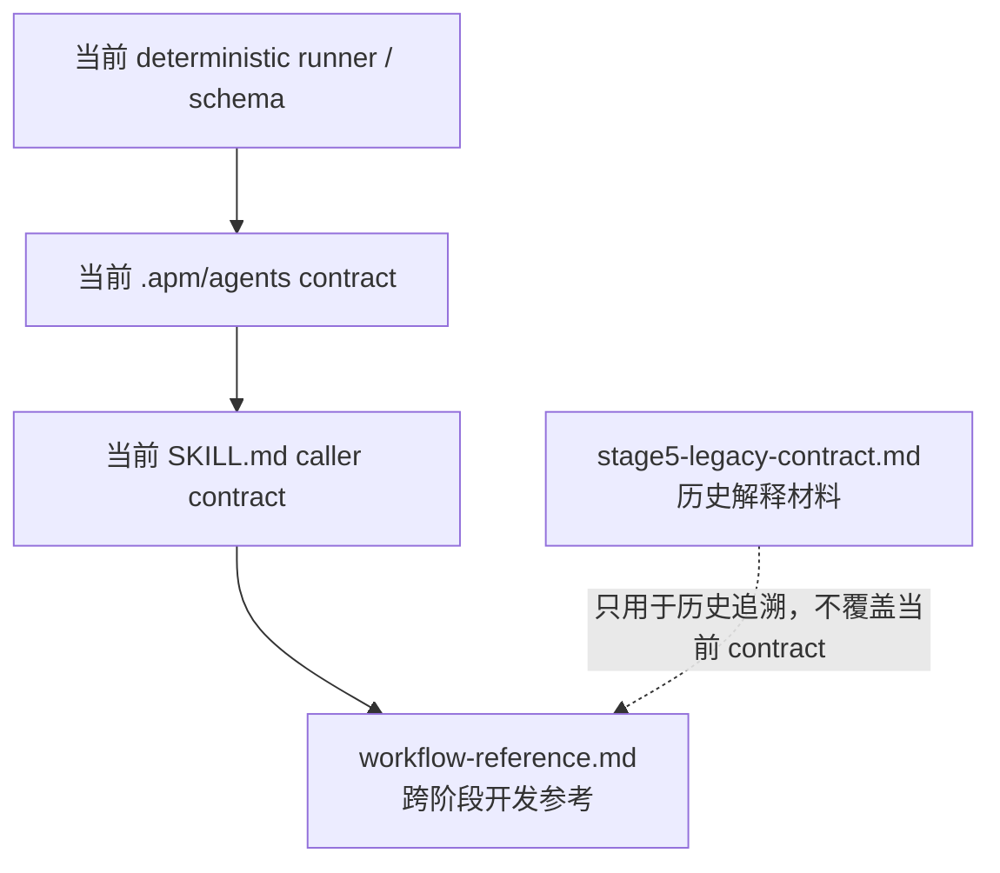

# professor-contact reference index

本目录区分**当前开发参考**与**历史兼容参考**。后续开发不要把两者混用。

## 当前开发参考

- [`workflow-reference.md`](./workflow-reference.md) — 当前 Stage 0–5 业务状态机、机器事实源、跨仓库职责、OpenCode/Codex 共用业务边界。流程图统一使用 Mermaid。
- [`../SKILL.md`](../SKILL.md) — caller contract、精确参数、runner reason code 与阶段执行细节。若精确 schema/CLI 与概览冲突，以当前 runner/agent contract 为准。

## 历史参考

- [`stage5-legacy-contract.md`](./stage5-legacy-contract.md) — **冻结的 Stage 5 历史契约**，保留用于理解迁移前行为。文件内部已经列出被当前 generator agent 覆盖的旧 humanizer / 调用规则。它不是当前 Stage 5 实现说明，不应作为新开发依据。

## 阅读优先级

修改状态机、唯一事实源、stable ID、fingerprint、跨仓库 owner 或 runtime 边界时，应在同一变更中同步检查 `workflow-reference.md`。