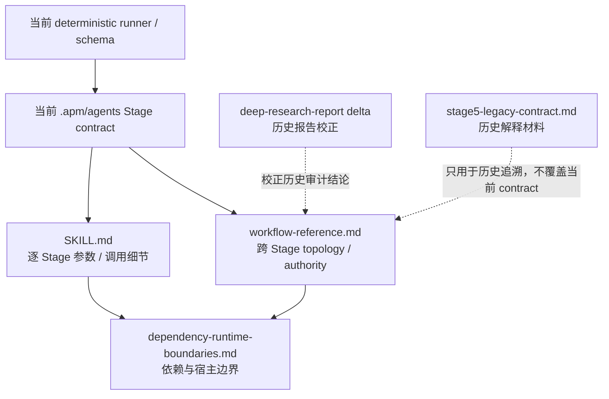

# professor-contact reference index

本目录区分**当前开发参考**与**历史兼容参考**。后续开发不要把两者混用。

## 当前开发参考

- [`workflow-reference.md`](./workflow-reference.md) — 当前 Stage 0–5 **跨阶段业务拓扑**、机器事实源、跨仓库职责、OpenCode/Codex 共用业务边界。流程图统一使用 Mermaid；判断“哪一步是否前置、谁是唯一事实源、formal clustering 是否必需、Stage 1 下载范围”时优先读这里。
- [`dependency-runtime-boundaries.md`](./dependency-runtime-boundaries.md) — 当前 APM/repo 依赖、`base-skills` / browser MCP 已解决的旧依赖结论，以及仍需宿主提供的 Zotero / Chrome / 网络 / KB runtime 边界。
- [`deep-research-report-delta-2026-09-16.md`](./deep-research-report-delta-2026-09-16.md) — 2026-09-03 深度审计报告与当前 producer main 的差异表；用于识别已经退役/已解决/仍成立的历史结论。
- [`../SKILL.md`](../SKILL.md) — caller contract、**逐 Stage 精确参数**、runner reason code 与执行细节。精确字段/schema/CLI 以当前 runner/agent/Stage contract 为准；不要从其中的背景性 screening / `Synergy` 示例反推跨阶段 mandatory topology，跨阶段拓扑由 `workflow-reference.md` 统一说明。

## 历史参考

- [`stage5-legacy-contract.md`](./stage5-legacy-contract.md) — **冻结的 Stage 5 历史契约**，保留用于理解迁移前行为。文件内部已经列出被当前 generator agent 覆盖的旧 humanizer / 调用规则。它不是当前 Stage 5 实现说明，不应作为新开发依据。
- 2026-09-03 的深度审计报告属于历史快照；使用前先读 [`deep-research-report-delta-2026-09-16.md`](./deep-research-report-delta-2026-09-16.md)，不要直接把报告中的当时状态当成当前 contract。

## 阅读优先级

同一层发生冲突时按“机器校验 > 当前 agent Stage contract > 对应职责文档”处理：字段/schema/CLI 看 runner/agent；跨阶段前后关系和事实权威看 `workflow-reference.md`；依赖是否属于 package / consumer / 宿主环境看 `dependency-runtime-boundaries.md`。

修改状态机、唯一事实源、stable ID、fingerprint、跨仓库 owner 或 runtime 边界时，应在同一变更中同步检查 `workflow-reference.md`；修改 package/runtime 依赖时同步检查 `dependency-runtime-boundaries.md`。