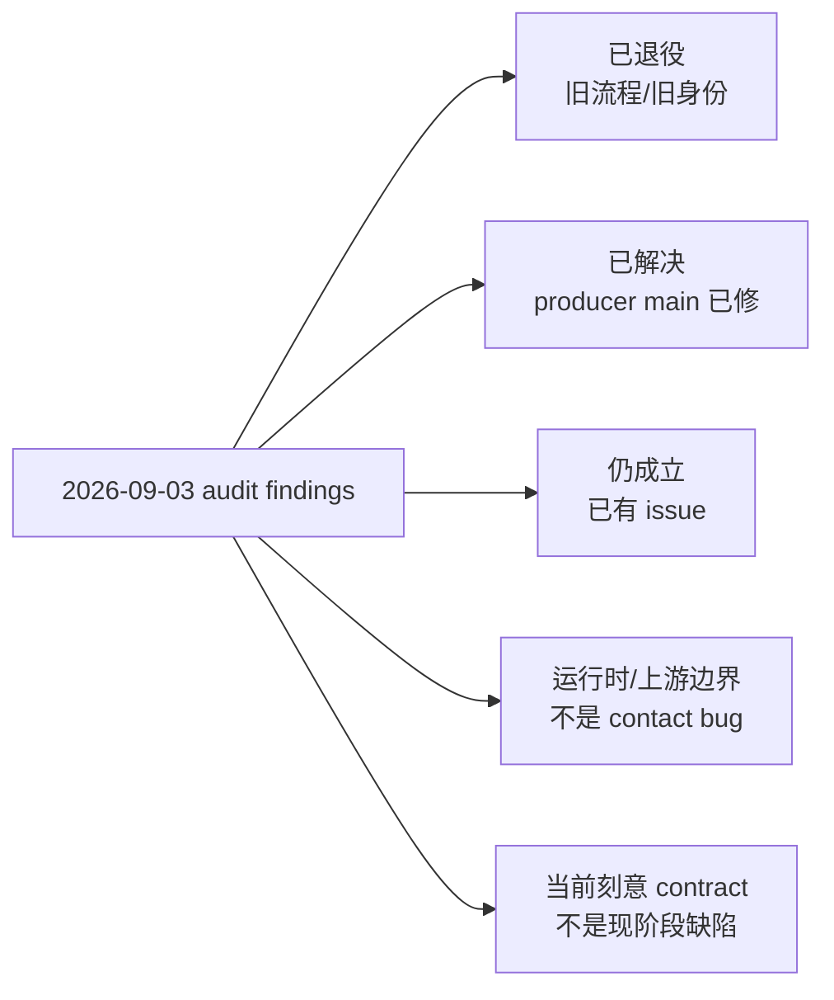
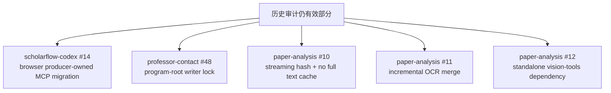

# 2026-09-03 深度审计与当前实现对账

> 基线：2026-09-16。
>
> 本文用于解释历史审计 `deep-research-report.md` 中哪些判断已经过时、哪些已经修复、哪些仍是当前边界或待办。它**不是新的机器 contract**；当前 runner / agent / SKILL contract 仍按 `docs/README.md` 的权威顺序解释。

## 1. 状态总览



当前最重要的变化是：9 月 3 日的报告抓到了一个**正在迁移中的中间态**。此后 Stage 0/1/2 身份、Codex target、Zotero 输入边界、browser MCP ownership、PDF dependency distribution 等都发生了实质变化。因此不能再把旧报告的 pipeline 图或“OpenCode-only”结论当成现行开发依据。

## 2. 逐项对账

| 2026-09-03 结论 | 2026-09-16 状态 | 当前判断 / 证据 | 当前动作 |
|---|---|---|---|
| contact 主链是 preview → professor keep-list → professor-wide `pdf_only` → formal clustering → Zotero `套磁候选` note | **已退役** | 当前为 preview → Stage 0 `direction_id` 选择 → `套磁目标.json` → Stage 1 direction candidate snapshot → candidate `item_keys` 定向补 PDF → Stage 2 full-text resolution | 已更新 `workflow-reference.md`、preview contract、topic-clustering caller flow |
| Stage 0 依赖 Zotero 固定标题 `套磁候选` note | **已退役** | Stage 0 只消费 normalized `方向预筛.json`，长期状态是 `教授研究/套磁目标.json`；无 Stage 0 Markdown | 无新 issue |
| Formal Zotero clustering 是 contact 前置 | **已退役** | `preview:false` 只是可选 Zotero organization projection；不能覆盖 preview/contact 权威 | 已更新 cross-repo reference |
| `collection_key` 是 contact 方向机器身份 | **已退役** | machine identity = stable `direction_id`；Stage 2 后 accepted resolved direction 对 outreach 权威 | 已由 Stage 0–4 schema/runner 实现 |
| `professor-contact` / `professor-research` / `paper-analysis` / browser tools OpenCode-only | **已解决** | 相关 producer manifests 已支持 `targets: [opencode, codex]`；另有 `scholarflow-codex` consumer workspace | 继续按 producer-local + consumer lock 分层维护 |
| Stage 2 无 PDF 时仍直接把 Zotero `item_key` 交给 `paper-analysis` | **已解决** | `professor-contact#1` 已 `closed/completed`；paper-analysis 只接受 text/PDF/text-file/normalized JSON，`item_key` 只作 provenance | 不再作为待办 |
| `paper-analysis` 仍有 deprecated Zotero compatibility branch | **已解决** | 当前 runtime contract 明确禁止 `zotero-read` / 根据 provenance 回查 Zotero | 不再作为待办 |
| `zotero-item-export` 硬编码 `127.0.0.1:23120/mcp` | **已解决可配置性** | `zotero_tools.endpoints` 统一解析 `ZOTERO_HTTP_URL` / `ZOTERO_MCP_URL`，默认值仍保留本机地址 | Zotero 本机服务本身仍属宿主边界 |
| `paper-analysis` / helpers 依赖 `pdf-processing-core @ main`，不可重复构建 | **已解决** | 已迁移到 `scholar-workflow-pdfx` release；root range + lock，PEP 723/helper 固定 `0.1.0` | 不再作为待办 |
| `humanizer-ja` 完全没有 package owner | **已解决（contact 主链）** | `humanizer-ja` 现在由 `ScholarWorkflow/base-skills` 提供；`professor-contact` 显式依赖 `base-skills` | 无新 issue |
| `vision-tools` 在整条 contact 主链里没有 package edge | **部分解决** | `base-skills` 已拥有 `vision-tools`，contact/research closure 能拿到；但 `paper-analysis` standalone `apm.yml` 没有依赖而 agent 仍要求它 | `paper-analysis#12` |
| browser-pdf-tools manifest 完全没有 Codex/native MCP 注册 | **producer 已解决；consumer 尚未升级** | producer `bdb4a862...` 已声明 `chrome-devtools/pdf-chrome/sd-chrome`；当前 `scholarflow-codex` lock 仍停在 pre-migration `73b7c7e...` | `scholarflow-codex#14` |
| browser producer 缺 Python/npm manifest，因此完全不可描述 runtime | **判断需要细化** | Chrome/CDP/登录态仍是宿主环境；但 producer 已通过 APM MCP + wrapper 描述 native server wiring，不再是“完全无注册” | #14 处理 consumer ownership；宿主浏览器仍不打包 |
| `contact_state.py` 原子写但无跨进程锁 | **仍成立** | 有 tempfile/fsync/replace 与 Stage2 proof，但无 program-root writer isolation；存在 read-modify-write lost update 风险 | `professor-contact#48` |
| `atomic_json_many()` 不是 crash-consistent 多文件事务 | **仍成立，低优先级 residual risk** | 普通 exception 可 rollback；SIGKILL/掉电卡在多个 rename 中间仍可能留 mixed generation | 暂未并入 #48；如服务化/高可靠化再单开 durability issue |
| `future_work.py` 用 `read_bytes()` 算整个 PDF hash，并缓存全篇页文本 | **仍成立** | 当前 `prepare()` 仍如此实现 | `paper-analysis#10` |
| `merge-ocr` 要求一次提交全部 required pages | **仍成立** | 当前 subset 仍直接报错；`ocr_resolved_pages` 也会被本轮覆盖 | `paper-analysis#11` |
| “字符串即 API”：Zotero note 标记和 future-work Markdown anchor 都脆弱 | **一半退役、一半保留** | Zotero note 状态触发器已彻底退役；future-work 仍要求两个 exact managed-template anchors，但它是 fail-closed 的内部 patch contract，不再承担用户选择身份 | 暂不立缺陷；若要解除 Markdown patch contract，应单独做结构化 section writer 迁移 |
| 本地 fingerprint 不等于外部事实仍最新 | **显著改善，但仍有 owner boundary** | Stage2 有 artifact/facts/freshness/preflight；Stage5 联系方式有 source-state `--check` + rebuild/recheck + frozen snapshot + age policy | 最新论文发现仍由 upstream collector refresh 负责；不是 contact 自己轮询互联网 |
| 61 个 browser/site adapters 高维护 | **仍成立的运维特性** | publisher DOM、cookie、VPN、反自动化变化仍是外部高维护面 | 不作为单一 correctness issue；下载失败按现有 deterministic status/degraded 路径处理 |
| Sci-Hub fallback 是可用性/合规/稳定性风险 | **当前刻意 source policy** | professor-research 仍明确保留此 fallback；不是当前实现 bug | 不在 contact repo 偷偷删除；若要改 source policy，应单独产品决策 |
| `knowledge-tools` 需要 Bun/KB server，安装不自包含 | **仍属可选宿主能力** | `kb_import` 是 Stage2 opt-in，不是 contact canonical success path 的前置 | 不作为主链 blocker |
| 缺 `boshu-collector`，不能从原始招生页面零状态启动 | **仍是上游产品边界** | professor-research/contact 仍从已有 boshu-output 风格 `program_root` 开始；这不是 Stage 0–5 应补的职责 | 已在 dependency/runtime reference 明示；不在 contact repo越界造 upstream collector |
| 顶层 README 缺失，开发入口难发现 | **已改善** | contact/research/paper-analysis/scholarflow-codex 已增加或补充顶层入口和 current workflow reference | 后续随 contract 同步维护 |
| Stage 2 是最大 token 热点，full-paper×多 agent 成本高 | **方向仍成立，数值已过时** | 现在已有 early `reuse_all` preflight、candidate-union idempotency、ChatGPT handoff、direction/facts cache；full analysis 范围的 correctness contract 也已变化 | 旧 token 数值不得用于当前容量结论；需要实际 telemetry 才重新预算 |
| 最佳 ChatGPT 化方式是另做一套简化 workflow | **已被当前 Codex 迁移路线替代** | 当前策略是 producer-local 双 target + locked consumer projection，而不是复制第二套事实源/状态机 | `scholarflow-codex` 只做锁定/投影/acceptance，不重定义 Stage 0–5 |

## 3. 当前真正需要跟踪的开发项

### 3.1 已开 issue



- `ScholarWorkflow/scholarflow-codex#14` — dependency refresh 时把 browser MCP canonical ownership 移交 producer，加入 transitive MCP trust，解耦 normalizer server allowlist 与 consumer launcher inventory，并做 Codex native `pdf-chrome:list_pages` 验收。
- `ScholarWorkflow/professor-contact#48` — `contact_state.py` 的短生命周期 program-root writer lock，主回归是并发 Stage 4 preserved selection 不再 lost update。
- `ScholarWorkflow/paper-analysis#10` — `future_work.prepare()` streaming SHA + 单遍 selected-page candidate extraction，输出 contract 不变。
- `ScholarWorkflow/paper-analysis#11` — partial OCR merge / resume，全部 required pages 完成前仍 fail closed，不生成权威 sidecar。
- `ScholarWorkflow/paper-analysis#12` — standalone package 显式声明 `base-skills` / `vision-tools` owner edge，clean consumer 可发现依赖。

每个 issue 都已经按 Project Consensus + Test Engineer Rule 写入 deterministic/clean-consumer/runtime（仅必要时）Recipe；没有把 shared fixtures 当产品补丁仓库。

## 4. 当前暂不立 issue 的残余风险

### 4.1 `atomic_json_many()` 硬中断 durability

这和 #48 是不同问题：#48 防**并发 writer lost update**；它不保证进程在两个 `os.replace()` 之间被 SIGKILL/掉电时的跨文件事务。

当前 Stage 4 pair：

```text
套磁选择.json
邮件输入.json
```

仍然只是 best-effort rollback。对当前本地、低并发交互式工作流，这是低于 writer lock 的优先级；如果未来把 contact runner 变成长期服务或允许无人值守并发，应考虑 WAL/transaction manifest、单一 canonical Stage4 envelope，或 SQLite。

### 4.2 exact Markdown anchors

当前 future-work patch 仍要求：

```text
## 局限性与批判性评价
## 对自身研究的帮助评估
```

这确实是字符串 contract，但当前分析 Markdown 是受管产物，而且 helper 对 anchor 不匹配会 fail closed，不会猜位置写错证据。因此现在更接近“严格模板接口”而不是未修 bug。

如果未来允许人类自由改 analysis section 标题，同时仍要求自动 patch，应把 section identity 放进结构化 sidecar/frontmatter，然后由 deterministic renderer 生成显示标题；这应作为单独迁移，不和 #10/#11 混做。

### 4.3 external discovery freshness

本地 fingerprint 只能证明“已知输入没变”，不能凭空发现教授刚发表的新论文。当前正确 owner 是：

```text
professor-collector refresh
  -> papers.json / contact evidence source state
  -> downstream exact fingerprints / preflight
```

Stage 2/5 不应该为了解决这个问题自己重新发明全网 professor crawler。

## 5. 如何使用旧审计报告

历史报告仍然有价值的部分：

- 对“确定性 runner / 模型判断 / 外部 adapter”分层的观察；
- 对 atomic file replacement 与 cross-process isolation 不同职责的提醒；
- 对 browser/site automation 维护成本的判断；
- 对 PDF evidence/OCR 资源使用的具体代码审计；
- 对 program-root 作为跨阶段状态边界的认识。

以下内容不再可直接执行：

- 旧 Stage A–M pipeline 图；
- Zotero `套磁候选` note 作为 Stage 0 prerequisite；
- professor keep-list 作为 contact PDF canonical scope；
- formal clustering 作为 contact 前置；
- OpenCode-only / “ChatGPT 只能另做一套”结论；
- raw `item_key → paper-analysis` 迁移待办；
- hard-coded Zotero endpoint 待办；
- moving `@main` pdf-processing dependency 待办；
- “humanizer-ja 完全无 owner”结论；
- “browser producer manifest 没有 MCP”作为 producer-main 现状。

后续开发应从：

1. `docs/workflow-reference.md`；
2. `docs/dependency-runtime-boundaries.md`；
3. 当前 `SKILL.md` / agents；
4. deterministic runner/tests；

向下追，而不是从 9 月 3 日报告反推现行 contract。
