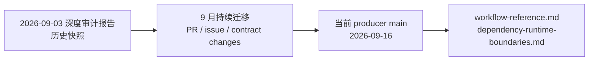
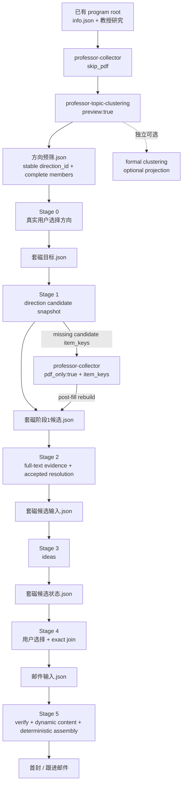

# 2026-09-03 深度审计报告：当前状态差异

> 本文用于解释 `deep-research-report.md` 一类 2026-09-03 审计材料与当前仓库状态之间的差异。旧报告仍可用于理解迁移背景，但**不是当前工作流事实源**。
>
> 当前业务流程以 `workflow-reference.md`、当前 agent contract、deterministic runner/schema 与跨仓库 downstream contract 为准。

## 为什么需要这份差异表

9 月 3 日的报告准确记录了当时读取到的实现，但随后项目连续进行了 Stage 0–5 状态机、preview contract、Codex 适配、依赖声明、PDF fast path、Stage 5 immutable-template/contact-evidence 等迁移。因此，报告中的若干“已确认问题”已经被解决，若干主流程已经被替换，还有一些宿主环境限制仍然存在。

## 关键结论差异

| 旧报告中的结论 | 当前状态 | 当前应如何理解 |
|---|---|---|
| Stage 0 依赖 Zotero 固定标题 `套磁候选` note | **已退役** | Stage 0 直接消费 normalized `方向预筛.json`，用户选择稳定 `direction_id`，写 `教授研究/套磁目标.json`；无 Stage 0 Markdown |
| preview 后用户先定 professor keep-list，再 professor-wide `pdf_only` 补全文 | **不再是 contact canonical path** | Stage 1 先构建 selected-direction candidate snapshot，只把缺失候选 `item_keys` 交给 `professor-collector(pdf_only:true, item_keys=...)` |
| formal topic clustering 是 contact 前置 | **已退役为前置条件** | `preview:false` 是可选 Zotero 组织投影；Stage 2 accepted full-text resolved direction 才是 outreach 权威 |
| Stage 0 输出 `套磁候选总览.md` | **已退役** | Stage 0 长期机器状态只有 `套磁目标.json`；人读材料来自 preview 与后续受管 projection |
| Zotero direction `collection_key` 是套磁方向身份 | **已退役** | canonical identity 是 preview/resolved `direction_id`；`collection_key` 只保留兼容 join / display provenance |
| professor-contact PR #2 “Stage 2 normalized input router” 仍 open | **已合并** | PR #2 于 2026-09-03 08:19 UTC 合并；Stage 2 no-PDF fallback 已迁到 normalized paper input 边界 |
| `professor-contact` / `professor-research` 是 OpenCode-only | **已改变** | 两个 producer 的 `apm.yml` 当前均为 `targets: [opencode, codex]`，并有 target-aware agent contract |
| `browser-pdf-tools` manifest 没有 native Chrome MCP 注册 | **已改变** | 当前 manifest 同时支持 OpenCode/Codex，并声明 `chrome-devtools` / `pdf-chrome` / `sd-chrome` stdio MCP entries |
| `humanizer-ja` / `vision-tools` 是没有 package edge 的外部 skill | **已改变** | 两者现位于 `ScholarWorkflow/base-skills`；`professor-contact` 与 `professor-research` manifest 都显式依赖 `base-skills` |
| Stage 5 对整封邮件做 humanizer | **已退役** | 模板/整封邮件不可 humanize；仅允许在模板拼装前对模型动态字段做可选 business polish，follow-up 正文不做整封 humanize |
| Stage 5 直接通过旧 5 级阶梯重找邮箱 | **已改变** | Stage 4 先把 `_联系方式证据.json` 教授记录冻结进 `邮件输入.json`；Stage 5 live checker/rebuild 只验证 freshness/fingerprint，变化必须回 Stage 4 重冻结，证据不足/冲突才升级 lookup |
| Markdown / cluster state 可以作为后续事实输入 | **已收紧** | 受管 Markdown 是 projection；Stage 3 唯一事实源是 `套磁候选输入.json`，Stage 5 研究与收件事实源是 `邮件输入.json` |

## 当前主链

## 仍然成立的报告结论

旧报告中以下架构观察仍然有效：

- JSON contract + deterministic runner + 模型语义判断的分层仍是主设计；
- program root / persisted state 是业务边界，不应从用户数据目录推导 skill 安装路径；
- Zotero Desktop、Chrome/CDP、网络、登录/VPN/cookie 等仍属于宿主环境条件，APM package edge 不能把它们变成纯仓库依赖；
- knowledge import 仍应被视为可选增强，而不是 professor-contact 主链必须前置；
- future-work 证据继续要求作者明说 / 精确 sidecar，不允许把普通 limitation 自动升级成作者 future work；
- producer `main` 与 `scholarflow-codex` consumer 的 `apm.lock.yaml` 必须分开判断：producer 修复不等于 consumer 已升级。

这些仍然成立的内容已经整理进 `dependency-runtime-boundaries.md` 和 `workflow-reference.md`，开发时应优先读当前文档，而不是从旧报告中摘取单条结论。

## 仍需注意但不能误归类的问题

### 上游 program root 起点

`professor-research` 仍以已有 boshu-output 风格 program root 作为主要业务输入。只有原始招生网页而没有 program root 时，需要上游招生资料收集能力；这不是 contact Stage 0–5 应偷偷补做的职责。

### 宿主环境并未消失

双 target 与 MCP/package 声明解决的是**安装和调用 contract**，不是桌面环境本身。真正进入 Zotero / browser download / KB runtime 的路径仍必须满足对应宿主条件。

### producer 与 consumer 的版本差

任何“现在已经修复”的判断都必须标明是在 producer `main` 还是当前 consumer lock 中。更新 producer 文档时不能顺便假设 `scholarflow-codex` 已经升级；consumer 升级必须走 pin / lock / bootstrap / acceptance 流程。

## 阅读顺序

1. 当前业务状态机：`workflow-reference.md`。
2. 当前 package / runtime / producer-consumer 边界：`dependency-runtime-boundaries.md`。
3. Stage 0–5 的精确 caller/agent contract 与 deterministic runner/schema。
4. 只有需要理解迁移历史时，再回看 2026-09-03 深度报告或 `stage5-legacy-contract.md`。
