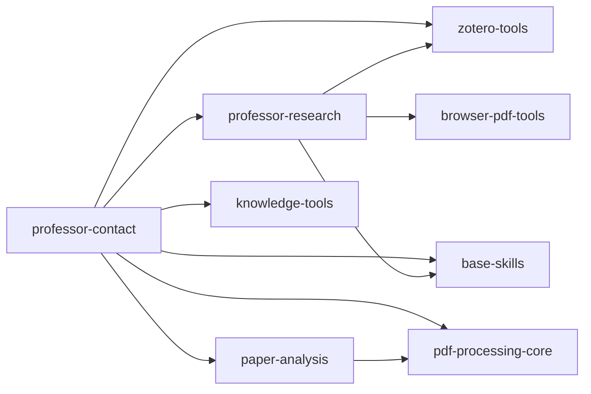
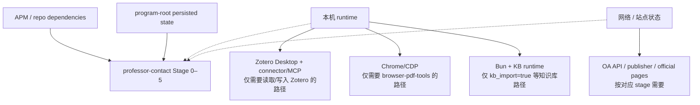

# 当前依赖与运行时边界

> 基线：2026-09-16。本文只说明 `professor-contact` 主链当前的 package / repo 依赖和仍需宿主环境提供的运行条件；阶段状态机本身见 `workflow-reference.md`。

## 1. 声明依赖图

`professor-contact/apm.yml` 当前声明：

- `ScholarWorkflow/zotero-tools`
- `ScholarWorkflow/knowledge-tools`
- `ScholarWorkflow/paper-analysis`
- `ScholarWorkflow/pdf-processing-core`
- `ScholarWorkflow/professor-research`
- `ScholarWorkflow/base-skills`

`professor-research/apm.yml` 当前声明 `zotero-tools`、`browser-pdf-tools`、`base-skills`。`paper-analysis`、`knowledge-tools`、`browser-pdf-tools`、`zotero-tools` 与两个主 producer 均已声明 `targets: [opencode, codex]`。

这张图描述 APM/package 层，不代表所有桌面服务和网络条件都能由 APM 安装。

## 2. 旧审计中已经解决或改变的项

### `humanizer-ja` / `vision-tools` 不再是未声明的孤立 runtime skill

两者现在都位于 `ScholarWorkflow/base-skills/.apm/skills/`；`professor-contact` 和 `professor-research` 都显式依赖 `ScholarWorkflow/base-skills`。同一个包还提供 `zotero-save` 与 `scihub-ask`。

因此当前依赖图里，Stage 5 动态字段使用 `humanizer-ja`、Stage 2/OCR 路径使用 `vision-tools` 时，不应再把它们描述成“完全没有 package edge 的外部 skill”。是否可调用仍取决于 consumer 安装/投影是否正确，但这是安装/runtime 可达性问题，不是 manifest 完全缺边。

### `paper-analysis` 已完成 Zotero 边界解耦

当前 `paper-analysis` caller contract 只接受 pasted text、绝对 PDF、`.txt/.md` 或 normalized paper-input JSON；`item_key` / `source` 在 normalized JSON 中只作 provenance。它明确规定：

> Zotero-aware caller 必须在上游把 fallback metadata / abstract 规范化，再只把 JSON 文件路径交给 `paper-analysis`。

因此不要再维护“paper-analysis 自己打开 Zotero / MCP”的新代码。教授联系 Stage 2 的 Zotero 读取和 normalized input 准备属于 caller/analyzer 侧职责。

### `browser-pdf-tools` 已把 Chrome MCP 注册写入 APM manifest

当前 `browser-pdf-tools/apm.yml` 除了同时支持 OpenCode/Codex，还声明了 `chrome-devtools`、`pdf-chrome`、`sd-chrome` 三个 stdio MCP entry，并通过安装后的 `browser-pdf-core/chrome-mcp-wrapper.sh` 解析 consumer-local runtime 路径。

所以“APM manifest 完全没有描述 Chrome MCP”已经不是现状。Chrome 本体、浏览器会话、登录/VPN/cookie 等仍是宿主环境条件；manifest 解决的是 MCP 注册与 wrapper 路由，不是把浏览器环境本身打包进 repo。

## 3. 当前仍属于宿主环境的条件

- **Zotero**：Stage 0、Stage 1 candidate build 与 Stage 2 `reuse_all` 可以完全不依赖 Zotero 在线；Stage 1 真正补 PDF、Stage 2 慢路径读取 Zotero 元数据/附件时才需要对应本地服务。
- **Chrome/CDP**：由 `browser-pdf-tools` 使用。Stage 1 只有在 collector 的下载路由实际进入浏览器路径时才需要；它不是 Stage 0–5 每次运行的全局前置。
- **网络**：preview 摘要补全、PDF 获取和 Stage 5 必要时的官方网页核验都可能使用网络，但 deterministic runner、fingerprint、状态 join 与大多数重跑缓存逻辑是本地的。
- **知识库**：`kb_import` 是 Stage 2 可选增强。不开启时不应把 KB runtime 当成 contact 主链的阻塞前置。

## 4. program-root 是业务状态边界，不是 skill 安装目录

不要从 `program_root` 反推 skill checkout、MCP wrapper 或脚本安装位置。程序根只存用户/程序数据；skill/agent/helper 必须从 consumer 安装投影或 producer checkout 的明确 locator 解析。

当前尤其重要的例子：

- Stage 5 联系方式 freshness checker 的 locator 不从 program root 推导；
- Stage 2/Stage 1 deterministic helper 应从已安装 `professor-contact` skill dir 执行；
- `browser-pdf-tools` MCP wrapper 从 consumer cwd 向上找安装后的 `.agents/skills/browser-pdf-core/...`，不是从用户数据目录猜源码路径。

## 5. 开发判断规则

遇到“缺依赖”时先区分三层：

1. **package edge 缺失**：需要修改 `apm.yml` / package dependency；
2. **consumer 安装/投影不可达**：依赖已声明，但当前 Codex/OpenCode 安装没有正确部署；
3. **宿主环境不可用**：Zotero、Chrome、网络、登录态等服务未就绪。

不要把第 2/3 类问题重新伪装成业务状态机默认值，也不要为了让 non-interactive eval 通过而在生产 contract 中自动选择网络访问、用户选择或外部服务状态。
