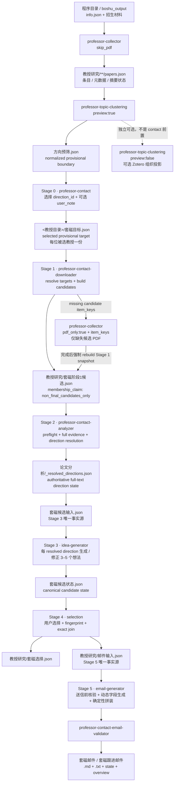
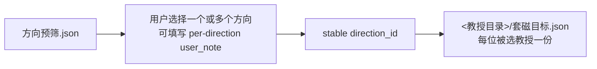
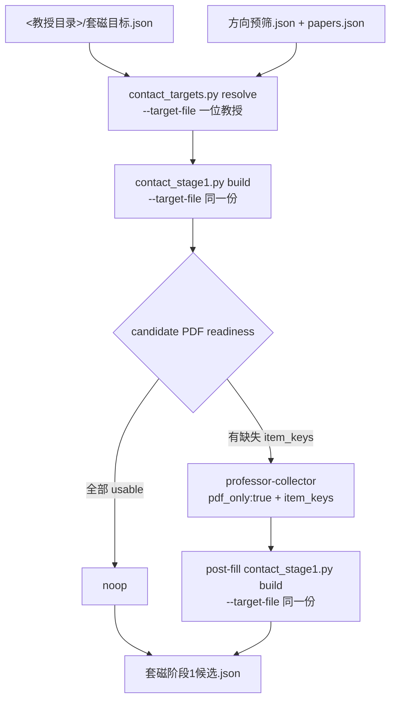
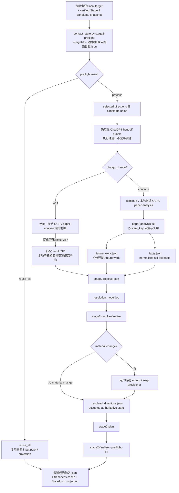
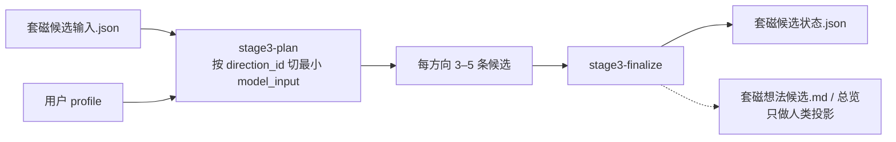
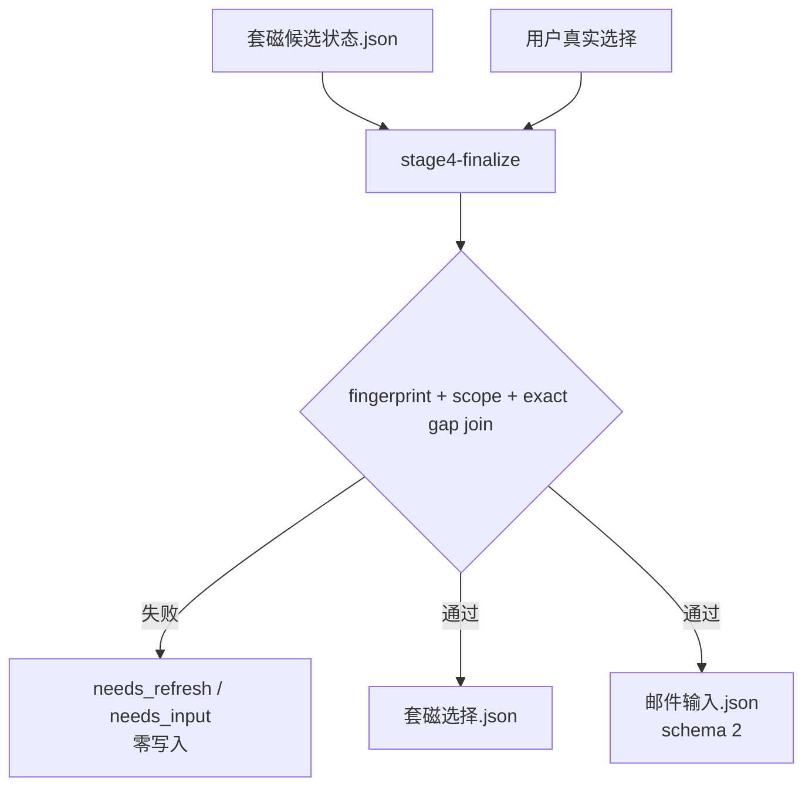
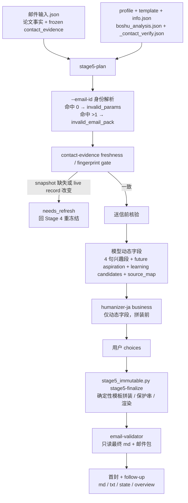
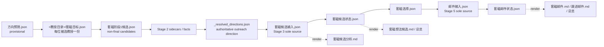
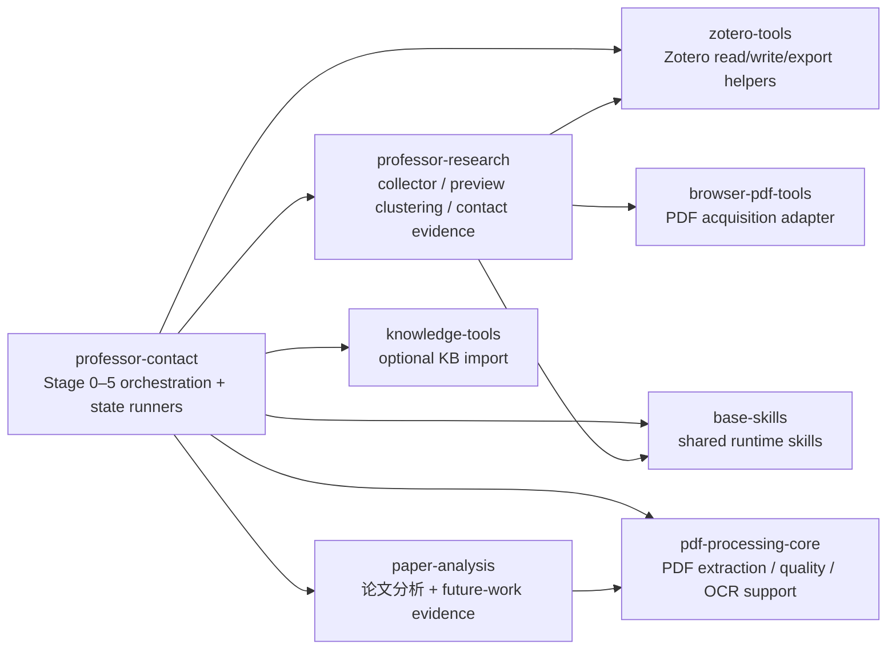
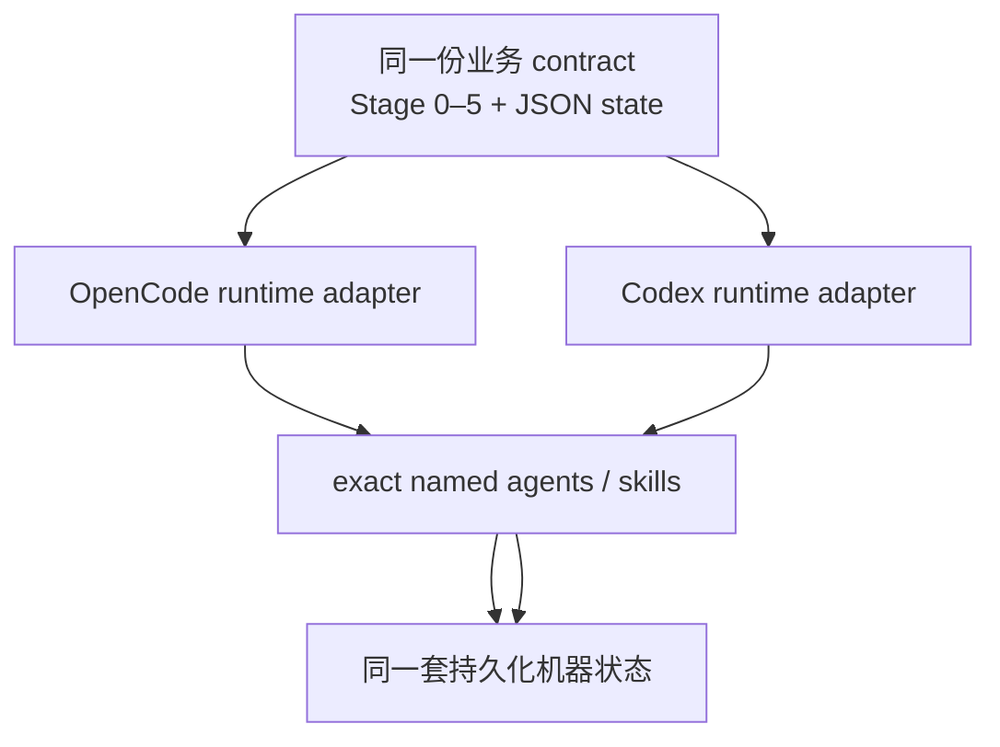

# Professor-contact 当前工作流参考

> 本文是 `professor-contact` 跨仓库开发时的**当前业务流程参考**。它描述机器事实源、阶段边界、跨仓库职责和允许的数据流，不替代各 agent / runner 的精确输入 schema。
>
> 当本文与实现冲突时，以当前 producer 仓库的 deterministic runner、schema 校验和 agent contract 为准；改变这些 contract 的 PR 应同步更新本文。
>
> 更新基线：2026-09-29。当前 `professor-contact` / `professor-research` 均支持 `opencode` 与 `codex` 两个 target；runtime 的委派方式不同，但本文中的业务状态机和事实源边界相同。

## 1. 当前总原则

1. **Stage 0 不再使用 Zotero 固定标题 `套磁候选` note。** 当前选择入口是 `professor-topic-clustering(preview:true)` 产出的 normalized `方向预筛.json`，机器方向身份是稳定 `direction_id`。
2. **正式 Zotero 聚类不是 professor-contact 前置条件。** `preview:false` 的正式聚类是可选的 Zotero 组织投影；outreach 的方向权威在 Stage 2 全文证据解析后形成。
3. **Stage 1 不再先给“保留教授”全量补 PDF。** 它先按被选方向构建保守高召回候选集，再仅把缺 PDF 的 `item_key` 交给 `professor-collector(pdf_only:true, item_keys=...)`。
4. **Stage 2 是学术证据与方向归属的权威层。** preview membership 只是 provisional；全文 facts / future-work sidecar 与 resolved-direction 状态决定后续 outreach 事实。
5. **Stage 3 与 Stage 5 都有唯一事实源。** Stage 3 只消费 `套磁候选输入.json`；Stage 5 只以 `邮件输入.json` 为研究与联系方式冻结事实源，再加 profile/template/info/boshu/verify 等被允许的非论文输入。
6. **Markdown 是人类投影，不是反向输入。** 受管 Markdown 不得被后续阶段重新解析成机器状态。
7. **模型只做语义判断；确定性 runner 负责身份、join、fingerprint、缓存、校验、原子写与渲染。**

## 2. 端到端主流程

### 与旧流程相比已经退役的路径

- Zotero 固定标题 `套磁候选` note → Stage 0 target state；
- 程序级 `教授研究/套磁目标.json`（schema 1 / kind `professor-contact-targets`）作为 Stage 0 权威 → 现为纯迁移输入，只由 `contact_targets.py migrate` 读取一次并逐条 fan-out 成各教授自己的 local target；
- `教授研究/套磁候选总览.md` 作为 Stage 0 机器/人类输出；
- 先按 professor keep-list 给教授全部论文补 PDF，再进入 contact；
- 用 Zotero direction `collection_key` 作为套磁方向机器身份；
- 正式 Zotero clustering 作为 professor-contact 的前置步骤；
- Stage 3/5 回读上游 Markdown、Zotero 或论文 PDF 重新构造事实。

历史文件可以保留，但不能重新进入当前状态机。

## 3. 各阶段职责与权威产物

| Stage | 主要执行者 | 当前输入边界 | 当前权威输出 | 下游约束 |
|---|---|---|---|---|
| 0 | `professor-contact` | normalized `方向预筛.json` | 逐教授 `<教授目录>/套磁目标.json`（每位被选教授一份） | 使用稳定 `direction_id`；一次 `select` 只提交一位教授；无 Stage 0 Markdown |
| 1 | `professor-contact-downloader` | 该教授的 local target + preview + `papers.json` | `教授研究/套磁阶段1候选.json` | 一次只 `resolve`/`build --target-file` 一位教授；快照按教授 merge，不挤掉其他教授条目；仅候选集；归属声明必须是 non-final |
| 2 | `professor-contact-analyzer` + `paper-analysis` | 该教授的 local target + verified Stage 1 snapshot + 本地论文证据 | `_resolved_directions.json`、`套磁候选输入.json` | 全文 resolved direction 对 outreach 权威；input pack 是 Stage 3 唯一事实源 |
| 3 | `professor-contact-idea-generator` | `套磁候选输入.json` + profile | `套磁候选状态.json` | 不读 Markdown / `_index.json` / sidecar；默认每方向 3–5 条 |
| 4 | `professor-contact-selection` | `套磁候选状态.json` + 用户真实选择 | `套磁选择.json`、`邮件输入.json` | exact `direction_id` / `(direction_id,item_key,gap_id)` join；过期零写入 |
| 5 | `professor-contact-email-generator` | `邮件输入.json` + profile/template/info/boshu + verify cache | 邮件 md/txt、跟进邮件、`套磁邮件状态.json`、总览 | `邮件输入.json` 是论文事实与冻结联系方式的唯一事实源 |

## 4. Stage 0：从 preview 选择目标方向

Stage 0 直接消费 `方向预筛.json` 的 normalized contract。至少依赖：

- `preview_fingerprint` / `preview_fingerprint_version`；
- `direction_id_version`；
- `membership_mode: overlap_allowed`；
- 每方向稳定 `direction_id`；
- 完整 `members[]`，每个 member 含 `item_key` 与 `preview_confidence`；
- `member_fingerprint`；
- 人读名字、summary、representatives。

用户可以多选方向，并为每个方向提供 `user_note`。A/B/C、方向显示名与 Zotero collection key 都不是机器身份。

Stage 0 的权威状态是**每位被选教授一份、只描述该教授自己**的 `<教授目录>/套磁目标.json`（schema 2 / kind `professor-contact-target`，无 `targets[]` 信封、无程序级索引文件）。路径由被校验的 preview 反推（`<preview 的父目录>/套磁目标.json`），调用方不传也不猜。一次 `select` 是一位教授的原子事务；多教授请求逐笔提交，已提交的教授绝不因后续教授失败而回滚或被重写。旧程序级 `教授研究/套磁目标.json` 只由 `contact_targets.py migrate` 一次性逐条 fan-out 读取，运行期 select/resolve/Stage 1/Stage 2 一律不再读它。

当被选方向的成员 `item_key` 集合变化或方向消失时，需要回到 Stage 0 重新确认；未选方向变化、纯 display 变化以及不改变成员身份的投影变化不能被当成整个 contact workflow 的无条件失效信号。

## 5. Stage 1：方向候选集与 item-scoped PDF fill

Stage 1 的候选集是**保守高召回输入范围**，不是最终方向归属。候选来源可以包括 provisional members、低置信成员、与被选方向有本地廉价证据重叠的他向/未安置论文，以及用户显式点名论文。

关键边界：

- `item_keys` fast path 与 professor keep-list 是两种不同语义；contact Stage 1 只能使用 item-scoped fast path。
- `item_keys` 与 `professors` 不得同时用于 Stage 1 的定向补下。
- Stage 1 一次只处理一位教授：`resolve`/`build`/`verify` 都要求显式 `--target-file <教授目录>/套磁目标.json`，绝不回退读旧程序级表；快照内其他教授的条目由按教授 merge 保留。
- `access_mode` 只有在 caller 已取得真实用户决定时才显式传 `oa_only|allow_non_oa`；不得在生产 contract 中偷偷造默认值。
- collector 修改 `papers.json` 后必须重建 Stage 1 snapshot；Stage 2 只能消费 post-fill snapshot。

## 6. Stage 2：证据、handoff 与 authoritative direction resolution

Stage 2 是当前最重要的学术权威边界。它首先做 cheap preflight；缓存证明完整时可以在 Zotero/PDF/OCR/model 之前 `reuse_all`。未命中时才进入全文证据链。

### Stage 2 的事实优先级

- `.future_work.json`：作者明确 future-work 引用证据的权威 sidecar；不能把一般 limitation 推断成作者明说 future work。
- `.facts.json`：全文论文事实的规范化机器 sidecar；其 input fingerprint / future-work join 必须有效。
- `_resolved_directions.json`：preview provisional membership 经全文证据修正后的 outreach 方向权威状态。
- `套磁候选输入.json`：Stage 2 对下游暴露的最小规范事实包；Stage 3 不得绕过它回读上述内部文件。

ChatGPT handoff 只是“谁执行高成本逐论文分析”的可选传输层。外部 ZIP 不能直接提供权威 `_index.json`、future-work sidecar、facts sidecar、gap ID、resolved state 或 `套磁候选输入.json`；这些都必须经过本地 deterministic validator / finalize。

## 7. Stage 3：按 resolved direction 生成候选想法

约束：

- 默认逐 resolved `direction_id` 独立生成；显示名和 `collection_key` 不决定身份。
- `gap_refs` 必须精确到 `(direction_id, item_key, gap_id)`。
- cross-direction 候选是显式 opt-in；未传 `cross_direction_groups` 时不得偷偷生成跨方向 job 或 section。
- profile 变化影响 Stage 3/4，而不要求重跑 Stage 2 学术事实。

## 8. Stage 4：真实用户选择与邮件包编译

Stage 4 的选择源是 `套磁候选状态.json`，不是 Markdown。没有真实用户选择就不能 finalize。

`邮件输入.json` 编译并冻结：

- 选中 idea 与 `direction_ids`；
- 方向 display provenance；
- 按 `item_key` 去重的论文短证据；
- 每条 gap 的精确 `direction_id` / `item_key` / `gap_id`；
- red lines / allowed sources / source hash；
- 上游 `_联系方式证据.json` 中该教授的 contact evidence snapshot 与 record fingerprint。

从这一刻起，Stage 5 不再重构论文事实。

## 9. Stage 5：唯一邮件事实源、冻结联系方式与确定性拼装

联系方式的关键语义：

- 邮件真正采用的收件地址来自 `邮件输入.json` 内冻结的 `contact_evidence`；
- live `_联系方式证据.json` / rebuild 只用于确认 source-state freshness 与 fingerprint；
- live/rebuild record 发生变化时，Stage 5 **不能直接采用新地址**，必须 `needs_refresh` 回 Stage 4 重编译邮件包；
- `_contact_verify.json` 才是送信核验 cache，但不能替代邮件包的冻结事实边界。

humanizer 的当前边界：只润色模型动态字段，且发生在模板拼装前。Subject、模板固定文字、用户选择短语、整封首封/跟进成品都不能交给 humanizer 重写。

单封定向范围（Issue #59）：`stage5-plan` 与 `stage5_immutable.py stage5-finalize` 都可以带 `--email-id <id>`；同一次定向运行的每次调用必须传**同一个 `email_id`**。runner 先按 `email_id` 解析出本次唯一范围，再依次做 `professor_dir` 归属、contact-evidence 新鲜度/指纹、`_contact_verify.json`、`套磁邮件状态.json`、result、choices、模板与写盘校验。因此无关条目的损坏或非 dict 形状既不会阻断这一封，也不会被读取或被写入；被选条目自身仍走全部既有 fail-closed 检查（含收件人权威）。找不到该 id → `invalid_params`（`email_id not found: <id>`）；同一 id 在包内出现多次 → `invalid_email_pack`，绝不按数组位置或教授名猜。

定向 finalize 是这一封邮件的事务：只写被选邮件的 md/txt 与 `套磁邮件状态.json`，不重建程序级 `套磁邮件总览.md`、不做聚合的投影冲突检测；总览已存在则结果 `overview_md` 给出其路径，不存在则为 `null`。批量（不带 `--email-id`）继续处理包内全部邮件并照旧重建聚合。校验侧同样按范围收敛：`professor-contact-email-validator` 只跑本次渲染出的那对 md，validation 文件只写被选输出的 id，`stage5-record-validation` 沿用 `--professor-dir` + `--validation-file`（它只记录调用方给出的那些行，因此不新增 `--email-id`）。

## 10. 机器事实源与人类投影

**禁止反向箭头。** Markdown 的人手修改不能被解析回机器事实；受管投影冲突应返回 `needs_decision`，需要保留的用户内容必须通过正式机器入口写回状态。

## 11. 跨仓库职责

这张图表达 producer 责任边界，不代表每一次 Stage 都会调用所有依赖。比如 Stage 3/4 不应该因为 manifest 存在 Zotero 依赖就重新读取 Zotero。

## 12. 双 runtime 边界

`professor-contact` 与 `professor-research` 当前 manifest 都是 `targets: [opencode, codex]`。业务状态机只有一份，但委派与用户输入边界按 runtime 适配：

- OpenCode 继续保留原生 Task / `question` / permission / depth 语义；
- Codex 使用安装后的 exact named custom agents，non-interactive 用户选择通过业务级 `needs_input` → 下一轮 fresh root invocation + 显式选择完成；
- 不把某一 runtime 的私有函数签名写成跨 runtime 产品 contract；
- 不允许为 Codex 适配而破坏既有 OpenCode production contract。

## 13. 修改工作流时的开发检查表

变更任何阶段时，开发者至少核对：

- owner repo 是否正确，是否把别的 repo 的实现责任搬进本 repo；
- 是否改变了上游/下游 JSON contract、stable ID、fingerprint 或唯一事实源；
- 是否误把 Markdown、Zotero projection、handoff bundle 或 cache 提升成权威事实；
- 是否让 Stage 1 下载范围从 candidate item keys 意外扩大回 professor-wide；
- 是否让 preview / formal clustering / full-text resolved direction 的权威层级倒置；
- 是否让 Stage 3/5 回读被禁止的上游材料；
- 是否在没有真实用户选择时写入了选择状态；
- 是否同时维护 OpenCode 与 Codex 的业务等价语义，而不把 runtime-specific API 混成一套。

如果变更触及测试或验收，测试方法、证据和 merge gate 以 Project Consensus 为准；产品测试留在 producer repo，fixture 仓库只承担共享测试资产与隔离运行环境。
