# professor-contact

`professor-contact` 是 ScholarWorkflow 的套磁编排与状态机仓库，负责从用户选中的教授研究方向，一路生成可追溯的研究想法、用户选择状态与首封/跟进邮件。

当前仓库同时面向 `opencode` 与 `codex`；两个 runtime 的委派方式不同，但共享同一套 Stage 0–5 业务状态与机器事实源。

## 当前流程

```mermaid
flowchart LR
    PRE["方向预筛.json"]
    S0["Stage 0<br/>方向选择"]
    T["套磁目标.json"]
    S1["Stage 1<br/>候选集 + 定向补 PDF"]
    C["套磁阶段1候选.json"]
    S2["Stage 2<br/>全文分析 + resolved directions"]
    I["套磁候选输入.json"]
    S3["Stage 3<br/>3–5 个想法 / 方向"]
    ST["套磁候选状态.json"]
    S4["Stage 4<br/>用户选择"]
    M["邮件输入.json"]
    S5["Stage 5<br/>核验 + 邮件生成"]
    O["首封 + follow-up"]

    PRE --> S0 --> T --> S1 --> C --> S2 --> I --> S3 --> ST --> S4 --> M --> S5 --> O
```

Stage 0 不再使用 Zotero 固定标题 `套磁候选` note；Stage 1 的 canonical 下载范围是方向候选 `item_keys`；正式 Zotero clustering 是可选组织投影；Stage 3 与 Stage 5 分别以 `套磁候选输入.json` 与 `邮件输入.json` 为唯一事实源。

## 开发参考

- [当前 Stage 0–5 工作流参考](.apm/skills/professor-contact/docs/workflow-reference.md)
- [当前依赖与运行时边界](.apm/skills/professor-contact/docs/dependency-runtime-boundaries.md)
- [reference index：current / legacy 阅读顺序](.apm/skills/professor-contact/docs/README.md)
- [caller contract](.apm/skills/professor-contact/SKILL.md)

`stage5-legacy-contract.md` 是冻结的历史参考，不是当前 Stage 5 contract。涉及 preview 边界时，同时参照 `professor-research/.apm/skills/professor-topic-clustering/references/preview-downstream-contract.md`。

如果修改状态机、stable ID、fingerprint、唯一事实源、跨仓库 owner 或 runtime 适配边界，应同步更新当前工作流参考；修改 package/runtime 依赖时同步更新依赖边界文档；涉及测试与 merge gate 时以 Project Consensus 为准。