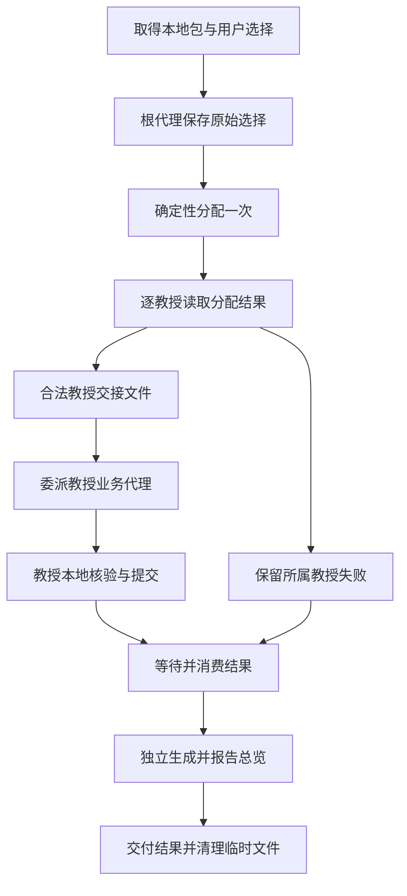

# 第68号问题完整执行计划第十七版

计划版本：`issue-68-plan-r17-2026-10-11`。状态：**已独立审核批准实施；不代表实现已审核或测试通过**。

本文件是第十七版**唯一完整候选执行计划**。第十三版已批准的教授事务、分配、文件交接、核验、清理和总览规则继续有效；第十四、十五版关于 Codex 原生委派的版本事实继续作为描述性依据，不固定工具参数或请求结构。独立审核对第十五版给出 `NEEDS_MODIFICATION`，第十六版落实其四项修改；随后独立审核确认 P1、P2 通过，但指出共享结果规则仍含 Codex 专属的调用次数与工具目录判断。本版将该分支改为运行时无关的业务条件，工具调用失败归因继续由各目标专属说明负责。共享业务说明仍要求每位合法教授走当前运行环境的原生委派并等待消费；教授子任务消息只传本教授业务输入与约束。Codex 专属的直接调用位置与处理方式留在 Codex 目标包。合法教授子任务未启动时，停止正常总览与完成报告并清理本次文件。第十三版[批准记录](https://github.com/ScholarWorkflow/professor-contact/pull/72#issuecomment-6008709709)及第十四至十六版候选不自动批准本版。

范围约定（2026-10-05）继续成立：本仓库假定教授姓名唯一，不处理两个教授姓名相同的情况；不要求同名支持、同名拒绝逻辑或相关测试。不同姓名教授的邮件编号相同及真实归属歧义仍须按既有规则处理。

本次计划修订只修改执行计划，未修改产品、测试或运行配置，也未发送新的正式评估请求。正式需求仍以[第68号议题](https://github.com/ScholarWorkflow/professor-contact/issues/68)和[验收第四版](https://github.com/ScholarWorkflow/professor-contact/issues/68#issuecomment-5981562292)为准。

## 1. 正式输入、依据与范围

| 项目 | 当前依据 |
| --- | --- |
| 需求 | [第68号正文](https://github.com/ScholarWorkflow/professor-contact/issues/68)，读取时更新于 `2026-10-05T13:41:30Z`；2026年9月29日按教授独立处理要求及2026年10月4日教授业务隔离澄清 |
| 验收约定 | [第四版](https://github.com/ScholarWorkflow/professor-contact/issues/68#issuecomment-5981562292)，`issue-68-gate1-r4-2026-10-05`，读取时更新于 `2026-10-05T13:40:05Z`；保留 R68-1至R68-8、AD68-1至AD68-5 |
| 前版计划 | `issue-68-plan-r12-2026-10-04`，评论5981550291，更新于 `2026-10-05T13:40:03Z` |
| 前版审核 | [批准记录5981691686](https://github.com/ScholarWorkflow/professor-contact/pull/72#issuecomment-5981691686)，更新于 `2026-10-05T13:39:44Z`；只批准第十二版 |
| 本轮触发 | [参数失败说明6000329400](https://github.com/ScholarWorkflow/professor-contact/pull/72#issuecomment-6000329400)，更新于 `2026-10-05T18:11:34Z`；用户在本轮明确要求修改计划，写清改什么及怎么改 |
| 目标仓库 | `ScholarWorkflow/professor-contact`，第五阶段，第72号拉取请求 |
| 目标版本 | 第十三版输入协议依据 `d7f3141569e0933adf95fe0b86d28bbd1cc1333d`；零委派的实际产品 `42f87abdbc3b73cf713da62b78ece51563468332`；目标会话 `01a1260f-c1a0-7001-8fb8-e36b94c6bd96`；执行器 `codex-cli 0.162.0-alpha.17.2`，实际生效模型 `gpt-6-luna/low`；第十七版审核基线 PR 头 `51957c434c5162efa89bdf079ae34bbb57dee70e`，新提交号以入库结果为准 |
| 上游及兼容 | 沿用第十二版的第67号 `issue-67-plan-r19-2026-10-02` 教授本地交付、第59号单邮件兼容要求；第48号拥有通用写锁，本轮不改变其责任或依赖关系 |
| 项目规则 | `Project Consensus` Notion 页面 ID `3d60101a-85f3-815a-8c43-f271f2b4d91d`，页面最近修改于 `2026-10-09T09:53:09.338Z`；`Plan Reviewer Rule` Notion 页面 ID `3e80101a-85f3-817a-94cb-c6eca1a76a5c`，页面最近修改于 `2026-10-09T20:13:35.508Z`。本计划以这两个页面及其明确 ID/更新时间定位规则，不引用无法复现的文件摘要 |

本轮范围：沿用第十三版的第五阶段教授事务、确定性分配、核验、总览与兼容约定；沿用第十四、十五版有来源的 Codex V2 委派运行事实。此次只冻结**根代理完成所有合法单教授交接之后的直接调用动作**、等待结果及零委派失败收尾。原有六个正式业务观察点保持不变，不添加工具注册快照或通用能力认证。

非目标：不重做前四阶段、上游邮件包或历史迁移；不修改邮件文案、用户模板、联系方式判断、校验业务、邮件编号公式、通用写锁、Codex 执行器源码或测试判定程序。当前测试计划仍由测试工程师管理，本计划仅交代受影响的正式行为与观察位置。

## 2. 当前事实、问题与决策依据

以下事实来自目标版本源码，不以运行叙述代替实际调用链。

### 2.1 参数文字与读取方式不一致

`contact_state.py` 第9703—9704行将根代理入口的 `--choices` 描述为原始选择 JSON 对象或列表，但第7751行执行 `stage5_choices_rows(Path(args.choices))`；第7485—7502行通过文件读取器载入数据，第159—171行实际打开路径。第9750—9754行的命令派发没有加入内嵌文本解码。

因此，直接把对象或列表文本放在 `--choices` 后会被当成文件路径。该问题发生在根代理选择输入边界；不能仅由此认定业务代理委派失败或执行者违反第十二版。

精确来源：[参数帮助](https://github.com/ScholarWorkflow/professor-contact/blob/d7f3141569e0933adf95fe0b86d28bbd1cc1333d/.apm/skills/professor-contact/scripts/contact_state.py#L9703)、[实际调用](https://github.com/ScholarWorkflow/professor-contact/blob/d7f3141569e0933adf95fe0b86d28bbd1cc1333d/.apm/skills/professor-contact/scripts/contact_state.py#L7751)、[选择读取器](https://github.com/ScholarWorkflow/professor-contact/blob/d7f3141569e0933adf95fe0b86d28bbd1cc1333d/.apm/skills/professor-contact/scripts/contact_state.py#L7485)。

### 2.2 分配结果已具备所需字段，但不能整份交给教授代理

根代理分配入口返回顶层 `status`、原始选择路径 `choices` 及 `owners` 列表。列表中每项包含本教授的 `professor_dir`、`email_pack`、可选 `email_id`、`partition` 判定；可执行项另有 `choices_rows`。`--out` 保存的是包含全部教授的完整返回对象，不是单教授交接文件。

精确来源：[返回对象及写出](https://github.com/ScholarWorkflow/professor-contact/blob/d7f3141569e0933adf95fe0b86d28bbd1cc1333d/.apm/skills/professor-contact/scripts/contact_state.py#L7814)。

### 2.3 教授代理说明仍有旧广播句子

代理说明第65—70行仍要求每位教授代理收到相同原始选择；第100行起和第123行起又要求根代理分配后只消费本教授行。这两种执行指令冲突。新计划明确删除前一种，不让执行者临场选择。

精确来源：[旧句子](https://github.com/ScholarWorkflow/professor-contact/blob/d7f3141569e0933adf95fe0b86d28bbd1cc1333d/.apm/agents/professor-contact-email-generator.agent.md#L65)、[当前本地交接说明](https://github.com/ScholarWorkflow/professor-contact/blob/d7f3141569e0933adf95fe0b86d28bbd1cc1333d/.apm/agents/professor-contact-email-generator.agent.md#L100)。

### 2.4 选择文件与业务输入值必须区分

当前教授业务入口也把 `--choices` 解释为路径；不可变模板包装程序将该参数原值传入内部计划和最终提交程序。代理业务对象中的 `choices` 则是对象或对象列表，代理负责将它序列化后传给程序。这两种表示不应混写。

精确来源：[教授本地读取](https://github.com/ScholarWorkflow/professor-contact/blob/d7f3141569e0933adf95fe0b86d28bbd1cc1333d/.apm/skills/professor-contact/scripts/contact_state.py#L7525)、[包装参数传递](https://github.com/ScholarWorkflow/professor-contact/blob/d7f3141569e0933adf95fe0b86d28bbd1cc1333d/.apm/skills/professor-contact/scripts/stage5_immutable.py#L38)。

### 2.5 决策及替代方向

**本轮确定采用文件路径方式**：所有第五阶段命令行 `--choices` 都接收保存选择值的 JSON 文件路径；调用方业务对象中的 `choices` 保持现有结构化值含义。

现实替代方向是增加内嵌 JSON 参数读取，但本轮不采用。文件方式与现有三个入口及包装程序一致，能避免长命令转义和目录字符串重打；只需统一帮助、调用步骤与交接说明，不需要引入第二种解码路径。文件读写和清理由请求负责者承担，详见第3.6节。

因果链：用户选择必须原样交给确定性分配 → 当前程序实际读文件而说明不明确 → 明确文件接口并程序化保存选择 → 根代理能按真实输入分配并交出单教授数据 → 满足教授隔离、身份保持与可执行要求。

这项文件方式是本计划确定的实现选择，不将其升级为所有未来调用方必须采用的新增产品要求。

### 2.6 目标会话的直接事实及 Codex V2 依据

1. **实际会话**：目标会话 `01a1260f-c1a0-7001-8fb8-e36b94c6bd96` 的 `thread/started` 显示实际模型 `gpt-6-luna/low`、执行器 `codex-cli 0.162.0-alpha.17.2`。用户提供的原始事件及[正式执行记录](https://github.com/ScholarWorkflow/professor-contact/blob/2994fa3496ab763d677c3e5ded7fa56ddf96118e/plan/issue68-test-execution-2026-10-09.md)均表明：两位教授的原始选择已正确分配并分别形成交接文件，17次执行工具调用均为 `exec`，原生 `spawn_agent` 0次、等待0次、教授结果0条；随后根代理调用总览重建（0位教授、0封邮件）并保留临时文件。`passed=true`、退出码0只证明评估进程正常结束，不是第五阶段业务通过。
2. **模型与源码**：Codex `rust-v0.162.0-alpha.17.2` 的模型目录为 `gpt-6-luna` 标注 `multi_agent_version=v2`、`tool_mode=code_mode_only`。[模型目录](https://github.com/openai/codex/blob/rust-v0.162.0-alpha.17.2/codex-rs/models-manager/models.json)；对应 [V2 委派源码](https://github.com/openai/codex/blob/rust-v0.162.0-alpha.17.2/codex-rs/core/src/tools/handlers/multi_agents_spec.rs#L108-L163)说明该版本支持通过原生委派调用命名代理。
3. **工具真正如何提供**：该版本[工具注册源码](https://github.com/openai/codex/blob/rust-v0.162.0-alpha.17.2/codex-rs/core/src/tools/spec_plan.rs#L1374-L1423)在 V2 默认 `non_code_mode_only=true` 时把原生 `spawn_agent` 直接提供给模型，不列入 `functions.exec` 下的 `ALL_TOOLS`；已加载自定义角色时可按已安装的准确角色名路由。[V2 配置默认](https://github.com/openai/codex/blob/rust-v0.162.0-alpha.17.2/codex-rs/core/src/config/mod.rs#L1374-L1404)。这些是该版本的描述性事实，不构成产品文档对工具参数或请求结构的规定。
4. **此前类似案例的适用范围**：[paper-analysis #16](https://github.com/ScholarWorkflow/paper-analysis/issues/16)证明过 V1 / 延迟工具目录可从真实列表绑定可调用名称，但不能将 `multi_agent_v1__spawn_agent` 搬进 GPT-6 V2；[Codex #44270](https://github.com/openai/codex/issues/44270)记录错误的委派提示地址，不能据此认定本次 0 委派的唯一根因。
5. **事实边界及处理**：会话说明已告知模型直接使用 `spawn_agent`，并指出该工具不在 `functions.exec` 的 `ALL_TOOLS` 目录；事件还证实 `.codex/agents/professor-contact-email-generator.toml` 存在。原始事件未保留完整模型请求工具定义或最终加载的角色表，因此不据此断言目标会话是否已加载该角色，也不把零调用归因于真实工具错误。目标版本源码足以支持本计划使用当前会话的原生委派入口和准确已安装角色名；实际可用性以运行时提供的接口为准。**方案覆盖成功调用与真实调用失败两条路径**，不依赖事先宣布工具或角色必定可用。运行期若真实调用返回角色/工具错误，按第3.8节记录并交配置/安装所有者；不要求审核前提取当次完整工具定义，不为验证这一点增跑正式业务或新建采集设施。

### 2.7 第十七版方案选择及依据

采用**Codex 当前会话的原生委派方式**：根代理在第3.5节的明确调用点直接使用本会话公开的 `spawn_agent`，将每位合法教授分别委派给已安装的准确命名角色 `professor-contact-email-generator`，随后由根代理等待并消费各子任务的最终结果。实际调用遵循当前会话原生工具暴露的接口，不在产品指令中固定私有参数名、调用签名或请求结构。交给子任务的内容只包含该教授的 `owner_input_file` 路径及本教授业务约束，不包含 coordinator 等待或路由指令。方案不声称本次会话已独立证明角色注册；角色不可选或真实调用失败时按第3.8节失败关闭，不使用默认代理、shell 或另发评估请求代偿。

可行替代是从 `functions.exec` 的工具目录查找或转调旧版委派工具；但该版本的原生入口由模型直接使用，此路不适用于本轮 Codex。通过 shell 启动其它 CLI、重新提交 `/eval`、用主代理冒充教授代理也不采用。OpenCode 继续使用其原生 Task；其他 Codex 版本使用其当次会话公开的原生委派入口。

因果链：两位合法 owner 的选择分配与文件交接已成立 → 根代理在交接后没有真正委派就重建空总览 → 在**交接结束的就地调用点**明确下一动作直接 `spawn_agent`，并规定真实等待、消费和零委派停止/清理 → 有实际教授完成结果后才重建总览。**前部早已存在“必须委派”的泛化提醒，不能把重复提醒当作修改完成；必须修订实际调用处的动作顺序，并由既有真实业务观察确认效果。**

## 3. 完整方案

### 3.1 教授事务和身份

一次 `professor-contact-email-generator` 调用只对应一个规范 `professor_dir`。业务调用、校验、状态、渲染和邮件输出只处理该教授的数据。

规范身份贯穿全链：第四阶段交付或独立发现的确切本地包 → 根代理按 `(professor_dir, email_id)` 分配 → 单教授交接 → 同教授业务输入、结果、校验和持久化状态 → 根代理按目录消费结果 → 独立总览。

教授展示名不用于重建目录、选择索引或合并结果。目录及编号字符串不得翻译、转写或从展示名重新推算。

允许交给教授代理的输入包括其自身 `email_pack`、本次选择、可选 `email_id`、普通调用参数及本教授结果路径。禁止夹带其他教授的目录、邮件包、编号、选择行、核验、状态、渲染路径或跨教授归属表。

### 3.2 两条入口

紧接第四阶段：根代理直接使用每位教授成功结果中实际交付的 `email_pack`，不重新进行程序级发现来猜归属。

独立启动第五阶段：根代理先调用只读 `stage5-list-inputs`，按返回行选择本次教授。坏包只形成所属教授的输入解析失败，其余合法教授继续。指定教授时按其姓名精确匹配本地输入；未找到时沿用现有缺输入处理。

发现逐包返回 `{professor, professor_dir, email_pack, status, reason_code}`。

发现只读取本地邮件包，不读核验、状态、渲染、总览或旧全局包，不写归属文件。保留删除 `--emit-choices-scope` 的方案。

### 3.3 参数与三类临时文件

| 对象 | 内容和读者 | 不得混用的边界 |
| --- | --- | --- |
| 根代理原始选择文件 | 用户本次提供的对象或对象列表；仅根代理分配入口读取 | 不作为教授代理的选择文件，不随委派广播 |
| 根代理完整分配文件 | `stage5-partition-choices --out` 写出的顶层对象及全部 `owners`；仅根代理读取 | 整份文件不得作为 `owner_input_file` 交给教授代理 |
| 单教授交接文件及选择文件 | 仅该教授业务对象，以及从其 `choices` 值序列化出的行列表；由该教授业务代理读取 | 不含其他教授行或根代理原始选择文件路径 |

文件名称不冻结；下面为说明使用 `raw-choices.json`、`partition.json`、`owner-input-0.json`、`owner-choices.json`。执行时由请求独占临时目录分配名称，不使用教授展示名拼文件名。

业务对象 `choices` 保留对象或对象列表含义；命令行 `--choices` 始终表示文件路径。根代理分配入口文件内容是原始用户值；教授业务入口文件内容是对应教授的分配行。对象和值不得通过拼接命令文本传递。

不新增内嵌 JSON 兼容分支，不根据字符串外观猜测它是路径还是 JSON，不把读文件失败改为尝试另一种输入解释。保留现有文件路径调用。

### 3.4 根代理准备和一次确定性分配

用户已提供选择时，按以下顺序实施：

1. 从用户结构化输入取得原始 `choices`。用 JSON 序列化工具将该值写入本次独占原始选择文件，不补字段、不翻译、不按教授手工切片。排版、转义和缩进不是业务字段变化，目录与编号字符串值必须保持原值。
2. 从第四阶段实际交付或只读发现取得本次选中教授的真实 `email_pack`，并保留各教授可选目标 `email_id`。每个规范教授目录只出现一次。
3. 使用安装来源中的 `contact_state.py stage5-partition-choices`。`--program-root` 传实际项目目录，每位教授使用一个 `--owner <email_pack> [email_id]`，`--choices` 传步骤1的绝对文件路径，`--out` 传根代理完整分配文件的绝对路径。用参数列表启动命令，不把选择值或教授路径重打进命令文本。
4. 命令完成后读取实际退出状态及结构化返回。返回顶层错误、文件读取失败或分配结果未形成时，保留真实原因；没有合法分配结果就不宣称已委派或已完成业务。
5. 使用 JSON 解析器读取返回的 `owners`。按每项自身 `professor_dir` 关联，不按展示名、返回位置或自然语言猜归属。返回身份不得偏离本次已选包；无法唯一对应时停止受影响交接并报告输入不一致。
6. 对 `partition.status` 非 `ok` 的项保留其实际状态、原因和相关字段，只停止该教授，不将其重新路由或传给其他教授。顶层 `status: ok` 不代表所有教授都可执行。
7. 对合法项读取其实际 `choices_rows`，不再做一次选择分配，不去重或删除错误行。缺失、重复和字段是否合法继续由该教授业务程序检查。

本入口继续承担第十二版确定的归属责任。本轮不修改现有分配算法，按目标版本实际行为说明如下；相关审核结论见[最新审核：保留第十三版批准](https://github.com/ScholarWorkflow/professor-contact/pull/72#issuecomment-6008709709)，不再以范围外的同名教授反例要求修改算法或验收约定：

- 显式目录行只归对应教授；不属于本次选中集合的行不进入任何教授交接。
- 指定 `email_id=X` 时，本教授未选中的编号先排除；目标自身身份、缺失、重复和字段仍严格检查。
- 整教授批量中本教授的错误编号只使该教授返回 `needs_input / choice_owner_invalid`。
- 无目录旧行只在根代理计算候选；范围来自本次选中包的实际执行范围。无候选为无关行；唯一候选进入该教授并参与重复检查；多个候选时才排除已被合法显式行满足的教授，剩一个绑定、剩多个返回各受影响教授的歧义、剩零个不改变已明确教授的结果。歧义行不广播。
- 原始行顺序不改变归属；根代理不复制收件人、跟进日期等业务校验。

用户没有提供 `choices` 时，保留既有缺输入分支：不虚构用户决定、不把缺省值冒充合法选择。根代理按已确定本地包形成不含 `choices` 的单教授交接，仍委派正式业务代理；不调用要求 `--choices` 的跨教授分配命令来猜选择。业务代理按现有执行器分支取得所需决定或返回 `needs_input`。这条路径不进行跨教授选择归属，也不扩大本轮用户交互要求。

### 3.5 单教授交接及业务调用

根代理对第3.4节每个合法教授项执行以下转换：

1. 建立只含该教授的业务对象。`email_pack` 取该项实际路径，提供了目标时保留同一 `email_id`；`choices` 的值直接取该项 `choices_rows`。将完整行列表保留为列表，不因只有一行改写字段或重建内容。
2. 补入本次真实 `program_root`、已提供的 `mode`、模板等普通参数；已提供的模型结果只能是该教授结果。没有提供的参数继续沿用现有缺省规则，不伪造值。
3. 不复制顶层原始选择路径、整个 `owners` 列表、其他教授项或跨教授范围。根代理解析出自己需要的逐教授判定即可，不让教授代理再解析多教授分配文件。
4. 用 JSON 序列化工具写完本次全部合法教授的单教授交接文件，业务对象中的路径和值只来自已解析字段。**最后一个合法 `owner_input_file` 写入后，下一动作必须按当前安装目标的原生路由说明，逐个委派给准确命名的 `professor-contact-email-generator` 代理**。每个子任务只接收本教授 `owner_input_file` 的绝对路径和本教授业务约束，不包含等待、路由或 caller 指令。Codex 的直接调用位置、原生入口和等待要求由第3.8节列明的 Codex 专属安装指令给出；产品指令遵循实际运行环境公开的工具接口，不固定私有参数名、调用签名或请求结构。此处不得再做通用工具目录搜索、代理路径猜测、主线程代写邮件、提前重建总览或直接结束回复。根代理须等待每个已启动的合法 owner 到最终结果；如果实际委派入口或准确角色不可用，按第3.8节停止该教授并清理，不用自然语言冒充角色。

教授代理收到后：

1. 解析自己的 `owner_input_file`，只取得自己的业务字段；不读根代理原始选择或完整分配文件，不重新发现其他教授。
2. 第一次 `stage5-plan` 保留现有顺序：读取同一 `email_pack` 及可选同一 `email_id`，先处理核验边界，不因用户提供选择而绕过核验。初次调用不携带模型结果和选择。
3. 到既有流程允许消费选择时，将解析所得本教授 `choices` 值用程序原样写入教授独占选择文件；以后 `stage5-plan` 和最终提交所需的 `--choices` 都传该文件路径。若业务代理根据既有交互补齐了该教授用户决定，使用实际用户决定，不伪造字段。
4. 保留同一教授本地包、同一目标编号及同一已确定选择值进入重规划和不可变模板包装。包装程序不重建选择、不增加其他教授范围、不代替业务校验。
5. 保留收件人权威、联系方式证据、结果、日期、重复及缺失等严格检查；同教授整批全部合法才提交。错误夹入其他教授行时，只拒绝当前教授输入，不向该教授重新路由。
6. 校验代理只检查本教授本次输出；状态记录仍按现有 `stage5-record-validation --professor-dir --validation-file`，不新增目标编号参数。
7. 返回一条完整结构化业务结果，保留实际 `professor_dir/status/reason_code` 及相关信息。未完成核验、缺输入、失败和部分结果不得改称成功。

### 3.6 生命周期、失败和清理

根代理拥有原始选择文件、完整分配文件和各单教授交接文件；教授代理拥有自己写出的选择与结果传递文件。文件只为本次请求传递数据，不是新的长期事实来源。

每次请求使用独占目录；使用程序生成不含教授名称的文件名，不覆盖另一请求文件。文件生成或写入失败时保留实际错误，不继续使用上一请求的旧文件，也不切换为内嵌文本重试。

原始选择不可读、非法 JSON 或顶层不是对象或对象列表时，保留当前 `invalid_result_json` 读取边界；不建立已分配或已完成业务的假象。某教授包、选择归属或交接失败时，只影响该教授；其他合法项继续。共用原始选择无法读取则没有可靠分配输入，先报告该输入问题，不制造逐教授成功结果。

教授代理结束前不得删除仍有子代理读取的单教授文件；根代理消费全部已委派结果并交付实际结果后清理自己拥有的临时文件。**零次委派、工具/角色调用失败、取消和正常完成都必须清理本请求可确认归属的传递文件**，不能为了“之后继续”主动保留未委派的旧交接。仍有子代理运行时先结束其本轮读取，再清理；清理失败单独报告，不回滚已提交教授结果，也不搜索或删除其他请求文件。

### 3.7 结果消费与独立总览

所有运行目标都遵守相同业务顺序：合法 owner 交接完成后立即发起该运行目标的原生委派，等待并消费每个已启动子任务的最终结果，随后按本教授的 `professor_dir` 关联结构化结果。不同运行目标的入口细节只放入相应的 target-specific 安装说明。真实委派失败只保留该教授实际错误，不停止其他合法教授；甲已提交的本地结果不因乙的失败或未启动而回滚。不以模型自述代替工具结果。

全部实际启动的教授均返回最终业务结果且根代理已消费后，才按最后本地状态最多执行一次 `stage5-rebuild-overview`，单教授请求同序。**合法 owner 存在但没有任何对应教授子任务实际启动时，该请求尚未进入教授处理：不得重建0人0封总览冒充完成；必须说明尚未进入教授核验、生成和校验，并执行第3.6节清理。具体如何判断目标运行环境中的调用失败，由相应目标专属路由说明规定。**若部分教授已启动、其他教授失败或未启动，仍等待全部已启动者，按实际完成的本地状态生成总览并逐位报告真实结果；总览失败不影响已完成教授事务。

总览是独立派生文件，不是教授提交条件；保留本地输入、状态合法性检查、总览人工修改保护及原子替换。它不改本地包、状态、邮件或核验缓存。本轮不增加跨请求最新者优先承诺，不把第48号写锁变成本议题的新增前置。

保留既有总览机制：`stage5-rebuild-overview` 只写 `教授研究/套磁邮件总览.md`，不读取、修改或保存 `_contact_projections.json`。已有总览的 `managed_by` 必须为 `contact_state`，且正文哈希须与合法 `render_sha256` 一致；否则返回 `needs_decision / manual_markdown_changed` 并保持文件。总览不存在时直接生成；成功通过一次原子替换写入完整 frontmatter 与正文，不增加 sidecar、临时锁或第二套 writer lock。

图示为用户已提供选择的路径；缺少选择的既有分支按第3.4节进入单教授交接，不制造原始选择。

### 3.8 Codex 专属路由与无法委派的处理（第十七版）

- **安装边界**：Codex 的 Stage 5 入口说明仅新增到 `packages/professor-contact-codex/.apm/instructions/stage5-routing.instructions.md`。该目录属于 `targets: [codex]` 的本地包，不把 Codex 原生工具名或 Codex 专属失败判断写入双目标共享的根技能或工作流参考。共享源只陈述每位合法 owner 的单教授业务交接、立即原生委派、等待消费及总览顺序。
- **入口与动作顺序**：Codex 根代理在所有合法 `owner_input_file` 写完后，下一动作直接使用当前会话公开的原生 `spawn_agent` 委派给准确命名的 `professor-contact-email-generator`。不得把 `ALL_TOOLS`、V1 工具目录、CLI 探测、模拟委派或另发 `/eval` 作为这个动作的前置或替代。调用方式按当次原生工具实际暴露的接口执行，不在产品说明里抄录私有参数名、签名或请求结构。
- **单教授输入**：每次子任务只接收本教授 `owner_input_file` 的绝对路径及本教授业务约束；不传根选择、完整 `owners`、其他教授项、等待指令或 caller-facing routing 文本。准确命名角色必须通过当前原生入口选择，不以自然语言指令冒充。
- **等待与失败归因**：根代理必须等待每个实际启动的子任务到最终业务结果并消费后，才能执行总览。若实际公开入口无法选择准确角色或调用返回错误，只停止并记录该教授的真实错误；**只有真实调用失败才称运行时委派失败**。合法 owner 存在而实际委派次数为零时，只报告“未委派”，不得由 `ALL_TOOLS` 搜索结果推断工具不可用或由根代理冒充子代理。
- **收尾**：零次委派时停止正常空总览及完成报告，说明尚未进入教授核验/生成/校验并按第3.6节清理。部分委派时等待已启动任务全部返回，再按已完成的本地状态重建一次总览并逐教授报告；失败或取消时先确认子任务不再读取其输入，再清理本次传递文件。
- **现有观察入口**：继续使用第六十一版辛原六项业务观察点，检查真实委派、教授状态及邮件、结果之后的总览、清理和最终回复。模型请求完整工具定义、角色加载快照、私有调用签名及通用工具探针均不是新的验收条件；外部故障依测试规则如实记为无法判断，零委派且提前空总览记为业务未达成。

## 4. 逐文件修改和实施顺序

下面的职责全部归产品仓库。本轮已有正确实现应保留，不因计划整理重写整段状态程序。行号只用于定位目标版本，函数名称不是必须新增的命名要求。

### 步骤1：统一命令参数说明与文件读取

修改 `.apm/skills/professor-contact/scripts/contact_state.py`：

- 在 `build_parser` 中将 `stage5-partition-choices` 的 `--choices` 帮助改为“原始用户选择 JSON 文件的路径；文件内容为对象或对象列表；只在根代理分配”。
- 将 `stage5-plan` 和 `stage5-finalize` 的 `--choices` 帮助统一为“当前教授选择 JSON 文件的路径；只含本教授已分配的行”。最终提交不得写成可接受完整多教授选择。
- 保留 `stage5_choices_rows` 的文件读取方式及对象转单行列表行为，保留 `stage5_choices_by_id` 的教授本地限制；不添加内嵌文本自动解析，也不在文件不存在时改为猜另一输入形式。
- 在分配入口的说明中写明返回顶层 `owners`，以及 `--out` 写出完整多教授分配对象，根代理必须逐项生成单教授交接文件。
- 保留现有逐教授失败、目标过滤、旧行歧义和业务校验归属；删除的跨教授范围入口不得恢复。
- 第十二版删除完整范围传递的决定继续有效：教授业务入口不得提供跨教授 `--choices-scope`；如保留同名内部辅助函数，它不能成为受支持的教授输入、处理多教授数据或出现在当前调用约定中。

完成条件：三个命令帮助对路径含义一致，实际实现仍从该路径读 JSON；返回对象与第3.3—3.5节说明一致；错误保持实际读取或业务原因，不因接口说明修正更改业务结果。

### 步骤2：更新共享根代理业务步骤

修改 `.apm/skills/professor-contact/SKILL.md` 的前部第五阶段输入规则、第五阶段独立入口及调用方选择说明：

- 在前部宿主路由门中，只将 Stage 5 的 Codex 直接调用和等待句改成“按当前安装目标的原生路由说明执行”；Stage 1–4 的既有行为不在本计划范围内。共享路由门保留当前宿主决定路径的通用原则，但不得在 OpenCode 投影中给出 Stage 5 的 Codex 工具动作。
- 将 `--choices <原始 choices>` 一律改为 `--choices <原始选择JSON文件绝对路径>`；紧邻给出“从用户结构化值程序化写文件”的动作。
- 明确 `--out` 文件只供根代理解析 `owners`，不得整份交给教授代理；逐项检查 `partition`，把本教授 `choices_rows` 直接赋给本教授业务对象的 `choices`。
- 写清单教授 `owner_input_file` 只含对应教授数据；禁止包含原始选择文件、完整分配文件、其他教授项或完整范围。
- 在第五阶段**完成合法 owner 交接文件的真实调用位置**，紧贴生成动作说明下一动作是按当前安装目标执行原生委派；逐个交出对应教授的 `owner_input_file` 与业务约束，并由根代理等待最终结果。这里不写 Codex 工具名、私有参数名或 Codex 专属失败判断，以免它们进入 OpenCode 投影。
- 在最后一个合法 `owner_input_file` 已保存的位置写出“紧接着执行当前安装目标的原生委派”，在原总览调用位置写出“合法 owner 存在而实际委派为零 → 停止、报告、清理，不执行正常空总览”。Codex 直接调用、确切角色选择、零委派处理等 host-specific 细节只写入步骤5确定的 Codex 专属安装说明。仅重复前部提示、追加同义口号或让模型搜索通用工具目录，均不算实施该修改点。
- 用户没提供选择时沿用第3.4节缺输入分支，禁止通过空默认值伪造完整选择；保留正常委派和业务代理已有交互边界。
- 第四阶段交付及独立发现仍分别处理；不重新引入全局邮件包或范围广播。

完成条件：仅阅读当前技能，根代理能够确定保存什么文件、传哪个路径、解析哪个字段、如何交接单教授数据及何时清理，不需要另找历史评论。

### 步骤3：更新教授代理说明

修改 `.apm/agents/professor-contact-email-generator.agent.md`：

- 在选择输入说明中删除“每位教授代理接收相同原始值”和依赖完整多教授归属范围的句子。替换为“根代理接收原始多教授选择并确定性分配；当前教授代理只接收对应选择行”。
- 保留禁止模型手工切片，但明确切片已经由根代理产品入口完成；教授代理不得广播、合并或重新归属。
- 根代理分配命令示例的 `--choices` 改为原始选择文件路径；写明分配结果 `owners[].choices_rows` 转为当前业务对象 `choices`，不是把整个 `owners` 当作输入。
- 前部机器结果协议和选择保存段统一：解析自己的交接文件，从已解码值生成本教授选择文件，再传路径；不把字段值转抄到委派正文或命令字符串。
- 核验先行、第一次计划不带结果和选择、同一包及目标贯穿重规划与最终提交、校验范围和真实结果返回均按第3.5节保留。
- 两种执行器分支只改变已有工具调用方式，不改变输入范围、文件接口或业务校验。

完成条件：整份有效代理说明只有一种选择来源和传递规则；不再同时包含旧广播和新单教授输入条款。

### 步骤4：同步共享工作流参考

修改 `.apm/skills/professor-contact/docs/workflow-reference.md` 中第五阶段归属、交接及顺序段：

- 当前计划指针更新为第十七版唯一完整文件；第十三版至第十六版仅作历史来源，不要求实现者从旧评论拼接当前指令。
- 增加业务 `choices` 值与命令 `--choices` 路径的区别；三个命令的例子与步骤1一致。
- 描述根代理原始选择文件、完整分配文件、单教授交接及选择文件的内容、读者和转换关系。
- 保留规范身份、单邮件过滤、整教授原子提交、逐教授失败、只读发现、结果消费及总览派生；第五阶段图表/执行顺序同步第3.5—3.8节“准备全部合法交接 → 当前安装目标的原生委派 → 根代理等待并消费 → 总览”的动作分界点和零委派停止/清理。工作流参考只描述共享业务顺序，不写 Codex 工具名、参数或 Codex 专属失败判断。
- 历史 `stage5-legacy-contract.md` 不升级为当前接口来源；有旧说明时由当前第五阶段规则明确覆盖，不改写历史参考来制造另一份规范。

完成条件：技能、代理说明、命令帮助、工作流参考在文件输入、字段关系、失败及清理上没有冲突；Codex 专属委派路由只由 Codex 目标包提供，不进入 OpenCode 投影。

### 步骤5：核对不可变模板包装与运行目标投影

检查 `.apm/skills/professor-contact/scripts/stage5_immutable.py`：

- `_PLAN_OPTIONS` 和参数转换继续把 `--choices` 文件路径原样传给内部计划；临时最终提交程序也收到相同本教授文件路径。
- 不在包装程序读取并分配原始多教授选择，不加入 `--choices-scope`，不从名称猜教授。
- 包装程序现有行为已符合时只更新必要说明或计划引用，不重做不可变模板处理、联系方式定位或来源标记逻辑。

根 `apm.yml` 声明 `opencode`、`codex` 两个目标，并依赖本地 `packages/professor-contact-codex` 与 `packages/professor-contact-opencode`。两个子包的 manifest 分别声明 `targets: [codex]` 和 `targets: [opencode]`。共享的选择值、文件接口、教授输入隔离及结果顺序仍放在根源码；新增 Codex 调用方式放在 `packages/professor-contact-codex/.apm/instructions/stage5-routing.instructions.md`，利用该子包的目标限制只进入 Codex 安装投影。APM 官方[包类型说明](https://microsoft.github.io/apm/reference/package-types/)规定 `.apm/instructions/` 为指令原语目录，并说明 target-scoped package 按其目标部署。本计划不新增邮件代理副本，也不把 Codex 指令放在自动包含两目标根源码的路径。

产品实施者只核对受影响的正式安装来源和目标投影；Codex 准确命名角色的现有安装定义继续由正式 APM 产物提供，目标会话已观察到相应 `.codex/agents` 文件。**文件存在不能独立证明角色实际加载，但也不能据此增加批准前置的完整模型工具清单**。真实委派尝试若显示准确角色不可用，才交运行配置/安装所有者按其正式配置修复，不能临时补丁消费者或修改测试入口。本轮不要求修改执行器源码、当前模型或运行配置。

完成条件：包装参数不偏离同教授文件；共享文件只描述业务输入与顺序；Codex 专属路由说明随 Codex 子包部署，不进入 OpenCode 投影；教授代理不存在旧的原始多教授选择广播句子。

### 步骤6：交付影响记录，再交测试工程师处理

产品实施者提交共享入口业务顺序、Codex 专属直接委派、零委派停止/清理、选择值/路径说明及工作流参考同步修改，记录产品提交号和受影响行为；已正确的教授分配、核验、状态程序及包装脚本直接保留，不为交付数量而重写。若真实委派得到准确角色/工具机器错误，再分派运行配置所有者定位正式安装或配置，不能把未发起调用归咎于环境。

测试工程师据此核对现有输入构造、提示词、步骤和依赖版本是否使用文件路径；只在当前方案确有不一致时修正对应测试方案或实现。相关材料包括 `tests/runtime/prepare_issue68_stage5_routing.py`、根代理提示词及当前正式运行入口引用的记录；它们不是产品接口的负责者。

本计划不规定新的用例编号、断言、解析器、判定程序、运行命令或通过证据。受影响的正式行为和观察位置见第7节，由测试工程师依据项目共识给出正式安排。不得先在测试环境打补丁补偿产品调用说明缺陷。

### 实施依赖顺序

1. 第十七版先作**独立限定计划审核**：P1按第1节精确页面 ID 与更新时间核对规则来源，并按第2.6节核对版本事实；P2核对共享业务契约与 Codex 工具接口边界；P3核对 Codex 包的安装目标过滤及不进入 OpenCode 投影；P4核对单教授输入、等待、失败和清理顺序。审核者正式记录 `Plan conclusion: APPROVED` 后才进入产品修改，本版作者不自批。
2. 产品实施者更新 `.apm/skills/professor-contact/SKILL.md` 的共享第五阶段业务输入与委派顺序，在 `packages/professor-contact-codex/.apm/instructions/stage5-routing.instructions.md` 补充 Codex 专属直接调用和零委派收尾，再同步 `docs/workflow-reference.md` 与教授代理的业务输入说明；仅真实委派出现准确角色/工具错误时，交正式运行配置或安装责任人修复，禁止为求通过修改消费者。
3. 保留第十三版 `--choices` 文件接口、确定性分配、教授代理业务及状态、邮件校验；Codex 实际调用遵循当前会话公开的原生接口，不在产品文档固定私有参数或签名。只修改本计划列明的 Stage 5 共享业务说明、Codex 专属路由和必要文件帮助，不重写已正确的业务脚本。
4. 测试工程师只沿用第六十一版辛原六项观察点核查真实委派、业务结果、总览顺序、清理和最终报告；甲至庚有效历史通过按影响复用。原有零委派失败保留，测试方案未授权新增采集完整工具定义、角色快照、探针、模型/提示词覆盖或新 `/eval` 请求。
5. 交付后仍须按已有第三关口取得真实业务通过结果；本文件和历史第十三版批准都不等同于新版实现通过。

## 5. 保留行为、禁止副作用和安全条件

保留行为：邮件编号公式、`source_hash`、业务字段和联系方式证据含义不变；教授目录作为规范事务身份；指定邮件只处理目标；同教授全部邮件是整笔提交；当前教授的缺失、重复、字段、收件人、跟进日期及业务核验仍严格拒绝；校验只看本教授本次输出；第四阶段交付和迁移仍归第67号；总览独立派生且保留人工修改保护。

禁止副作用：不恢复旧全局邮件包、双读、双写或第二事实来源；不把模型手工按展示名切选择当成确定性分配；不让业务代理接收完整多教授选择或归属范围；不因教授乙失败影响教授甲合法结果；不以总览失败回滚教授提交；不在包装程序、共享测试环境或判定程序中补偿产品负责者的缺陷。

本仓库处理范围内必须成立的安全条件：

1. 每一教授交接及业务读取仅归一个规范目录，跨阶段归属不丢失。
2. 根代理只分配一次，教授业务只消费分配结果；无目录旧行歧义不广播，唯一候选仍参与缺失和重复校验。
3. 本次目标范围始终相同；目标以外的本教授行不阻断指定邮件，目标自身严格校验不减弱。
4. 同教授整批全部合法才写入，教授之间不互为提交条件。
5. 两类根代理文件不会误作教授选择；文件读取方式与帮助及调用一致；选择值不因翻译、默认补齐或命令转义变化。
6. 请求临时文件相互隔离，在消费者结束前可读；清理不删其他请求文件、不改变已经完成的业务结果。
7. 总览消费最后本地状态，在教授结果消费后独立生成并单独报告，失败不改教授结果。

代表性反例用于审查方案，不是新测试用例：

- 教授乙本地包损坏或选择错误：只保留乙失败，甲合法分配仍委派。
- 本教授指定邮件甲，原始选择另含未选中邮件乙：乙先过滤，不阻断甲；甲自身重复仍拒绝。
- 姓名不同的两教授旧格式行邮件编号相同：根代理确定唯一或歧义，不向两位业务代理广播同一行。
- 调用者提供内嵌 JSON 文本作为 `--choices`：这是不符合本版文件接口的调用，按实际文件读取错误处理；说明必须事先清楚要求路径。
- 根代理将整个 `partition.json` 交给某教授：违反交接条件，实施步骤明确禁止；应交由本教授项生成的文件。
- 路径含空格或非中文字符：从解析字段构造参数列表和 JSON，字符串值不重打或翻译。
- 请求甲未结束，请求乙开始：各自文件独占；甲清理不删除乙文件，不能提前删甲子代理仍在读取的输入。
- 总览冲突或清理失败：单独报告，不把教授成功改为失败。

## 6. 修订分类和审核范围

### 第十三版历史决定（以下为保留记录）

本次不新增业务需求，不另选负责者或事务边界。新增计划决定是确定文件接口及具体交接、清理动作；同时删除当前交付中的失效广播表达。第十二版“可采用临时文件或等价结构”在本轮具体实施中确定为文件方式，不再让执行者在两种参数解释之间自行选择。

与第十二版的对应关系：第3.3节补齐文件参数和返回对象读取，第3.6节补齐临时生命周期；修改步骤1、4、5细化为本版步骤1—5；其余选择归属、教授业务校验、身份、整批提交、发现及总览方案仍保留。前版描述旧范围仍存在的事实改为目标版本当前接口问题，不把失效状态写成当前事实。

申请限定审核：P1核对参数事实与来源；P2核对根代理和教授业务责任未偏移；P3核对单教授传递、身份和清理条件及直接连带影响；P4核对逐文件实施和依赖顺序。前版与本修订无关的事实及关卡判断可以由审核者按影响分析复用，作者不自行声明任何关卡继续通过。

关键假设：本方案不依赖未文档化运行事件或新的工具能力。当前原始选择文件读写、根代理输出对象、教授读取和包装传参均有目标源码依据。两个安装目标的实际交付来源核对为实施交接动作，不据此假定存在新的运行行为。

范围排除的影响：第3.4节旧格式行候选收窄的同名反例已由[最新审核：保留第十三版批准](https://github.com/ScholarWorkflow/professor-contact/pull/72#issuecomment-6008709709)撤销为阻断，不要求为它修改计划、算法、验收或测试。范围内的一般选择归属歧义处理保留。本次文字清理不判定产品实现或测试结果。

第十三版的批准以审核者自己的[最新审核：保留第十三版批准](https://github.com/ScholarWorkflow/professor-contact/pull/72#issuecomment-6008709709)为准；该历史批准不自动授予第十四版实施许可。

### 第十五、十六版审核结果与第十七版修订边界

- 独立审核者对第十五版给出 `P1–P4: NEEDS_MODIFICATION`、`Gate review completeness: COMPLETE`、`Plan conclusion: NEEDS_MODIFICATION`，没有批准任何变更。第十六版处理了四项发现：规则页以可复查的 Notion 页面 ID 和更新时间定位；不在产品文档规定原生工具参数结构；Codex Stage 5 委派说明放入 Codex 目标包；子任务只收业务输入，不接收根代理等待指令。
- 第十六版独立审核完整，P1、P2 通过，P3、P4 要求修改：§3.7 的共享结果规则出现 Codex 专属调用次数和工具目录判断，与目标隔离和实施步骤冲突。第十七版将共享条件改为“存在合法 owner 但没有任何对应教授子任务实际启动”，不指名工具或工具目录；Codex 失败归因仅留在 §3.8 目标专属说明。
- 规则来源修订：原候选引用的两个文件摘要不能映射到审核者取到的规则正文。第十六版改用第1节列出的准确页面 ID 与 `page_last_edited_at`。独立审核者已从同一两个页面读取相关条款：Codex 规则不得进入 OpenCode 投影；可固定公开 `spawn_agent` 工具名和准确命名目标，但不可固定参数签名或请求结构；根代理必须等待并消费子任务结果；子任务载荷只含业务输入与约束。
- `intended_change`：合法教授交接文件写完后，目标运行时立即按其专属说明进行原生委派，根代理等待并消费已启动任务；合法教授子任务均未启动时停止正常空总览和完成报告并清理本次文件。
- `preserved_behavior`：第5节全部教授隔离、选择、原值保持、业务核验、持久状态、总览和清理规则；OpenCode 继续走原生 Task。
- `prohibited_side_effect`：禁止主代理代做教授生成、将 V1 工具名硬套到 V2、用未注册角色冒充、把 Codex 调用规则部署到 OpenCode、向子任务发送 coordinator 等待/路由指令、测试环境补丁、增加第二长期状态或临时改模型求绿。
- 独立审核者于 `2026-10-11` 完成第十七版 P1–P4 审核，四项均为 `PASS`，记录 `Gate review completeness: COMPLETE`、`Plan conclusion: APPROVED`、无必需修改；批准范围仅为本版计划实施，不代表实现审核、测试通过或 PR 可合并。

## 7. 影响与正式观察位置

| 记录项 | 本版说明 |
| --- | --- |
| `intended_change` | 沿用第十三版文件输入及教授独立事务；共享源说明合法交接后的目标运行时原生委派顺序，Codex 目标包明确直接委派给准确命名角色及等待消费；零委派不得提前空总览并须清理本次文件 |
| `preserved_behavior` | 第5节全部业务要求及安全条件；两个安装目标共享业务含义 |
| `approved_behavior_change` | 本版不新增或自行批准业务行为变化；沿用第十二版及当前验收的根代理分配、教授本地业务、只读发现、独立总览 |
| `prohibited_side_effect` | 第5节禁止副作用；不新增内嵌文本推测分支、长期选择事实源或测试环境补偿 |
| `unresolved_impact` | 现有原始事件没有实际模型请求的完整工具定义/角色表，故不肯定目标会话是否已加载准确角色；该事实影响当次运行能否启动，但失败关闭路径完整，**不会改变选定的产品修改位置、教授隔离、现有合同或第六十一版业务观察点**；只有真实机器错误发生才由配置/安装所有者处理 |
| 正式行为及观察位置 | 保留三个命令帮助、分配交接、教授本地状态与邮件输出；仅用现有第六十一版辛原六项检查真实准确命名委派、两位最终结果、之后的总览、清理与真实报告。不新增工具注册证明或测试设施 |

这些位置保留产品本身受支持的调用、结构化返回和文件输入，不要求新增测试专用产品接口；具体取证与判定由测试工程师处理。

## 8. 交接与本轮完成条件

计划编写完成条件：本版已包含完整需求、当前事实、唯一文件参数方式、数据传递、共享/目标专属文件边界、逐文件修改、失败、清理、兼容及顺序；审核和实施不必拼接历史评论。

产品实施完成条件：根技能在全部合法单教授交接完成后，**直接调用**准确命名的真实 V2 教授代理、等待并消费结果；零次实际调用时按未委派失败关闭，不提前重建空总览、不假称运行时工具失败或业务成功，并清理本请求传递文件。部分教授成功时保留其合法结果，待全部真实启动的教授结束后才从本地状态重建一次总览。已正确的第十三版输入、隔离、核验、校验与独立总览语义保持不变；根技能、工作流参考及正式安装说明一致。

第十三版批准及第十四至十六版候选保留历史；**第十七版已取得正式 `Plan conclusion: APPROVED`，可按本版进入实现**。当前负责人按共享业务入口和 Codex 专属安装指令落实；只有真实委派返回工具/角色错误才交运行配置/安装负责人。本轮不新增测试或 `/eval` 请求。

## 旧计划清理的内容归并（2026-10-06）

本次仅将仍有效但原文简述的发现返回字段与总览保护机制直接归入第3.2、3.7节。依据为[当前验收第四版](https://github.com/ScholarWorkflow/professor-contact/issues/68#issuecomment-5981562292)的 AD68-3及 AD68-2；有效总览保护细节已归入本计划第3.7节。没有新增要求、修改负责者或恢复旧广播、同名处理及第48号合并前置；版本和既有批准含义保持，不新增审核、测试或合并批准。当前完整计划可直接阅读，不需拼接旧计划。
