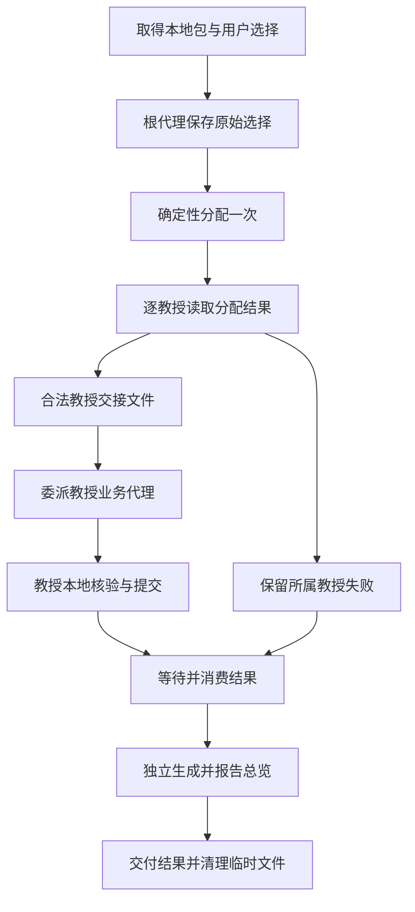

# 第68号问题完整执行计划第十四版

计划版本：`issue-68-plan-r14-2026-10-10`。状态：**待独立计划审核；不得当作已获批准的实现结论或测试通过证据**。

本文件是第十四版**唯一完整候选执行计划**。它在第十三版全部有效业务条款上，限定补齐 Codex GPT-6 的原生子代理 V2 调用、等待与异常收尾。第十三版原文及其[独立批准记录](https://github.com/ScholarWorkflow/professor-contact/pull/72#issuecomment-6008709709)保留为历史，受本轮修订影响的部分以本候选第2.6、2.7、3.5、3.6、3.7、3.8和第4节为准；第十四版须单独审核后才能正式实施。

范围约定（2026-10-05）继续成立：本仓库假定教授姓名唯一，不处理两个教授姓名相同的情况；不要求同名支持、同名拒绝逻辑或相关测试。不同姓名教授的邮件编号相同及真实归属歧义仍须按既有规则处理。

本轮只修改执行计划，未修改产品、测试或运行配置，也未发送新的正式评估请求。正式需求仍以[第68号议题](https://github.com/ScholarWorkflow/professor-contact/issues/68)和[验收第四版](https://github.com/ScholarWorkflow/professor-contact/issues/68#issuecomment-5981562292)为准。

## 1. 正式输入、依据与范围

| 项目 | 当前依据 |
| --- | --- |
| 需求 | [第68号正文](https://github.com/ScholarWorkflow/professor-contact/issues/68)，读取时更新于 `2026-10-05T13:41:30Z`；2026年9月29日按教授独立处理要求及2026年10月4日教授业务隔离澄清 |
| 验收约定 | [第四版](https://github.com/ScholarWorkflow/professor-contact/issues/68#issuecomment-5981562292)，`issue-68-gate1-r4-2026-10-05`，读取时更新于 `2026-10-05T13:40:05Z`；保留 R68-1至R68-8、AD68-1至AD68-5 |
| 前版计划 | `issue-68-plan-r12-2026-10-04`，评论5981550291，更新于 `2026-10-05T13:40:03Z` |
| 前版审核 | [批准记录5981691686](https://github.com/ScholarWorkflow/professor-contact/pull/72#issuecomment-5981691686)，更新于 `2026-10-05T13:39:44Z`；只批准第十二版 |
| 本轮触发 | [参数失败说明6000329400](https://github.com/ScholarWorkflow/professor-contact/pull/72#issuecomment-6000329400)，更新于 `2026-10-05T18:11:34Z`；用户在本轮明确要求修改计划，写清改什么及怎么改 |
| 目标仓库 | `ScholarWorkflow/professor-contact`，第五阶段，第72号拉取请求 |
| 目标版本 | 第十三版输入协议依据 `d7f3141569e0933adf95fe0b86d28bbd1cc1333d`；本轮委派问题复核的实际产品 `42f87abdbc3b73cf713da62b78ece51563468332`（执行器 `0.162.0-alpha.17.2`、测试模型配置 `gpt-6-luna`/`low`）；本计划编写时 PR 头 `454bfb563aac666d927d1455d38809770d5cf171`。旧版源码行号只用于第十三版输入协议说明 |
| 上游及兼容 | 沿用第十二版的第67号 `issue-67-plan-r19-2026-10-02` 教授本地交付、第59号单邮件兼容要求；第48号拥有通用写锁，本轮不改变其责任或依赖关系 |
| 项目规则 | 当前 `PROJECT_CONSENSUS.md` 与 `Plan Reviewer Rule.md`；摘要分别为 `d71d4fe3d6988e64dcf3e9768c815a756f12dcfe923c874c617e7bef62973741`、`1f84e2303581959d281ff8963a80cadac2540b95628c5f2a1ad3683f9797b3eb` |

本轮范围：沿用第十三版的第五阶段教授事务、确定性分配、文件交接、核验及总览规则；针对 Codex V2 增补真实委派入口、自定义代理角色选定、等待结果和失败收尾。两个安装目标继续共享业务规则。

非目标：不重做前四阶段、上游邮件包或历史迁移；不修改邮件文案、用户模板、联系方式判断、校验业务、邮件编号公式、通用写锁、Codex 执行器源码或测试判定程序。当前测试计划仍由测试工程师管理，本计划仅交代受影响的正式行为与观察位置。

## 2. 当前事实、问题与决策依据

以下事实来自目标版本源码，不以运行叙述代替实际调用链。

### 2.1 参数文字与读取方式不一致

`contact_state.py` 第9703—9704行将根代理入口的 `--choices` 描述为原始选择 JSON 对象或列表，但第7751行执行 `stage5_choices_rows(Path(args.choices))`；第7485—7502行通过文件读取器载入数据，第159—171行实际打开路径。第9750—9754行的命令派发没有加入内嵌文本解码。

因此，直接把对象或列表文本放在 `--choices` 后会被当成文件路径。该问题发生在根代理选择输入边界；不能仅由此认定业务代理委派失败或执行者违反第十二版。

精确来源：[参数帮助](https://github.com/ScholarWorkflow/professor-contact/blob/d7f3141569e0933adf95fe0b86d28bbd1cc1333d/.apm/skills/professor-contact/scripts/contact_state.py#L9703)、[实际调用](https://github.com/ScholarWorkflow/professor-contact/blob/d7f3141569e0933adf95fe0b86d28bbd1cc1333d/.apm/skills/professor-contact/scripts/contact_state.py#L7751)、[选择读取器](https://github.com/ScholarWorkflow/professor-contact/blob/d7f3141569e0933adf95fe0b86d28bbd1cc1333d/.apm/skills/professor-contact/scripts/contact_state.py#L7485)。

### 2.2 分配结果已具备所需字段，但不能整份交给教授代理

根代理分配入口返回顶层 `status`、原始选择路径 `choices` 及 `owners` 列表。列表中每项包含本教授的 `professor_dir`、`email_pack`、可选 `email_id`、`partition` 判定；可执行项另有 `choices_rows`。`--out` 保存的是包含全部教授的完整返回对象，不是单教授交接文件。

精确来源：[返回对象及写出](https://github.com/ScholarWorkflow/professor-contact/blob/d7f3141569e0933adf95fe0b86d28bbd1cc1333d/.apm/skills/professor-contact/scripts/contact_state.py#L7814)。

### 2.3 教授代理说明仍有旧广播句子

代理说明第65—70行仍要求每位教授代理收到相同原始选择；第100行起和第123行起又要求根代理分配后只消费本教授行。这两种执行指令冲突。新计划明确删除前一种，不让执行者临场选择。

精确来源：[旧句子](https://github.com/ScholarWorkflow/professor-contact/blob/d7f3141569e0933adf95fe0b86d28bbd1cc1333d/.apm/agents/professor-contact-email-generator.agent.md#L65)、[当前本地交接说明](https://github.com/ScholarWorkflow/professor-contact/blob/d7f3141569e0933adf95fe0b86d28bbd1cc1333d/.apm/agents/professor-contact-email-generator.agent.md#L100)。

### 2.4 选择文件与业务输入值必须区分

当前教授业务入口也把 `--choices` 解释为路径；不可变模板包装程序将该参数原值传入内部计划和最终提交程序。代理业务对象中的 `choices` 则是对象或对象列表，代理负责将它序列化后传给程序。这两种表示不应混写。

精确来源：[教授本地读取](https://github.com/ScholarWorkflow/professor-contact/blob/d7f3141569e0933adf95fe0b86d28bbd1cc1333d/.apm/skills/professor-contact/scripts/contact_state.py#L7525)、[包装参数传递](https://github.com/ScholarWorkflow/professor-contact/blob/d7f3141569e0933adf95fe0b86d28bbd1cc1333d/.apm/skills/professor-contact/scripts/stage5_immutable.py#L38)。

### 2.5 决策及替代方向

**本轮确定采用文件路径方式**：所有第五阶段命令行 `--choices` 都接收保存选择值的 JSON 文件路径；调用方业务对象中的 `choices` 保持现有结构化值含义。

现实替代方向是增加内嵌 JSON 参数读取，但本轮不采用。文件方式与现有三个入口及包装程序一致，能避免长命令转义和目录字符串重打；只需统一帮助、调用步骤与交接说明，不需要引入第二种解码路径。文件读写和清理由请求负责者承担，详见第3.6节。

因果链：用户选择必须原样交给确定性分配 → 当前程序实际读文件而说明不明确 → 明确文件接口并程序化保存选择 → 根代理能按真实输入分配并交出单教授数据 → 满足教授隔离、身份保持与可执行要求。

这项文件方式是本计划确定的实现选择，不将其升级为所有未来调用方必须采用的新增产品要求。

### 2.6 第十四版新增事实：目标版本的 Codex V2 委派

1. **实际运行**：2026-10-10 对产品 `42f87abdbc3b73cf713da62b78ece51563468332` 的追加评估使用 `codex-cli 0.162.0-alpha.17.2`。选择已被正确分配成两份单教授交接，但原生委派 **0 次**、教授结果 **0 条**，根代理提前重建了 0 人 0 封的总览且保留临时交接文件。外层 `passed=true`、退出码 0 只能证明评估进程结束；详见[执行记录](https://github.com/ScholarWorkflow/professor-contact/blob/454bfb563aac666d927d1455d38809770d5cf171/plan/issue68-test-execution-2026-10-09.md)。
2. **模型与源码**：Codex `rust-v0.162.0-alpha.17.2` 的模型目录为 `gpt-6-luna` 标注 `multi_agent_version=v2`、`tool_mode=code_mode_only`。[模型目录](https://github.com/openai/codex/blob/rust-v0.162.0-alpha.17.2/codex-rs/models-manager/models.json)；[V2 工具形状](https://github.com/openai/codex/blob/rust-v0.162.0-alpha.17.2/codex-rs/core/src/tools/handlers/multi_agents_spec.rs#L108-L163)将 `task_name` 和 `message` 列为必填，可在角色已注册时携带 `agent_type`，可用 `fork_turns=none` 避免继承父对话。
3. **工具真正如何提供**：该版本[工具注册源码](https://github.com/openai/codex/blob/rust-v0.162.0-alpha.17.2/codex-rs/core/src/tools/spec_plan.rs#L1374-L1423)在 V2 默认 `non_code_mode_only=true` 时以 `DirectModelOnly` 暴露原生 `spawn_agent`，这类工具不会列进 `functions.exec` 下的 `ALL_TOOLS`；并且仅在已加载自定义 agent roles 时才暴露 `agent_type`。[V2 配置默认](https://github.com/openai/codex/blob/rust-v0.162.0-alpha.17.2/codex-rs/core/src/config/mod.rs#L1374-L1404)。
4. **此前类似案例的适用范围**：[paper-analysis #16](https://github.com/ScholarWorkflow/paper-analysis/issues/16)证明过 V1 / 延迟工具目录可从真实列表绑定可调用名称，但不能将 `multi_agent_v1__spawn_agent` 搬进 GPT-6 V2；[Codex #44270](https://github.com/openai/codex/issues/44270)记录错误的委派提示地址，不能据此认定本次 0 委派的唯一根因。
5. **事实尚缺一项**（`UNVERIFIED_ASSUMPTION`）：现有追加评估记录没有当次模型实际收到的 V2 工具定义，也没有角色已加载的直接证明；请求配置写为 `gpt-6-luna` 并不独立证明本轮最终生效模型及其工具提供状态。审核 P1 前，运行配置负责人只查该次已有会话/启动记录中与 `spawn_agent`、`agent_type` 和实际生效模型相关的最小信息；如果记录不足，如实记为未证实并暂停受影响结论，不把“查不到”升级为环境缺工具，也不额外跑完整邮件评估或制作通用能力认证设施。

### 2.7 第十四版选择及依据

采用**当前 Codex 已注册的原生委派入口**：GPT-6/V2 请求直接调用当前会话可用的 `spawn_agent`，以已注册 `agent_type` 选择准确命名的邮件生成代理；每个 owner 一次真实委派、等待并消费结果。规范行为不依赖 V2 工具的某个私有 namespace、固定的原始 JSON 传输签名或内部事件字段。参数名称仅作上述**被测版本**的定位依据，不提升为跨版本业务接口。

可行替代是用 `functions.exec` 枚举工具后调用目录中的 V1 名称；但该版本 V2 默认直接给模型而不放进该目录，此路不可用于本轮 Codex。通过 shell 启动其它 CLI、重新提交 `/eval`、用主代理冒充教授代理也不采用。OpenCode 仍按原生 Task；其他 Codex 版本由其真实注册的官方原生入口负责，不强迫使用此版本的私有形状。

因果链：两位合法 owner 交接已准备好 → 原生委派零次，教授业务未开始 → 根技能在 V2 路由点明确使用已提供的真实 `spawn_agent` 与命名角色，并按本次请求读取其真实结果 → 各教授分别走既有核验/生成/提交 → 两份结果消费后独立重建总览、清理临时传递物 → 满足第68号需求。**当前尚不能把所有失败归因于某一个上游提示缺陷；待第2.6节未证实事实关闭后方能判定修订的实际可执行性。**

## 3. 完整方案

### 3.1 教授事务和身份

一次 `professor-contact-email-generator` 调用只对应一个规范 `professor_dir`。业务调用、校验、状态、渲染和邮件输出只处理该教授的数据。

规范身份贯穿全链：第四阶段交付或独立发现的确切本地包 → 根代理按 `(professor_dir, email_id)` 分配 → 单教授交接 → 同教授业务输入、结果、校验和持久化状态 → 根代理按目录消费结果 → 独立总览。

教授展示名不用于重建目录、选择索引或合并结果。目录及编号字符串不得翻译、转写或从展示名重新推算。

允许交给教授代理的输入包括其自身 `email_pack`、本次选择、可选 `email_id`、普通调用参数及本教授结果路径。禁止夹带其他教授的目录、邮件包、编号、选择行、核验、状态、渲染路径或跨教授归属表。

### 3.2 两条入口

紧接第四阶段：根代理直接使用每位教授成功结果中实际交付的 `email_pack`，不重新进行程序级发现来猜归属。

独立启动第五阶段：根代理先调用只读 `stage5-list-inputs`，按返回行选择本次教授。坏包只形成所属教授的输入解析失败，其余合法教授继续。指定教授时按其姓名精确匹配本地输入；未找到时沿用现有缺输入处理。

发现逐包返回 `{professor, professor_dir, email_pack, status, reason_code}`。

发现只读取本地邮件包，不读核验、状态、渲染、总览或旧全局包，不写归属文件。保留删除 `--emit-choices-scope` 的方案。

### 3.3 参数与三类临时文件

| 对象 | 内容和读者 | 不得混用的边界 |
| --- | --- | --- |
| 根代理原始选择文件 | 用户本次提供的对象或对象列表；仅根代理分配入口读取 | 不作为教授代理的选择文件，不随委派广播 |
| 根代理完整分配文件 | `stage5-partition-choices --out` 写出的顶层对象及全部 `owners`；仅根代理读取 | 整份文件不得作为 `owner_input_file` 交给教授代理 |
| 单教授交接文件及选择文件 | 仅该教授业务对象，以及从其 `choices` 值序列化出的行列表；由该教授业务代理读取 | 不含其他教授行或根代理原始选择文件路径 |

文件名称不冻结；下面为说明使用 `raw-choices.json`、`partition.json`、`owner-input-0.json`、`owner-choices.json`。执行时由请求独占临时目录分配名称，不使用教授展示名拼文件名。

业务对象 `choices` 保留对象或对象列表含义；命令行 `--choices` 始终表示文件路径。根代理分配入口文件内容是原始用户值；教授业务入口文件内容是对应教授的分配行。对象和值不得通过拼接命令文本传递。

不新增内嵌 JSON 兼容分支，不根据字符串外观猜测它是路径还是 JSON，不把读文件失败改为尝试另一种输入解释。保留现有文件路径调用。

### 3.4 根代理准备和一次确定性分配

用户已提供选择时，按以下顺序实施：

1. 从用户结构化输入取得原始 `choices`。用 JSON 序列化工具将该值写入本次独占原始选择文件，不补字段、不翻译、不按教授手工切片。排版、转义和缩进不是业务字段变化，目录与编号字符串值必须保持原值。
2. 从第四阶段实际交付或只读发现取得本次选中教授的真实 `email_pack`，并保留各教授可选目标 `email_id`。每个规范教授目录只出现一次。
3. 使用安装来源中的 `contact_state.py stage5-partition-choices`。`--program-root` 传实际项目目录，每位教授使用一个 `--owner <email_pack> [email_id]`，`--choices` 传步骤1的绝对文件路径，`--out` 传根代理完整分配文件的绝对路径。用参数列表启动命令，不把选择值或教授路径重打进命令文本。
4. 命令完成后读取实际退出状态及结构化返回。返回顶层错误、文件读取失败或分配结果未形成时，保留真实原因；没有合法分配结果就不宣称已委派或已完成业务。
5. 使用 JSON 解析器读取返回的 `owners`。按每项自身 `professor_dir` 关联，不按展示名、返回位置或自然语言猜归属。返回身份不得偏离本次已选包；无法唯一对应时停止受影响交接并报告输入不一致。
6. 对 `partition.status` 非 `ok` 的项保留其实际状态、原因和相关字段，只停止该教授，不将其重新路由或传给其他教授。顶层 `status: ok` 不代表所有教授都可执行。
7. 对合法项读取其实际 `choices_rows`，不再做一次选择分配，不去重或删除错误行。缺失、重复和字段是否合法继续由该教授业务程序检查。

本入口继续承担第十二版确定的归属责任。本轮不修改现有分配算法，按目标版本实际行为说明如下；相关审核结论见[最新审核：保留第十三版批准](https://github.com/ScholarWorkflow/professor-contact/pull/72#issuecomment-6008709709)，不再以范围外的同名教授反例要求修改算法或验收约定：

- 显式目录行只归对应教授；不属于本次选中集合的行不进入任何教授交接。
- 指定 `email_id=X` 时，本教授未选中的编号先排除；目标自身身份、缺失、重复和字段仍严格检查。
- 整教授批量中本教授的错误编号只使该教授返回 `needs_input / choice_owner_invalid`。
- 无目录旧行只在根代理计算候选；范围来自本次选中包的实际执行范围。无候选为无关行；唯一候选进入该教授并参与重复检查；多个候选时才排除已被合法显式行满足的教授，剩一个绑定、剩多个返回各受影响教授的歧义、剩零个不改变已明确教授的结果。歧义行不广播。
- 原始行顺序不改变归属；根代理不复制收件人、跟进日期等业务校验。

用户没有提供 `choices` 时，保留既有缺输入分支：不虚构用户决定、不把缺省值冒充合法选择。根代理按已确定本地包形成不含 `choices` 的单教授交接，仍委派正式业务代理；不调用要求 `--choices` 的跨教授分配命令来猜选择。业务代理按现有执行器分支取得所需决定或返回 `needs_input`。这条路径不进行跨教授选择归属，也不扩大本轮用户交互要求。

### 3.5 单教授交接及业务调用

根代理对第3.4节每个合法教授项执行以下转换：

1. 建立只含该教授的业务对象。`email_pack` 取该项实际路径，提供了目标时保留同一 `email_id`；`choices` 的值直接取该项 `choices_rows`。将完整行列表保留为列表，不因只有一行改写字段或重建内容。
2. 补入本次真实 `program_root`、已提供的 `mode`、模板等普通参数；已提供的模型结果只能是该教授结果。没有提供的参数继续沿用现有缺省规则，不伪造值。
3. 不复制顶层原始选择路径、整个 `owners` 列表、其他教授项或跨教授范围。根代理解析出自己需要的逐教授判定即可，不让教授代理再解析多教授分配文件。
4. 用 JSON 序列化工具写入单教授交接文件，业务对象中的路径和值取自已解析字段，不手工重打。Codex/GPT-6 的当前 V2 入口使用会话直接提供的原生 `spawn_agent`：给本请求每个教授分配一个不重复、仅含小写字母/数字/下划线的 `task_name`（仅是任务身份），通过真正的 `agent_type=professor-contact-email-generator` 选择已安装的命名角色，`message` 只交本教授的 `owner_input_file` 路径及本教授任务约束。优先采用该版本支持的 `fork_turns=none` 保持父对话与其他教授输入不进入子代理，不改当前模型或推理设置。此处是版本化调用指引；实际调用参数以本轮官方工具定义为准，不把私有签名升级为业务合同。若本轮工具未提供角色选择字段，不得用 `task_name`、提示文本或默认代理代替 `agent_type`；保留该教授未委派状态并交运行配置负责人确认角色注册。OpenCode 的 Task 分支不改变。

教授代理收到后：

1. 解析自己的 `owner_input_file`，只取得自己的业务字段；不读根代理原始选择或完整分配文件，不重新发现其他教授。
2. 第一次 `stage5-plan` 保留现有顺序：读取同一 `email_pack` 及可选同一 `email_id`，先处理核验边界，不因用户提供选择而绕过核验。初次调用不携带模型结果和选择。
3. 到既有流程允许消费选择时，将解析所得本教授 `choices` 值用程序原样写入教授独占选择文件；以后 `stage5-plan` 和最终提交所需的 `--choices` 都传该文件路径。若业务代理根据既有交互补齐了该教授用户决定，使用实际用户决定，不伪造字段。
4. 保留同一教授本地包、同一目标编号及同一已确定选择值进入重规划和不可变模板包装。包装程序不重建选择、不增加其他教授范围、不代替业务校验。
5. 保留收件人权威、联系方式证据、结果、日期、重复及缺失等严格检查；同教授整批全部合法才提交。错误夹入其他教授行时，只拒绝当前教授输入，不向该教授重新路由。
6. 校验代理只检查本教授本次输出；状态记录仍按现有 `stage5-record-validation --professor-dir --validation-file`，不新增目标编号参数。
7. 返回一条完整结构化业务结果，保留实际 `professor_dir/status/reason_code` 及相关信息。未完成核验、缺输入、失败和部分结果不得改称成功。

### 3.6 生命周期、失败和清理

根代理拥有原始选择文件、完整分配文件和各单教授交接文件；教授代理拥有自己写出的选择与结果传递文件。文件只为本次请求传递数据，不是新的长期事实来源。

每次请求使用独占目录；使用程序生成不含教授名称的文件名，不覆盖另一请求文件。文件生成或写入失败时保留实际错误，不继续使用上一请求的旧文件，也不切换为内嵌文本重试。

原始选择不可读、非法 JSON 或顶层不是对象或对象列表时，保留当前 `invalid_result_json` 读取边界；不建立已分配或已完成业务的假象。某教授包、选择归属或交接失败时，只影响该教授；其他合法项继续。共用原始选择无法读取则没有可靠分配输入，先报告该输入问题，不制造逐教授成功结果。

教授代理结束前不得删除它仍需读取的单教授文件；根代理消费全部已委派结果并交付本轮结果后清理其拥有的临时传递物。正常结束、失败或取消均按同一归属清理；仍有业务代理运行时，先按现有执行器结束处理，不能先删除其输入。清理错误单独报告，不回滚或降级已经形成的教授业务结果；只清理能确认属于本请求的文件，不扩大为目录搜索删除。

### 3.7 结果消费与独立总览

根代理对每位可执行教授发起真实原生委派，保存该轮工具返回的任务身份；等待其业务最终结果并分别消费。V2 的返回与等待按本次工具提供的任务名称、最终消息/通知办理，不套用 V1 的 agent-id 及 `wait_agent` 参数格式，不用模型自述替代机器结果。某位教授的真实委派返回失败时记录其错误，仍继续其他可执行教授；按规范 `professor_dir` 关联，不能按任务排列或教授展示名合并。教授甲成功不因教授乙输入、选择、核验、状态、渲染或业务失败被阻止、回滚、重跑或降级。

全部已启动教授的最终业务结果都被根代理收到并消费后，才根据最后本地状态统一生成总览，最多调用一次 `stage5-rebuild-overview`；单教授请求采用相同顺序。若存在可执行教授而本轮**没有任何真实原生委派调用**，属于提前中断：报告未委派和已知原因，不抢先生成一个空总览冒充处理完成，执行第3.6节失败清理。存在真实委派且有教授失败时，等待已启动的教授结束，按真实本地状态重建总览并分别报告成功、失败和总览状态；总览失败或人工修改冲突不改变教授结果。

总览是独立派生文件，不是教授提交条件；保留本地输入、状态合法性检查、总览人工修改保护及原子替换。它不改本地包、状态、邮件或核验缓存。本轮不增加跨请求最新者优先承诺，不把第48号写锁变成本议题的新增前置。

保留既有总览机制：`stage5-rebuild-overview` 只写 `教授研究/套磁邮件总览.md`，不读取、修改或保存 `_contact_projections.json`。已有总览的 `managed_by` 必须为 `contact_state`，且正文哈希须与合法 `render_sha256` 一致；否则返回 `needs_decision / manual_markdown_changed` 并保持文件。总览不存在时直接生成；成功通过一次原子替换写入完整 frontmatter 与正文，不增加 sidecar、临时锁或第二套 writer lock。

图示为用户已提供选择的路径；缺少选择的既有分支按第3.4节进入单教授交接，不制造原始选择。

### 3.8 Codex V2 路由与无法委派的处理（第十四版）

- **入口确认**：GPT-6 的 V2 原生 `spawn_agent` 是当前会话的直接模型工具。用该已提供入口执行真实教授任务，不把 `ALL_TOOLS` 搜索、工具目录可见性或 V1 命名空间列为先决条件。正常运行不做独立的模拟委派、能力探针或补发评估请求。
- **角色确认**：委派时 `agent_type` 应明确为 `professor-contact-email-generator`；`task_name` 是本次任务名称，不能充当角色。角色字段不在工具定义中、命名角色不可用或真实调用失败时，保留该教授原样失败，不让根代理代写邮件。区分“未提供真实工具定义”、“字段/角色不可用”、“已调用但返回机器失败”三种情况，只有最后一种能断言运行时委派调用失败。
- **输入/隐私边界**：每个子代理只收自己的一份 `owner_input_file`；不要广播根选择、全部 `owners` 或上一位教授内容。当前版本的 `fork_turns=none` 是优先隔离方式，受支持时使用；项目指令、agent 安装仍由正式 APM 产物提供。
- **等待及收尾**：V2 创建成功后按真实任务身份等待/接收最终消息，消费当前教授结构化 `professor_dir/status/reason_code`；所有真实启动的 owner 结束后才执行总览。零次委派时先报告阻断并清理自己的请求文件，禁止凭模型自述宣称“工具不可用”、也禁止假装完成委派。
- **可观察性**：本次要求确认实际教授调用和最终业务结果，仍由[现有第六十一版测试计划](https://github.com/ScholarWorkflow/professor-contact/blob/454bfb563aac666d927d1455d38809770d5cf171/plan/issue68-test-plan.md)六个观察点检查；V2 私有工具签名、搜索过程、全局工具注册快照不新增为业务验收条件。外部运行/模型问题按项目共识记为无法判断，产品主动跳过已提供委派入口仍记为业务未满足。

## 4. 逐文件修改和实施顺序

下面的职责全部归产品仓库。本轮已有正确实现应保留，不因计划整理重写整段状态程序。行号只用于定位目标版本，函数名称不是必须新增的命名要求。

### 步骤1：统一命令参数说明与文件读取

修改 `.apm/skills/professor-contact/scripts/contact_state.py`：

- 在 `build_parser` 中将 `stage5-partition-choices` 的 `--choices` 帮助改为“原始用户选择 JSON 文件的路径；文件内容为对象或对象列表；只在根代理分配”。
- 将 `stage5-plan` 和 `stage5-finalize` 的 `--choices` 帮助统一为“当前教授选择 JSON 文件的路径；只含本教授已分配的行”。最终提交不得写成可接受完整多教授选择。
- 保留 `stage5_choices_rows` 的文件读取方式及对象转单行列表行为，保留 `stage5_choices_by_id` 的教授本地限制；不添加内嵌文本自动解析，也不在文件不存在时改为猜另一输入形式。
- 在分配入口的说明中写明返回顶层 `owners`，以及 `--out` 写出完整多教授分配对象，根代理必须逐项生成单教授交接文件。
- 保留现有逐教授失败、目标过滤、旧行歧义和业务校验归属；删除的跨教授范围入口不得恢复。
- 第十二版删除完整范围传递的决定继续有效：教授业务入口不得提供跨教授 `--choices-scope`；如保留同名内部辅助函数，它不能成为受支持的教授输入、处理多教授数据或出现在当前调用约定中。

完成条件：三个命令帮助对路径含义一致，实际实现仍从该路径读 JSON；返回对象与第3.3—3.5节说明一致；错误保持实际读取或业务原因，不因接口说明修正更改业务结果。

### 步骤2：更新根代理调用方步骤

修改 `.apm/skills/professor-contact/SKILL.md` 的前部第五阶段输入规则、第五阶段独立入口及调用方选择说明：

- 将 `--choices <原始 choices>` 一律改为 `--choices <原始选择JSON文件绝对路径>`；紧邻给出“从用户结构化值程序化写文件”的动作。
- 明确 `--out` 文件只供根代理解析 `owners`，不得整份交给教授代理；逐项检查 `partition`，把本教授 `choices_rows` 直接赋给本教授业务对象的 `choices`。
- 写清单教授 `owner_input_file` 只含对应教授数据；禁止包含原始选择文件、完整分配文件、其他教授项或完整范围。
- 依第3.5、3.8节把 Codex GPT-6/V2 调用写清：当前会话直接发起 `spawn_agent`、准确 `agent_type` 选择 `professor-contact-email-generator`、任务名只作一次调用身份、仅传本教授交接；结果与清理按第3.6、3.7节执行。V1 工具目录示例不得进入 GPT-6 的正式路由；不硬编码私有命名空间、签名或事件字段。
- 在长的根代理准备结束、即将启动教授时再次明说必须真实委派并等待；无调用时不得直接重建总览或宣称工具运行时失败。
- 用户没提供选择时沿用第3.4节缺输入分支，禁止通过空默认值伪造完整选择；保留正常委派和业务代理已有交互边界。
- 第四阶段交付及独立发现仍分别处理；不重新引入全局邮件包或范围广播。

完成条件：仅阅读当前技能，根代理能够确定保存什么文件、传哪个路径、解析哪个字段、如何交接单教授数据及何时清理，不需要另找历史评论。

### 步骤3：更新教授代理说明

修改 `.apm/agents/professor-contact-email-generator.agent.md`：

- 在选择输入说明中删除“每位教授代理接收相同原始值”和依赖完整多教授归属范围的句子。替换为“根代理接收原始多教授选择并确定性分配；当前教授代理只接收对应选择行”。
- 保留禁止模型手工切片，但明确切片已经由根代理产品入口完成；教授代理不得广播、合并或重新归属。
- 根代理分配命令示例的 `--choices` 改为原始选择文件路径；写明分配结果 `owners[].choices_rows` 转为当前业务对象 `choices`，不是把整个 `owners` 当作输入。
- 前部机器结果协议和选择保存段统一：解析自己的交接文件，从已解码值生成本教授选择文件，再传路径；不把字段值转抄到委派正文或命令字符串。
- 核验先行、第一次计划不带结果和选择、同一包及目标贯穿重规划与最终提交、校验范围和真实结果返回均按第3.5节保留。
- 两种执行器分支只改变已有工具调用方式，不改变输入范围、文件接口或业务校验。

完成条件：整份有效代理说明只有一种选择来源和传递规则；不再同时包含旧广播和新单教授输入条款。

### 步骤4：同步工作流参考

修改 `.apm/skills/professor-contact/docs/workflow-reference.md` 中第五阶段归属、交接及顺序段：

- 计划指针更新为第十三版。
- 增加业务 `choices` 值与命令 `--choices` 路径的区别；三个命令的例子与步骤1一致。
- 描述根代理原始选择文件、完整分配文件、单教授交接及选择文件的内容、读者和转换关系。
- 保留规范身份、单邮件过滤、整教授原子提交、逐教授失败、只读发现、结果消费和总览独立派生；同步第十四版 3.8 的 V2 入口、角色字段边界和零委派收尾，不修改 OpenCode 正式 Task 调用。
- 历史 `stage5-legacy-contract.md` 不升级为当前接口来源；有旧说明时由当前第五阶段规则明确覆盖，不改写历史参考来制造另一份规范。

完成条件：技能、代理说明、命令帮助、工作流参考在文件输入、字段关系、失败及清理上没有冲突。

### 步骤5：核对不可变模板包装与安装来源

检查 `.apm/skills/professor-contact/scripts/stage5_immutable.py`：

- `_PLAN_OPTIONS` 和参数转换继续把 `--choices` 文件路径原样传给内部计划；临时最终提交程序也收到相同本教授文件路径。
- 不在包装程序读取并分配原始多教授选择，不加入 `--choices-scope`，不从名称猜教授。
- 包装程序现有行为已符合时只更新必要说明或计划引用，不重做不可变模板处理、联系方式定位或来源标记逻辑。

目标版本 `apm.yml` 声明两个目标及自动包含根源码，另有 `packages/professor-contact-codex`、`packages/professor-contact-opencode` 依赖目录。目标版本目录清单中两包的代理覆盖文件为分析代理；本次第五阶段技能、邮件生成代理和业务脚本修改落在上述根源码，不凭包名新增邮件代理副本。

本地执行代理交付时核对两个目标的实际安装来源及受影响产物都来自这些修正源；Codex 安装产物还应包含 `.codex/agents/professor-contact-email-generator.toml`，并从第2.6节要求的现有运行配置/会话资料确认该命名角色被注册进本轮实际可用的 `agent_type`，不能仅凭文件存在宣布已注册。不得只改已经安装的用户副本、测试消费者或生成文件。若发现实际投影另有当前第五阶段源，先记录其来源及覆盖关系，再同步同一接口规则，不能另写不同协议。现有依赖名称及运行配置不变。

完成条件：包装参数不偏离同教授文件；两个目标当前调用说明来自统一源，没有第二份旧广播指令。

### 步骤6：交付影响记录，再交测试工程师处理

本地执行代理提交产品和说明修改后，记录实现提交、受影响的根技能及流程说明修改与对应第十四版条款；第十三版输入协议已正确的命令帮助、教授代理、业务脚本及包装程序注明保留，不为了交付数量重写。同步真实运行中有关角色注册的已确认事实或明确未知。

测试工程师据此核对现有输入构造、提示词、步骤和依赖版本是否使用文件路径；只在当前方案确有不一致时修正对应测试方案或实现。相关材料包括 `tests/runtime/prepare_issue68_stage5_routing.py`、根代理提示词及当前正式运行入口引用的记录；它们不是产品接口的负责者。

本计划不规定新的用例编号、断言、解析器、判定程序、运行命令或通过证据。受影响的正式行为和观察位置见第7节，由测试工程师依据项目共识给出正式安排。不得先在测试环境打补丁补偿产品调用说明缺陷。

### 实施依赖顺序

1. 第十四版提交**独立限定审核**：P1 先核对被测 `0.162.0-alpha.17.2` 的 V2 模型/工具/角色加载事实并关闭第2.6节 `UNVERIFIED_ASSUMPTION`；P2 判断工具暴露与产品/运行配置职责；P3 判断教授隔离、等待、失败和清理；P4 判断修改位置及实际执行顺序。没有正式 `Plan conclusion: APPROVED` 前，不据本候选修改产品。
2. 执行者优先修改根技能 `.apm/skills/professor-contact/SKILL.md` 的 Codex 第五阶段委派规则，并同步 `docs/workflow-reference.md`；对照安装的 Codex 角色投影，角色注册若确实有配置缺口交运行配置/安装责任者修复，不能改测试消费者代偿。
3. 第十三版 `--choices` 文件接口、确定性分配、单教授业务代理、状态和邮件校验继续适用。只有因本轮修订实际受影响的文件及行为才修改或复核；产品提交使用一个明确版本，保留先前正式运行记录。
4. 测试工程师只按既有第六十一版测试计划核对受影响的真实委派、结果、总览顺序和清理；相关步骤不合时做限定修订并审核，不能更改提示词、模型、配置或验收条件求通过。本计划不授权新的正式 `/eval` 请求。
5. 交付后仍须按已有第三关口取得真实业务通过结果；本文件和历史第十三版批准都不等同于新版实现通过。

## 5. 保留行为、禁止副作用和安全条件

保留行为：邮件编号公式、`source_hash`、业务字段和联系方式证据含义不变；教授目录作为规范事务身份；指定邮件只处理目标；同教授全部邮件是整笔提交；当前教授的缺失、重复、字段、收件人、跟进日期及业务核验仍严格拒绝；校验只看本教授本次输出；第四阶段交付和迁移仍归第67号；总览独立派生且保留人工修改保护。

禁止副作用：不恢复旧全局邮件包、双读、双写或第二事实来源；不把模型手工按展示名切选择当成确定性分配；不让业务代理接收完整多教授选择或归属范围；不因教授乙失败影响教授甲合法结果；不以总览失败回滚教授提交；不在包装程序、共享测试环境或判定程序中补偿产品负责者的缺陷。

本仓库处理范围内必须成立的安全条件：

1. 每一教授交接及业务读取仅归一个规范目录，跨阶段归属不丢失。
2. 根代理只分配一次，教授业务只消费分配结果；无目录旧行歧义不广播，唯一候选仍参与缺失和重复校验。
3. 本次目标范围始终相同；目标以外的本教授行不阻断指定邮件，目标自身严格校验不减弱。
4. 同教授整批全部合法才写入，教授之间不互为提交条件。
5. 两类根代理文件不会误作教授选择；文件读取方式与帮助及调用一致；选择值不因翻译、默认补齐或命令转义变化。
6. 请求临时文件相互隔离，在消费者结束前可读；清理不删其他请求文件、不改变已经完成的业务结果。
7. 总览消费最后本地状态，在教授结果消费后独立生成并单独报告，失败不改教授结果。

代表性反例用于审查方案，不是新测试用例：

- 教授乙本地包损坏或选择错误：只保留乙失败，甲合法分配仍委派。
- 本教授指定邮件甲，原始选择另含未选中邮件乙：乙先过滤，不阻断甲；甲自身重复仍拒绝。
- 姓名不同的两教授旧格式行邮件编号相同：根代理确定唯一或歧义，不向两位业务代理广播同一行。
- 调用者提供内嵌 JSON 文本作为 `--choices`：这是不符合本版文件接口的调用，按实际文件读取错误处理；说明必须事先清楚要求路径。
- 根代理将整个 `partition.json` 交给某教授：违反交接条件，实施步骤明确禁止；应交由本教授项生成的文件。
- 路径含空格或非中文字符：从解析字段构造参数列表和 JSON，字符串值不重打或翻译。
- 请求甲未结束，请求乙开始：各自文件独占；甲清理不删除乙文件，不能提前删甲子代理仍在读取的输入。
- 总览冲突或清理失败：单独报告，不把教授成功改为失败。

## 6. 修订分类和审核范围

### 第十三版历史决定（以下为保留记录）

本次不新增业务需求，不另选负责者或事务边界。新增计划决定是确定文件接口及具体交接、清理动作；同时删除当前交付中的失效广播表达。第十二版“可采用临时文件或等价结构”在本轮具体实施中确定为文件方式，不再让执行者在两种参数解释之间自行选择。

与第十二版的对应关系：第3.3节补齐文件参数和返回对象读取，第3.6节补齐临时生命周期；修改步骤1、4、5细化为本版步骤1—5；其余选择归属、教授业务校验、身份、整批提交、发现及总览方案仍保留。前版描述旧范围仍存在的事实改为目标版本当前接口问题，不把失效状态写成当前事实。

申请限定审核：P1核对参数事实与来源；P2核对根代理和教授业务责任未偏移；P3核对单教授传递、身份和清理条件及直接连带影响；P4核对逐文件实施和依赖顺序。前版与本修订无关的事实及关卡判断可以由审核者按影响分析复用，作者不自行声明任何关卡继续通过。

关键假设：本方案不依赖未文档化运行事件或新的工具能力。当前原始选择文件读写、根代理输出对象、教授读取和包装传参均有目标源码依据。两个安装目标的实际交付来源核对为实施交接动作，不据此假定存在新的运行行为。

范围排除的影响：第3.4节旧格式行候选收窄的同名反例已由[最新审核：保留第十三版批准](https://github.com/ScholarWorkflow/professor-contact/pull/72#issuecomment-6008709709)撤销为阻断，不要求为它修改计划、算法、验收或测试。范围内的一般选择归属歧义处理保留。本次文字清理不判定产品实现或测试结果。

第十三版的批准以审核者自己的[最新审核：保留第十三版批准](https://github.com/ScholarWorkflow/professor-contact/pull/72#issuecomment-6008709709)为准；该历史批准不自动授予第十四版实施许可。

### 第十四版限定修订与待关闭事实

- 第十三版已经确定的教授事务身份、单邮件兼容、整教授提交、分配接口、临时文件归属、总览保护和 OpenCode 正式调用保持有效；第十四版仅修改 Codex/GPT-6 V2 委派入口及与之直接相关的等待/清理，不引入新业务需求。
- 本轮 `UNVERIFIED_ASSUMPTION`：正式追加评估当次是否把带 `agent_type` 的 V2 `spawn_agent` 作为可调用的直接工具提供给已生效模型；已有响应未展示该字段的注册结果。由本地运行配置负责人优先查现存会话/启动记录的这三个相关字段；如果无法确认，P1 保留 `NEEDS_MODIFICATION`，不靠“没有搜索到”作否定事实，也不擅自修改模型或正式测试。
- `intended_change`：让第五阶段合法 owner 在当前 Codex V2 通过受支持的直接调用真正到达已安装邮件生成代理，再等待并消费结果；零委派时不提前空总览、不遗漏清理。
- `preserved_behavior`：第5节全部教授隔离、选择、原值保持、业务核验、持久状态、总览和清理规则。
- `prohibited_side_effect`：禁止主代理代做教授生成、V1 工具名硬套 V2、用未注册角色冒充、测试环境补丁、增加第二长期状态或临时改模型求绿。
- 第十四版待审核对象：第2.6、2.7、3.5、3.6（失败清理边界）、3.7、3.8、步骤2/4/5、实施依赖顺序以及第7/8节的直接影响。P1–P4 由独立审核者给结论；本文不声明 `APPROVED`。

## 7. 影响与正式观察位置

| 记录项 | 本版说明 |
| --- | --- |
| `intended_change` | 沿用第十三版固定文件接口；补齐 Codex/GPT-6 V2 真正委派、命名角色选择、结果等待及零委派收尾；产品修改集中于根技能与工作流参考 |
| `preserved_behavior` | 第5节全部业务要求及安全条件；两个安装目标共享业务含义 |
| `approved_behavior_change` | 沿用第十二版及当前验收的根代理分配、教授本地业务、只读发现、独立总览；本版接口实施细化的批准来源见独立审核范围更正，不自行授予批准 |
| `prohibited_side_effect` | 第5节禁止副作用；不新增内嵌文本推测分支、长期选择事实源或测试环境补偿 |
| `unresolved_impact` | 当前实际生效模型、V2 委派工具是否已提供、`agent_type` 角色是否注册仍缺本次运行直接证明，列为 P1 待关闭；同名反例继续排除；不扩展本轮测试 |
| 正式行为及观察位置 | 保留三个命令参数帮助、分配及交接、选择消费和邮件状态；第十四版另核对真实 V2 命名代理委派、两份教授终局结果、之后一次总览及清理（沿用辛的原六项） |

这些位置保留产品本身受支持的调用、结构化返回和文件输入，不要求新增测试专用产品接口；具体取证与判定由测试工程师处理。

## 8. 交接与本轮完成条件

计划编写完成条件：本版已包含完整需求、当前事实、唯一参数方式、数据传递、逐文件修改、失败、清理、兼容及顺序；审核和实施不必拼接历史评论。

产品实施完成条件：继续满足第十三版文件接口和教授隔离条件；Codex 根技能在已确认加载命名角色的 V2 会话里对可执行教授分别发起真实原生委派并等待，保留全部 `professor_dir/status/reason_code`，结果完成后才重建一次总览，按本请求文件归属清理。根技能、工作流参考和两个安装目标说明一致；已有正确代码注明保留，不要求为交付数量重写。

第十三版的批准保留历史；**第十四版待独立审核，须先关闭第2.6节影响 P1 的未证实事实并取得 `Plan conclusion: APPROVED`**。下一负责人依第4节为本地运行配置负责人（最小来源核对）及随后产品实现负责人；测试工程师只核对受影响的现有六项。本文件不代表产品已完成修改、测试通过或可合并。

## 旧计划清理的内容归并（2026-10-06）

本次仅将仍有效但原文简述的发现返回字段与总览保护机制直接归入第3.2、3.7节。依据为[当前验收第四版](https://github.com/ScholarWorkflow/professor-contact/issues/68#issuecomment-5981562292)的 AD68-3及 AD68-2；有效总览保护细节已归入本计划第3.7节。没有新增要求、修改负责者或恢复旧广播、同名处理及第48号合并前置；版本和既有批准含义保持，不新增审核、测试或合并批准。当前完整计划可直接阅读，不需拼接旧计划。
